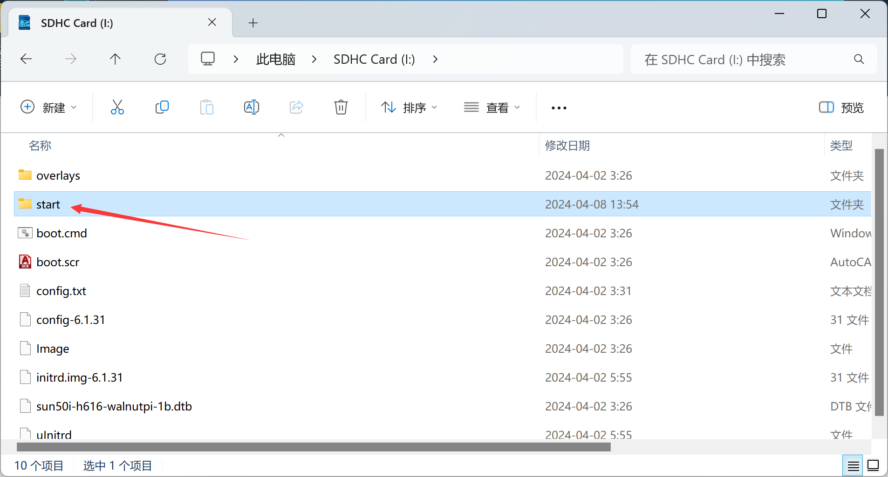
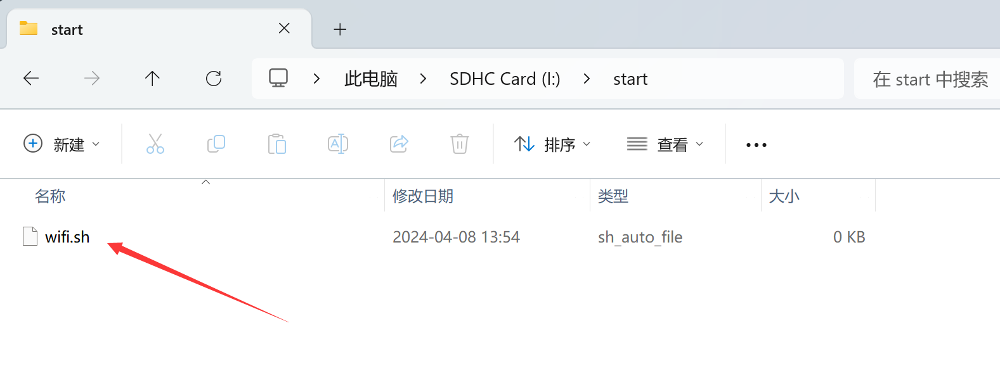
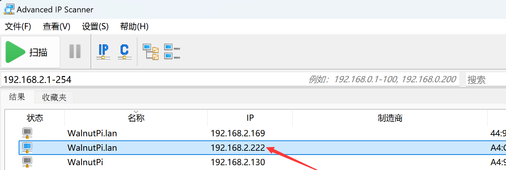
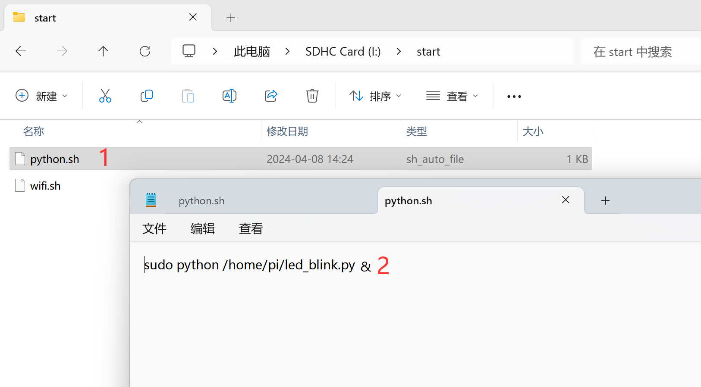
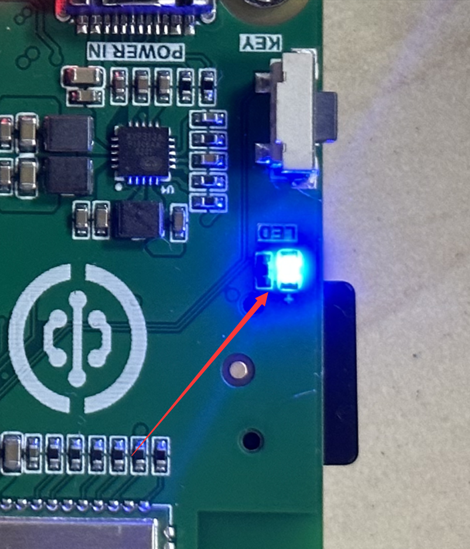

# 开机自动运行脚本

核桃派官方Debian系统支持开机自动运行`/boot/start`路径下的所有`sh`文件。

用户可以通过windows读取SD卡或在核桃派下自定义多个sh文件，实现开机执行各种自定义指令内容。下面是一些应用案例：

## 开机自动连接WiFi

烧录镜像后假设我们没有网线，也没有USB TTL串口工具，就可以使用这个功能让核桃派自动连接wifi,再通过路由器或者wifi扫描工具获取核桃派IP地址，实现SSH远程终端。（核桃派系统出厂带wifh.sh文件）。

在`/boot/start`路径下创建一个文件，名称以.sh结尾，如wifi.sh。






填入下面内容：注意将下面的 `walnutpi` 和 `12345678` 改成自己家里或办公室的wifi账号和密码，支持2.4G和5G信号。
```
# 扫描wifi
nmcli dev wifi > /dev/null

# 连接wifi
nmcli dev wifi connect walnutpi password 12345678
```


将SD卡插入核桃派，启动后就会自动执行这个wifi.sh脚本，实现连接指定WiFi。

下载IP扫描工具，下载地址： https://www.advanced-ip-scanner.com/cn/，


安装后在同一局域网内(通常是同一路由器下)可以扫描到核桃派的IP地址。




然后就可以通过ssh远程终端无线登录核桃派：[SSH远程终端教程](./ssh.md)

## 开机自动运行Python代码

利用该功能还可以实现上电自动运行我们编写好的python脚本。

我们先写一段测试用的Python代码，可以利用板载LED灯闪烁效果作为功能展示。


```python
'''
实验名称：LED闪烁
实验平台：核桃派
'''

#导入相关模块
import board,time
from digitalio import DigitalInOut, Direction

#构建LED对象和初始化
led = DigitalInOut(board.LED) #定义引脚编号
led.direction = Direction.OUTPUT  #IO为输出

while True:

    led.value = 1 #输出高电平，点亮板载LED蓝灯
    
    time.sleep(0.5)
    
    led.value = 0 #输出低电平，熄灭板载LED蓝灯
    
    time.sleep(0.5)

```

将上面代码保存名称为 **led_blink.py** 文件，放在核桃派 /home/pi 目录下用于测试。可以使用Thonny传输或者使用U盘直接拷贝到该目录。

然后我们在 /boot/start/ 目录下新建一个 python.sh 文件，里面写下面内容（表示运行led_blink.py文件）：

:::tip 提示
在下面指令末尾加 **&** 表示新建线程执行，避免python程序有死循环阻塞导致系统启动过程其它服务无法启动。
:::

```
sudo python /home/pi/led_blink.py &
```



将SD卡插入核桃派开发板启动系统或重启开发板，即可看到核桃派启动后蓝灯闪烁，说明自动运行python代码成功。

