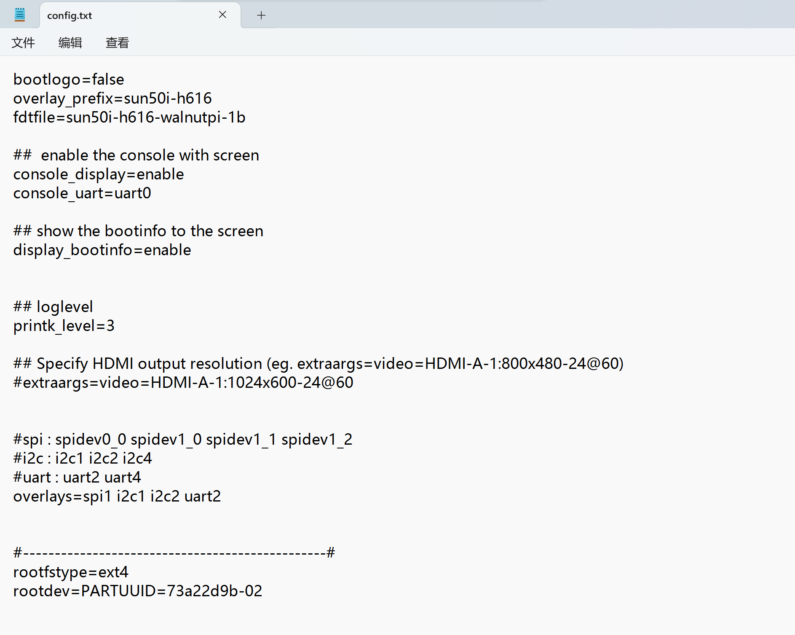
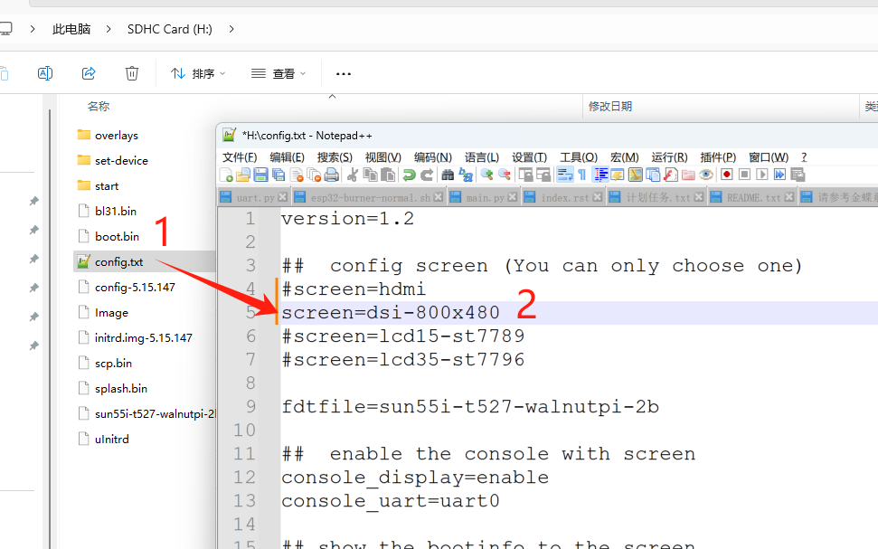

# config.txt

**config.txt is primarily used to configure certain features of the Walnut Pi.**

The SD card has two partitions, and config.txt is located in the first partition. On the Walnut Pi board, you can access config.txt under the `/boot` directory. If you read the SD card on a Windows computer using a card reader, the second partition is in ext4 format (unrecognizable by Windows), and the system may show an error about the SD card being corrupted—simply ignore this.




## Display Configuration

The default display is via HDMI (`screen=hdmi`). You can modify the parameter to enable other display outputs.

- Walnut Pi Official 1.54-inch SPI Display

```bash
screen=lcd15-st7789
```

- Walnut Pi Official 3.5-inch SPI Display

```bash
screen=lcd35-st7796
```
- Walnut Pi Official 5.5-inch MIPI Display (1920x1080)

```bash
screen=dsi-1920x1080
```

- Walnut Pi Official 10.1-inch MIPI Display (1280x800)

```bash
screen=dsi-1280x800
```

- Third-party Raspberry Pi MIPI Display (800x480)

```bash
screen=dsi-800x480
```




## Enable or Disable Console Terminal on Display (HDMI or LCD)
`console_display` is enabled by default. If disabled, after the boot messages finish, there will no longer be a terminal prompt asking for login credentials.

Typical use case: You write a Qt program to display on the framebuffer and set it to auto-start at boot. If the display terminal is not turned off, all your keyboard input will be received by both the Qt window and the terminal simultaneously. The terminal will also output information to the display.

- Enable
```
console_display=enable
```
- Disable
```
console_display=disable
```

## Set Serial Terminal Location
`console_uart`: uart0 is the default serial terminal. It can be reconfigured to other serial ports.

U-Boot information is always output from uart0.

- Set to UART2
```
console_uart=uart2
```


## Enable or Disable Boot Messages on Display
`display_bootinfo` is enabled by default. If disabled, the boot log messages will not appear on the display.

- Enable
```
display_bootinfo=enable
```
- Disable
```
display_bootinfo=disable
```

## Kernel Log Output Level
`printk_level` defaults to 3. When drivers output information, each message has a level number. Messages with a level lower than this variable's value will be directly output to the terminal.

| Number | Meaning |
| - | - |
| 0 | System is unusable 
| 1 | Must take immediate action
| 2 | Critical
| 3 | Error
| 4 | Warning
| 5 | Normal but significant
| 6 | Informational
| 7 | Debug


## Enable Device Tree Overlays
`overlay_prefix`: Specifies the device tree file prefix, default is `sun50i-h616`.

`overlays`: This variable indicates which device tree overlays the Linux kernel will load at boot. For example, when `overlays=spi1`, the system will load the `sun50i-h616-spi1.dtbo` device tree file from the `/boot/overlays` directory.

We provide a `set-device` command that scans all device tree files under `/boot/overlays` and enables/disables them with a single command ---> [set-device](../gpio/gpio_config)
