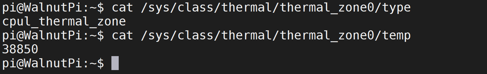
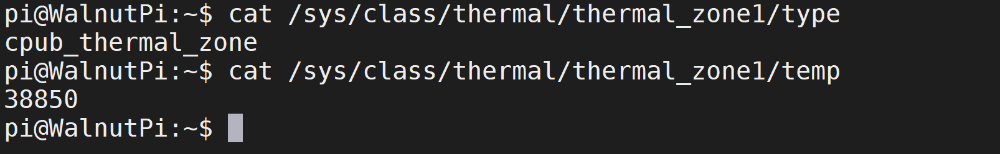
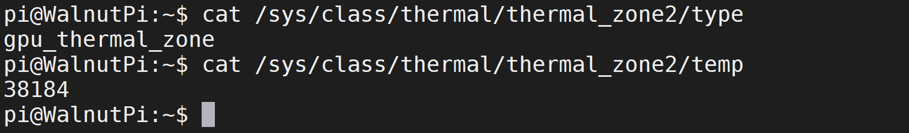
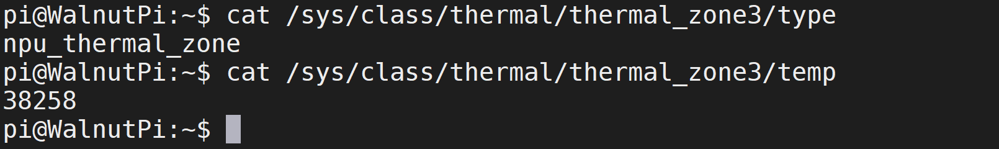
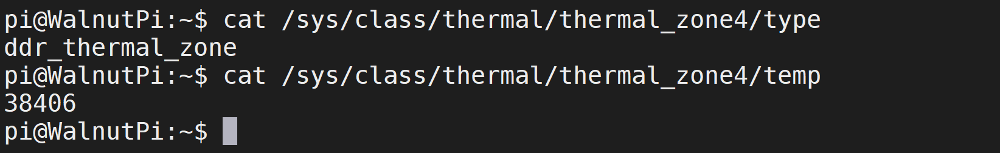
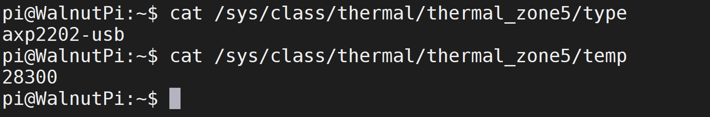

# Temperature Information

The Walnut Pi 2B's T527 chip has 6 temperature sensors:

- `sensor0`: CPUL (Little Core) temperature
- `sensor1`: CPUB (Big Core) temperature
- `sensor2`: GPU temperature
- `sensor3`: NPU temperature
- `sensor4`: DDR temperature
- `sensor5`: PMIC temperature

::::tip Note
Temperature values retrieved by the commands below need to be divided by 1000.
::::

## CPU Temperature

### CPUL

Check sensor type command:

```bash
cat /sys/class/thermal/thermal_zone0/type
```

Check temperature command:
```bash
cat /sys/class/thermal/thermal_zone0/temp
```



### CPUB

Check sensor type command:

```bash
cat /sys/class/thermal/thermal_zone1/type
```

Check temperature command:
```bash
cat /sys/class/thermal/thermal_zone1/temp
```



## GPU Temperature

Check sensor type command:

```bash
cat /sys/class/thermal/thermal_zone2/type
```

Check temperature command:
```bash
cat /sys/class/thermal/thermal_zone2/temp
```



## NPU Temperature

Check sensor type command:

```bash
cat /sys/class/thermal/thermal_zone3/type
```

Check temperature command:
```bash
cat /sys/class/thermal/thermal_zone3/temp
```



## DDR Temperature

Check sensor type command:

```bash
cat /sys/class/thermal/thermal_zone4/type
```

Check temperature command:
```bash
cat /sys/class/thermal/thermal_zone4/temp
```



## PMIC Temperature

Check sensor type command:

```bash
cat /sys/class/thermal/thermal_zone5/type
```

Check temperature command:
```bash
cat /sys/class/thermal/thermal_zone5/temp
```


