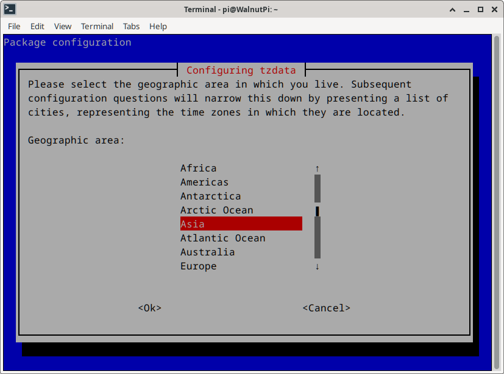
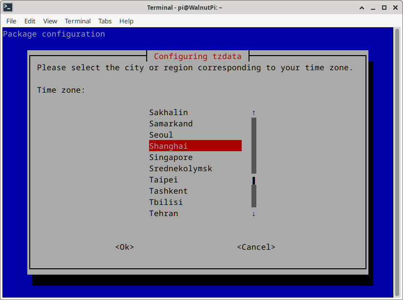
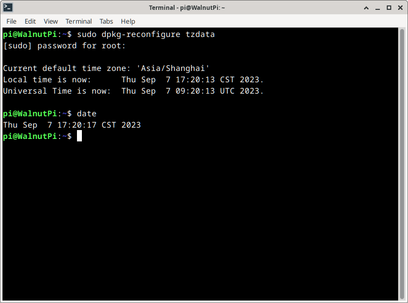

# Time Settings

When the Linux system starts, it automatically synchronizes the network time, but it uses the UTC (London time) by default. For use in China, you need to change the timezone to **Asia/Shanghai** so that the `date` command returns the correct time.

Run the command:
```bash
sudo dpkg-reconfigure tzdata
```
Select Asia and press Enter.


Select Shanghai and press Enter.


After configuration, you can use the `date` command to check the time:
```bash
date
```

