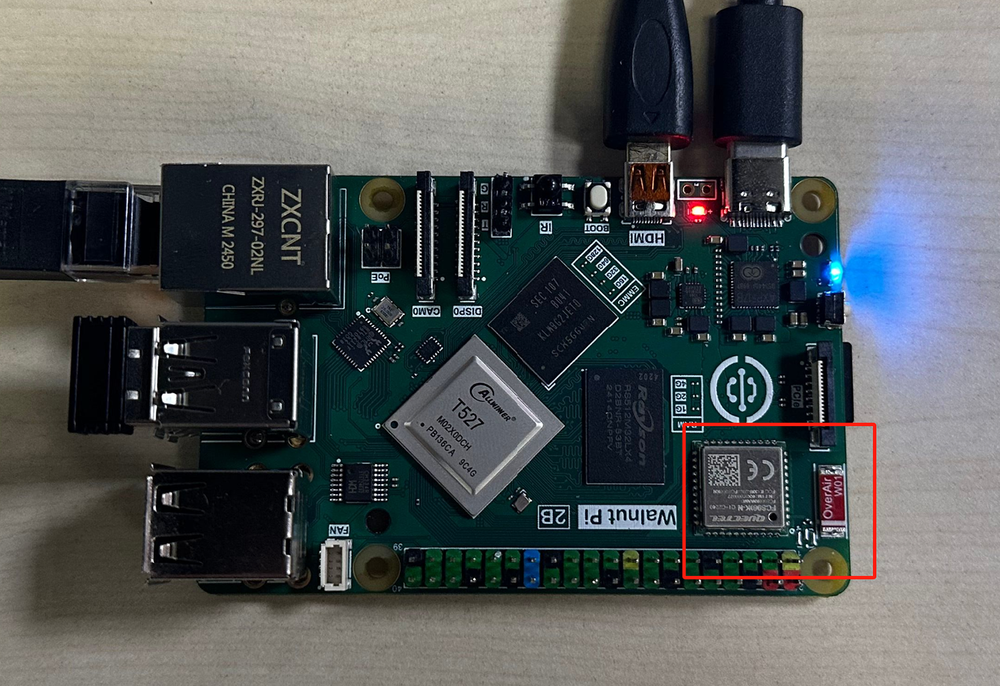
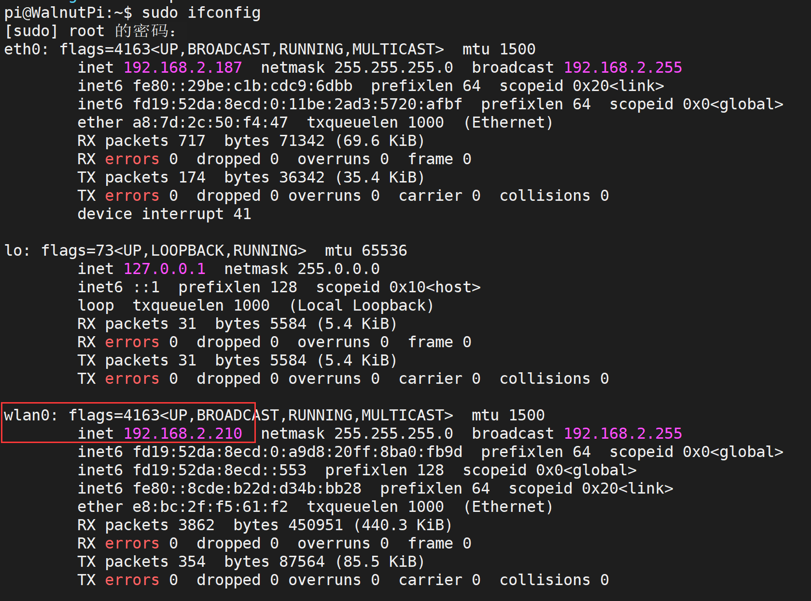
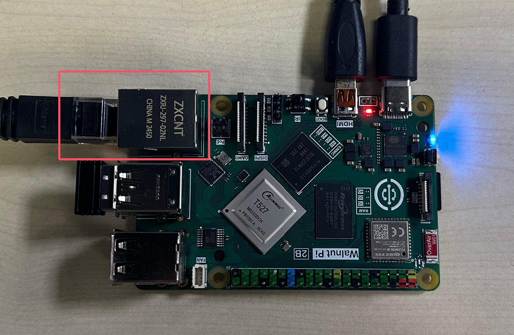

# IP Address

## WiFi IP Address

WiFi module hardware location—connects wirelessly to the router (supports 2.4G and 5G signals):



Use the following command to retrieve all network IP addresses of the Walnut Pi. **wlan0** is the WiFi wireless adapter name; once connected, its IP address will be displayed.
```bash
sudo ifconfig
```



## Ethernet IP Address

Ethernet module hardware location—connects to the router via Ethernet cable:



Use the following command to retrieve all network IP addresses of the Walnut Pi. **eth0** is the Ethernet adapter name; once connected, its IP address will be displayed.
```bash
sudo ifconfig
```


