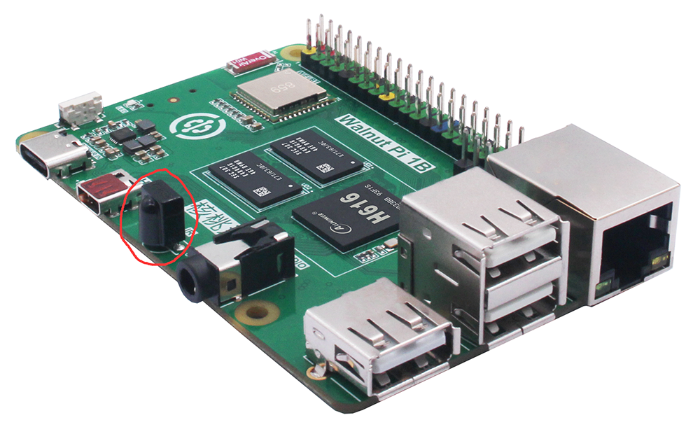
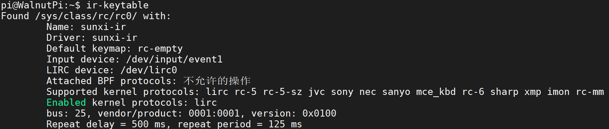
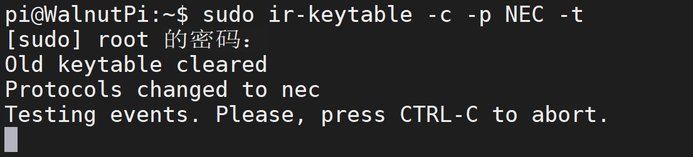
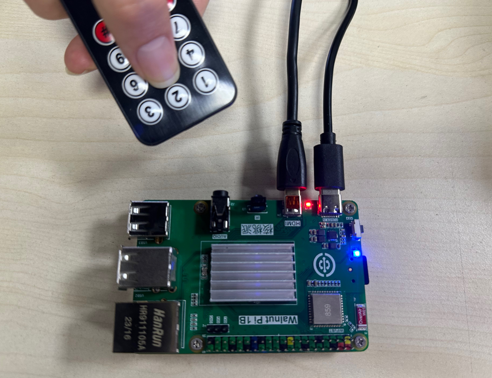
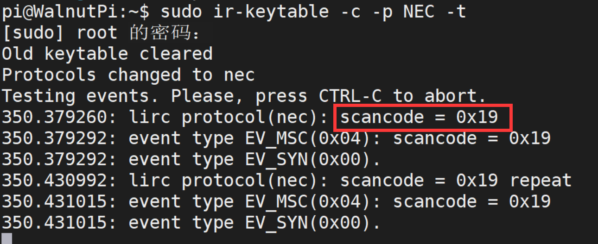

# IR Receiver

The Walnut Pi has 1 onboard infrared receiver.



The Walnut Pi system comes pre-installed with **ir-keytable** software, which can be used to view IR device information and test IR reception decoding.

## Viewing Device Information

Run the following command in the terminal to view IR device information:

```bash
ir-keytable
```


## IR Reception Test

First, you will need a commonly available remote control, such as the one shown below, which is easy to purchase.


Enter the following command in the terminal and wait for IR remote signals:

```bash
sudo ir-keytable -c -p NEC -t
```



Point the remote control at the IR receiver and press any button:



You will see the received IR code in the terminal:


