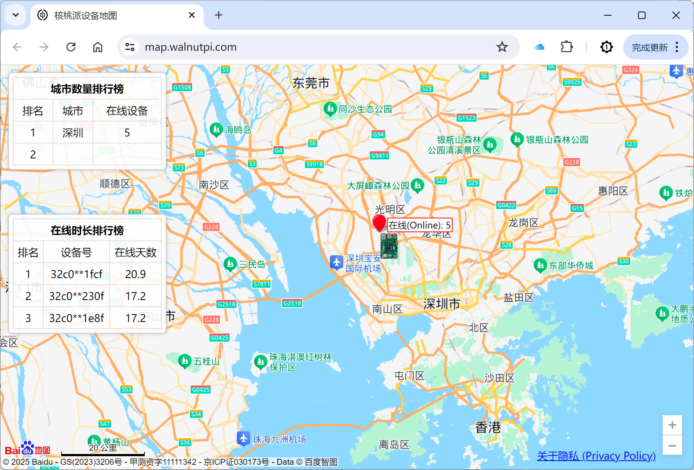

# Device Map

The Walnut Pi Device Map is a unique feature of the Walnut Pi system. It retrieves the board's location via IP address and displays it on a map, pinpointed to the city level. [Device Map Link](https://map.walnutpi.com)



This feature is enabled by default. Users can disable it manually:

**Disable command:**

```bash
systemctl disable map_device.service
```

Takes effect after rebooting.

**Enable command:**

```bash
systemctl enable map_device.service
```

Takes effect after rebooting.
