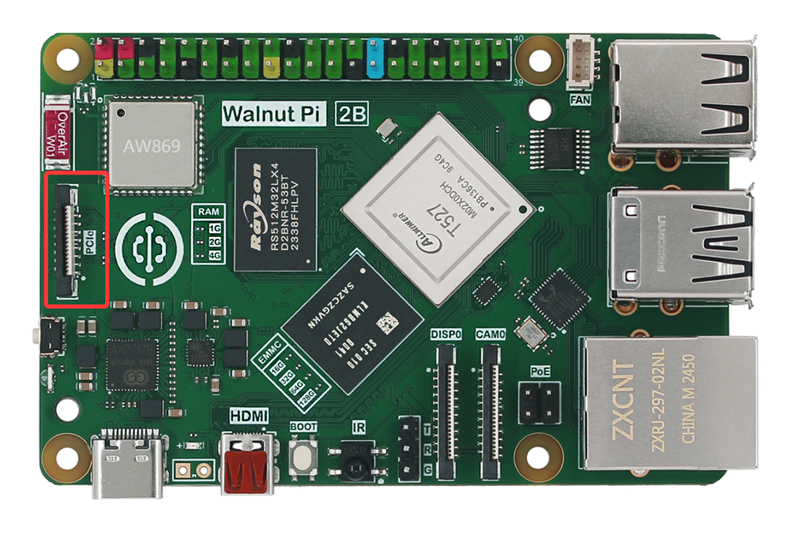
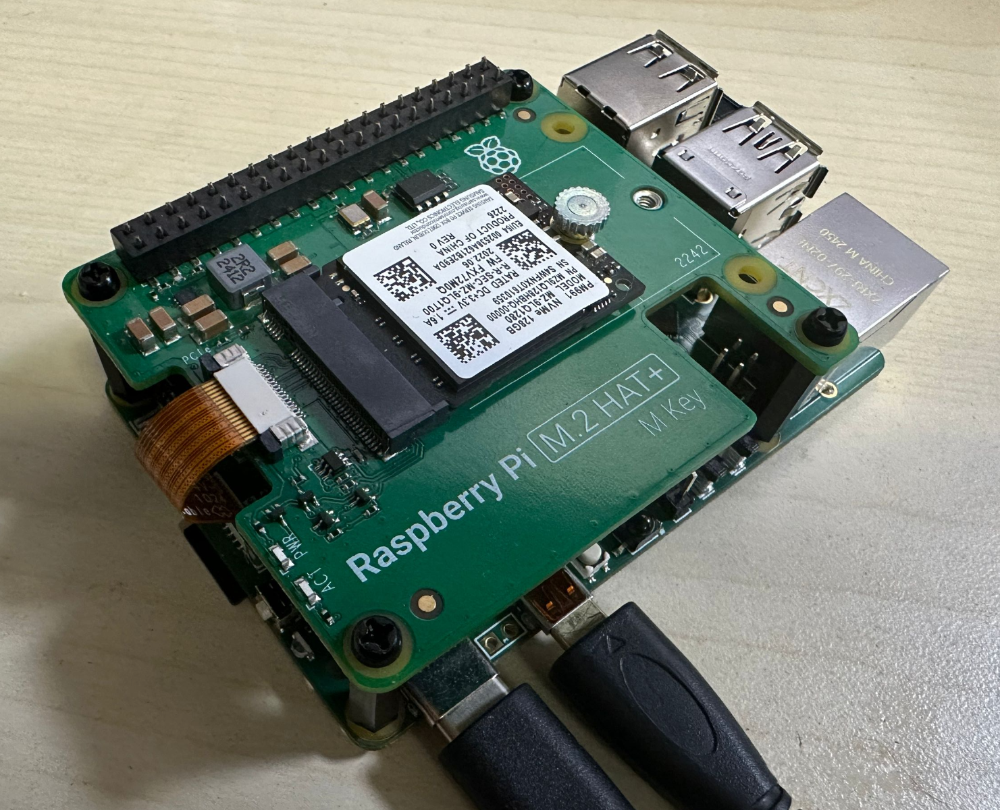
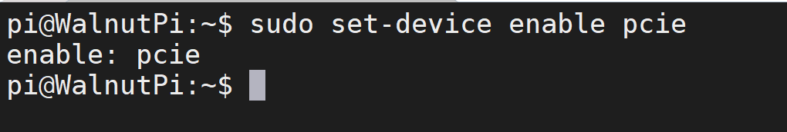
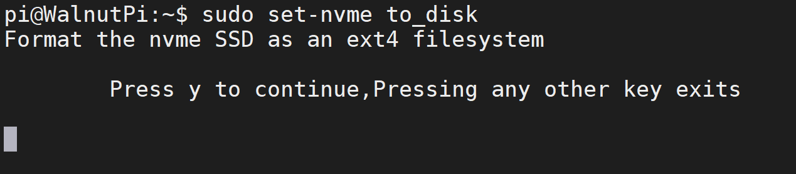
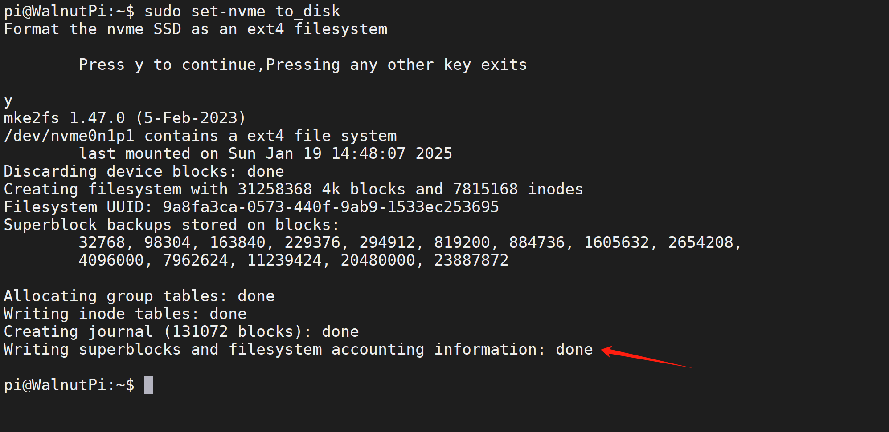
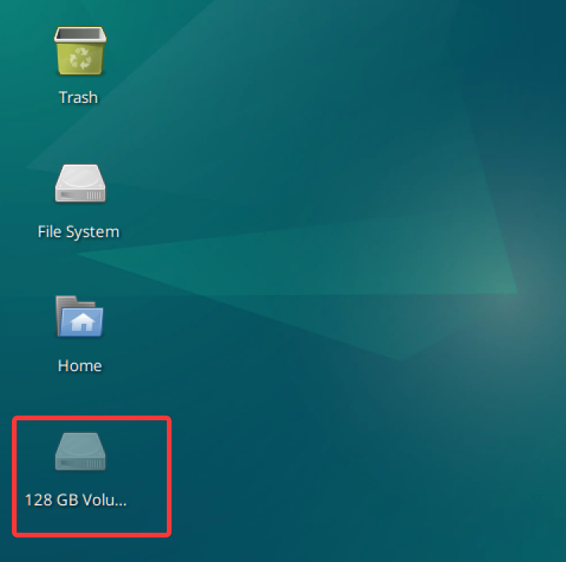
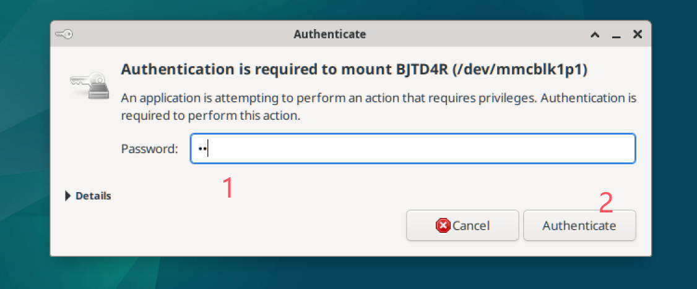

# NVMe SSD

The Walnut Pi 2B features a PCIe 2.1 interface that supports NVMe protocol SSDs—the fastest non-volatile storage medium on the Walnut Pi 2B.



The Walnut Pi PCIe 2.1 interface is compatible with Raspberry Pi 5. Users can purchase the Raspberry Pi 5 official SSD adapter board or third-party adapter boards, connecting them to the Walnut Pi 2B via a 16-pin ribbon cable.



## Enabling the PCIe 2.1 Interface

Since the Walnut Pi 2B's USB 3.0 and PCIe 2.1 share the same pins, the system defaults to USB 3.0 at boot. First, use the following command to configure the system to enable PCIe 2.1:

```bash
sudo set-device enable pcie
```



Takes effect after reboot:

```bash
sudo reboot
```

## Configuring as a Storage Drive

Once enabled, configure the NVMe SSD as a usable drive for the Walnut Pi 2B. The Walnut Pi system includes a quick configuration command:

```bash
sudo set-nvme to_disk
```

::::danger Warning
This command configures the NVMe SSD as a Walnut Pi storage drive. It will format the NVMe SSD and erase all content. Please back up any important files beforehand.
::::

After running the command, a confirmation prompt will appear. Press "y" to continue:



**Execution will take tens of seconds depending on the drive capacity. Please wait patiently.** Upon completion, it will appear as shown below:



You will see a drive on the desktop with the capacity of the NVMe SSD.



Double-click to mount and use it. When the authentication prompt appears, enter the system password, i.e., `pi`.


