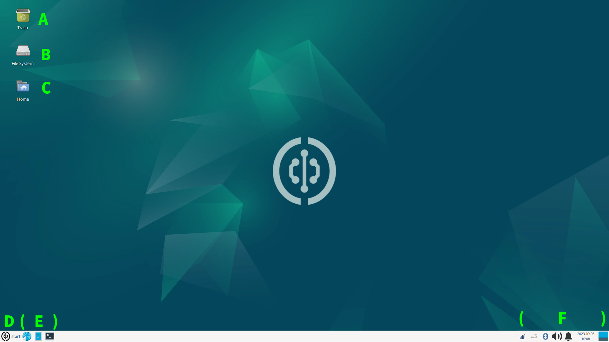
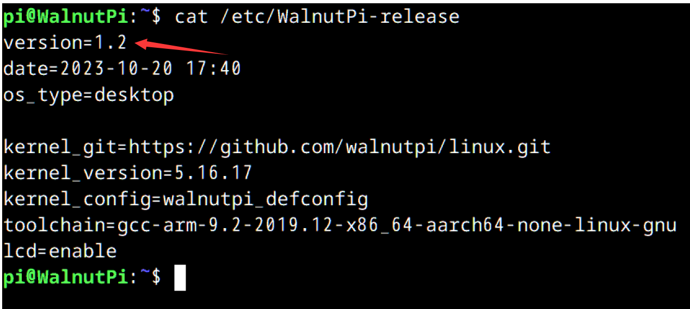

# OS Introduction

In the previous chapter, we powered on the Walnut Pi and logged into the system. The main difference between the Desktop and Server editions: you can think of the Server edition as the Desktop edition with the desktop removed. Therefore, standard Linux commands and configuration instructions are generally universal across both systems.

::::tip Note

The first boot of the Walnut Pi Desktop Edition takes quite a while—approximately several minutes—as it needs to initialize software and services. Please be patient and wait for the system desktop to appear. Subsequent boots will be much faster, taking only about tens of seconds.

:::: 

<br></br>

- `Normal User (Default)` Username: pi ; Password: pi
- `Root Account` Username: root ; Password: root

## Desktop Features
The Walnut Pi Debian system has been customized and modified to be closer to Windows, lowering the barrier to entry for users. Below is an overview of the desktop features.



**<font color='#06fe00' size='4'>A&nbsp;</font>** **<font size='4'>Trash</font>** &nbsp;&nbsp;&nbsp;&nbsp;&nbsp;&nbsp;
**<font color='#06fe00' size='4'>B&nbsp;</font>** **<font size='4'>File System</font>** &nbsp;&nbsp;&nbsp;&nbsp;&nbsp;&nbsp; 
**<font color='#06fe00' size='4'>C&nbsp;</font>** **<font size='4'>Current User Files</font>** &nbsp;&nbsp;&nbsp;&nbsp;&nbsp;&nbsp; 
**<font color='#06fe00' size='4'>D&nbsp;</font>** **<font size='4'>Menu Bar</font>** &nbsp;&nbsp;&nbsp;&nbsp;&nbsp;&nbsp; 

**<font color='#06fe00' size='4'>E&nbsp;</font>** **<font size='4'>Launch Bar:</font>** <font size='4'>From left to right: **Browser, File Manager, Terminal**</font>

**<font color='#06fe00' size='4'>F&nbsp;</font>** **<font size='4'>System Tray:</font>** <font size='4'>From left to right: **Network, Input Method, Bluetooth, Sound, Notifications, Date & Time, Quick Desktop**</font>

## Browser
The Walnut Pi system comes pre-installed with Chromium (Google Chrome Mini). It is located as the first item in the Launch Bar and works just like any regular computer browser.


## File Manager
The File Manager is the second item in the Launch Bar. Opening it reveals all files on the Walnut Pi, which are stored on the SD card.


## System Settings
System Settings can be found in the Start Menu. Users can configure various Walnut Pi system features according to their needs.


## System Version Query

You can check the current Walnut Pi system version with the following command:

```bash
cat /etc/WalnutPi-release
```



## OTA System Update

You can fetch upgrade packages from the Walnut Pi cloud server via a command, enabling remote system upgrades without the need to re-burn the image each time.

OTA update command:

```bash
sudo wpi-update
```


