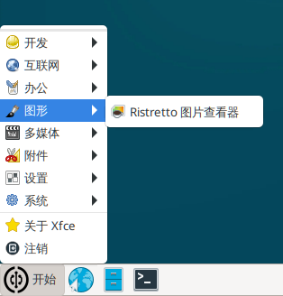
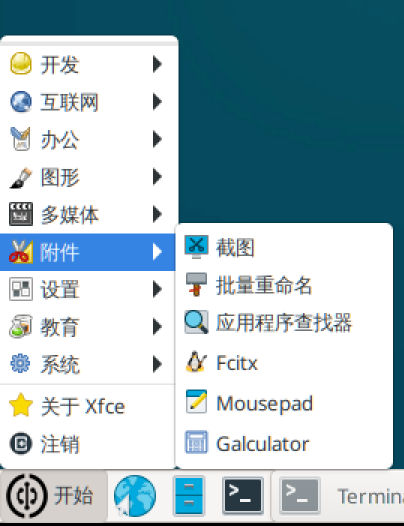

# Pre-installed Software

The Walnut Pi system comes with several pre-installed applications for user convenience. This section provides a brief introduction to these applications, which can be found in the Start Menu.

## Programming & Development


### Geany
Geany is a compact integrated development environment and free open-source software. Walnut Pi C programming will use Geany.

### Thonny
Thonny is a lightweight Python IDE primarily used for Python programming and development. Walnut Pi's Python embedded programming content mainly uses Thonny. Thonny can also be used for developing MicroPython hardware (pyboard, ESP32, etc.) connected to the Walnut Pi.

## Internet


### Chromium Browser
Google's mini browser, used for browsing the web. It is also the default browser on the Walnut Pi system.

### VNC Viewer
A VNC client that can remotely access the desktop of a computer running a VNC server.

## Office


### LibreOffice
This is an open-source office suite for Linux that can open and edit Word, Excel, PPT, and related files.

## Graphics



### Ristretto Image Viewer
Ristretto Image Viewer can open common JPG and PNG files.

## Multimedia


### PulseAudio Volume Control
Adjusts the volume of the 3.5mm audio output jack.

### VLC Media Player
Used for playing multimedia files such as MP3 and MP4.

## Accessories



### Screenshot
Screenshot software.

### Mousepad Text
A lightweight text editor.

### Galculator
Calculator.

## System


### Task Manager
View system CPU and memory usage, as well as running processes.

### Xfce Terminal
The default terminal on the Walnut Pi system.

### btop

Starting from Walnut Pi OS v2.4.0, the btop system monitoring tool has been added. Compared to the Task Manager, it provides more comprehensive system information and can be used on both Desktop and Server editions.

Desktop edition command:

```bash
btop
```

Server (headless) edition command:

```bash
btop --utf-force
```


