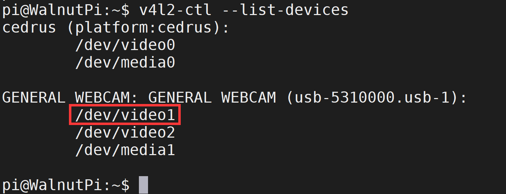
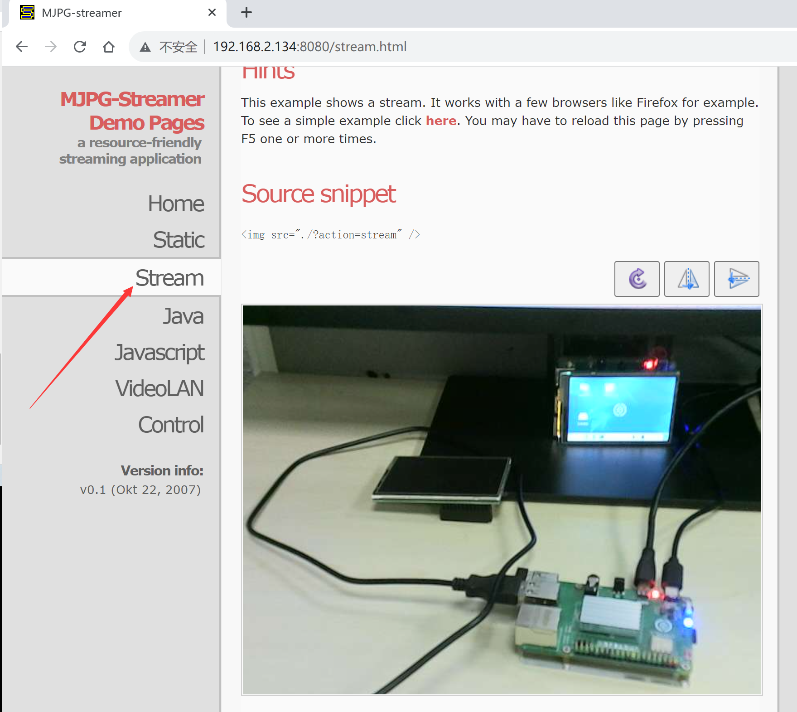

# USB Camera

The Walnut Pi system has built-in USB camera drivers. Most USB cameras on the market are supported. This tutorial uses the following model as an example:


Simply plug it into any USB port on the Walnut Pi.


## Getting Device Information

First, use `v4l2-ctl` to view the current USB camera device information. Install v4l—most Walnut Pi software can be installed via `sudo apt install`:

```bash
sudo apt install v4l-utils
```

After installation, run the following command to view the connected USB camera information:

```bash
v4l2-ctl --list-devices
```

You can see that this camera has multiple video devices, with the first one usually being the correct one. Here it's: video1

 

## Testing with mjpg-streamer

### Download the Project

Project URL: https://github.com/jacksonliam/mjpg-streamer 

We'll use git to clone it for easy updates later.

```bash
git clone https://github.com/jacksonliam/mjpg-streamer.git
```

 

::::tip Note

If you don't have access to GitHub, you can open the project URL in a browser, click **Code -- Download Zip** to download the project files, and then copy them to the Walnut Pi.

::::
 

You'll also need to install the dependency packages:

```bash
sudo apt install -y cmake libjpeg62-turbo-dev
```

### Build and Install

Next, execute the following commands to build and install mjpg-streamer:

```bash
cd mjpg-streamer/mjpg-streamer-experimental
```

```bash
make -j4
```

```bash
sudo make install
```

### Start and Test

After installation, run the following command to start mjpg_streamer. Note that we use video1 here—replace it with your actual device number.

```bash
export LD_LIBRARY_PATH=.
```

```bash
sudo ./mjpg_streamer -i "./input_uvc.so -d /dev/video1 -u -f 30" -o "./output_http.so -w ./www"
```

Upon successful startup, you'll see the output below (some error messages can be safely ignored):
 

Open a web browser on a computer on the same LAN (typically connected to the same router) and enter the Walnut Pi's IP address with port 8080, e.g.: 192.168.2.134:8080. The mjpg_streamer homepage will appear. **You can also do this directly in the Walnut Pi's Desktop edition browser.**

 

Click Stream to view the real-time video feed from the camera.

 
