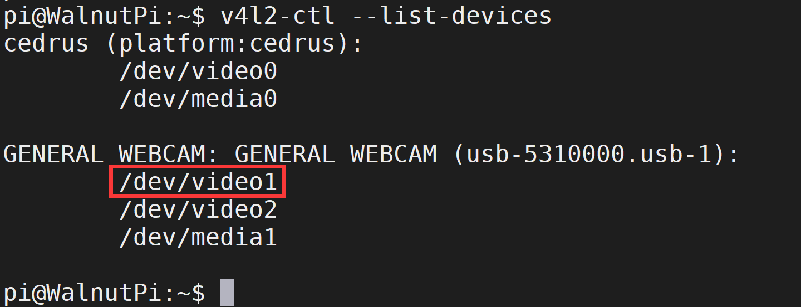
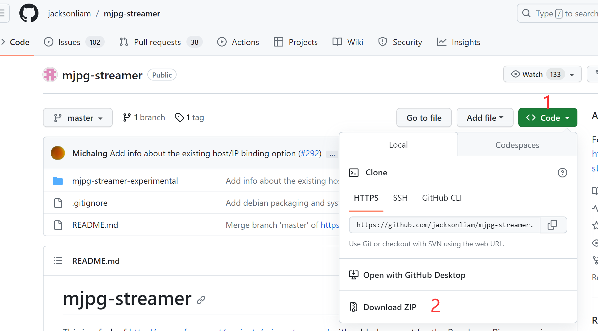
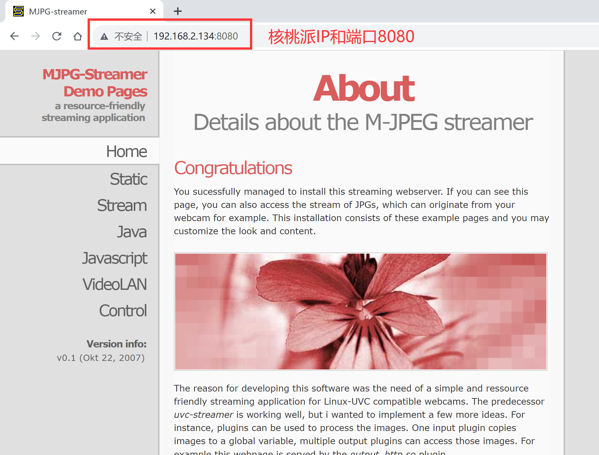
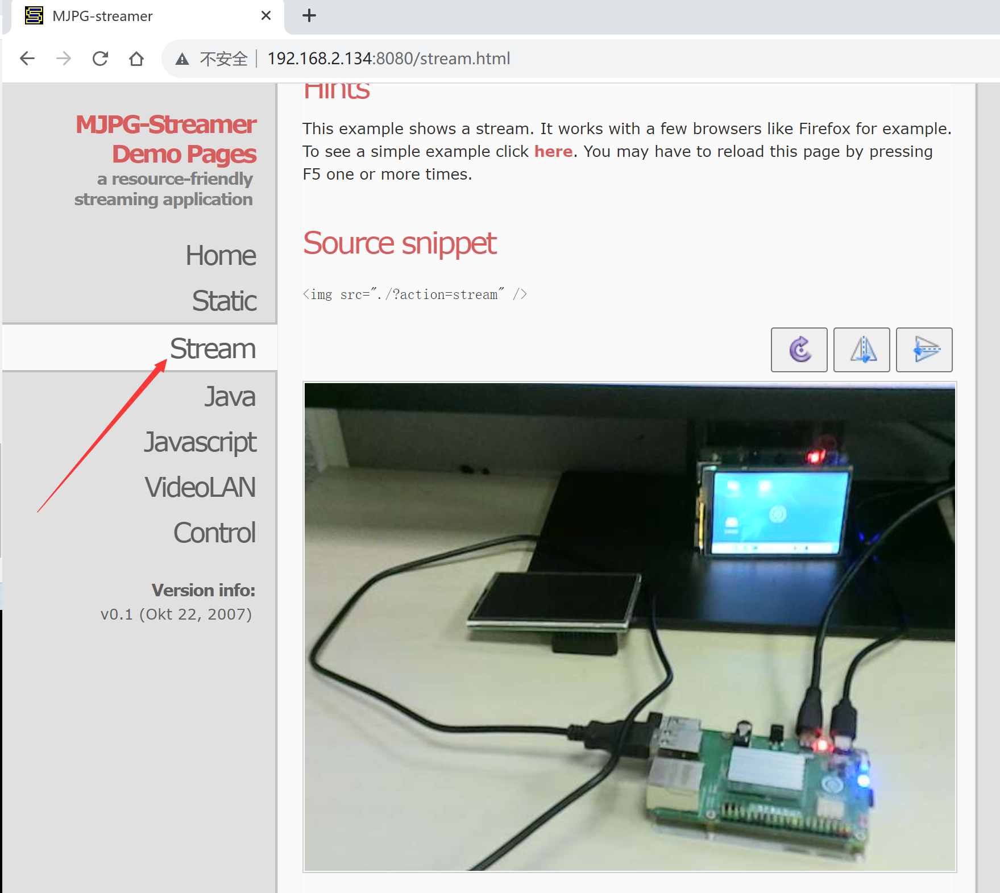

# USB摄像头

核桃派系统内置USB摄像头驱动。市面上大部分USB CAM都可以使用，这里使用下面这款讲解：


直接插到核桃派其中一个USB口就好。


## 获取设备信息

先使用v4l2-ctl查看当前USB摄像头设备信息，这要安装 v4l ，核桃派大部分软件都可以通过 sudo apt install 方式安装：

```bash
sudo apt install v4l-utils
```

安装完成后运行下面指令查看插入的USB摄像头信息：

```bash
v4l2-ctl --list-devices
```

可以看到这款摄像头有多个video，通常是第一个。这里是：video1

 

## 使用 mjpg-streamer 测试

### 下载项目

项目地址：https://github.com/jacksonliam/mjpg-streamer 

这里使用git方式下载，方便以后更新。

```bash
git clone https://github.com/jacksonliam/mjpg-streamer.git
```

 

:::tip 提示

如果没有科学上网条件，可以用浏览器打开项目地址，点击**Code -- Download Zip** 下载项目文件然后拷贝到核桃派。

:::
 

另外还需要安装一下依赖软件：

```bash
sudo apt install -y cmake libjpeg62-turbo-dev
```

### 编译和安装

接下来执行下面指令编译和安装 mjpg-streamer 

```bash
cd mjpg-streamer/mjpg-streamer-experimental
```

```bash
make -j4
```

```bash
sudo make install
```

### 启动测试

安装完成后输入下面命令启动 mjpg_streamer ，注意我们这里是video1，具体根据你的设备号来填写。

```bash
export LD_LIBRARY_PATH=.
```

```bash
sudo ./mjpg_streamer -i "./input_uvc.so -d /dev/video1 -u -f 30" -o "./output_http.so -w ./www"
```

启动成功后如下图，部分error提示可以忽略：
 

在同一局域网（通常是同一路由器下）的电脑打开浏览器，输入核桃派IP地址和端口8080 ，如：192.168.2.134:8080 ，打开网页，可以看到 mjpg_streamer 的主页出来了。**你也可以直接在核桃派的桌面系统的浏览器这么操作。**

 

点击Stream, 就可以看到摄像头实时采集的视频流。

 
