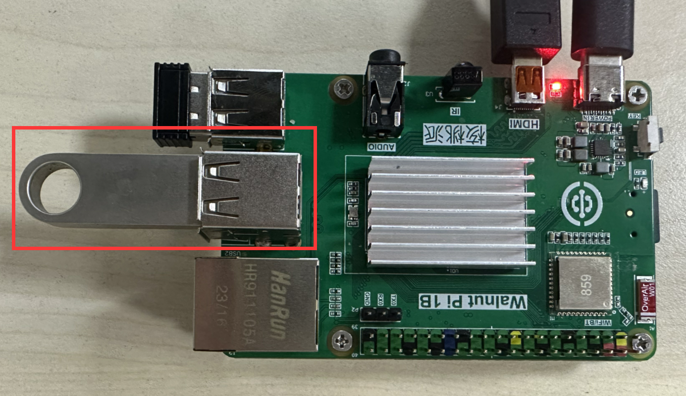
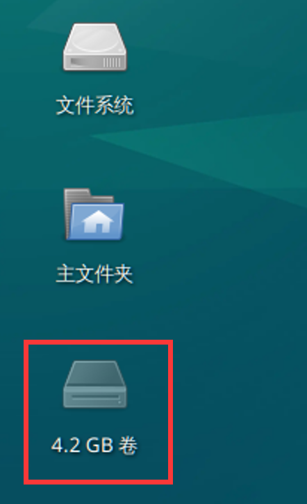
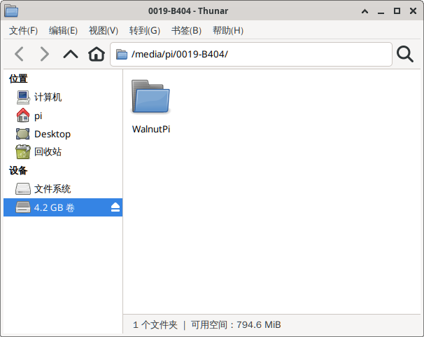
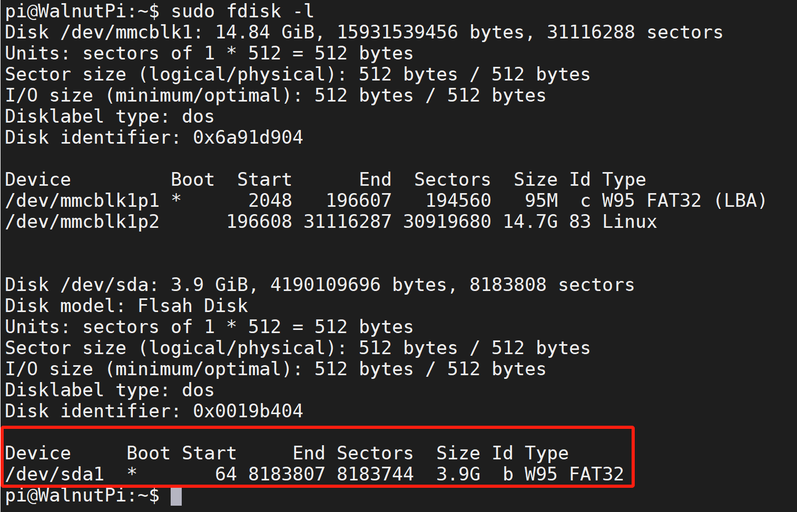
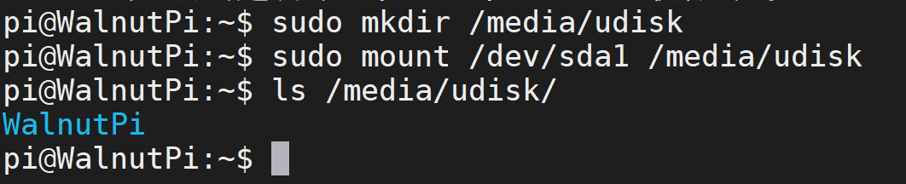

# USB Drive Mounting

Insert the USB drive into one of the Walnut Pi's USB ports.



## Desktop Edition

The Desktop edition behaves similarly to a Windows PC: after inserting a USB drive, a semi-transparent USB drive icon will appear on the desktop.



Simply double-click the icon to mount and open the USB drive. You will see that the USB drive is located under the `/media/pi/` directory:



## Server Edition (Headless)

On the Server edition, you can use commands to mount the USB drive. **(This method also works on the Desktop edition)**

After inserting the USB drive, first check its information:
```bash
sudo fdisk -l
```


In this example, a 4GB USB drive is used. From the image above, you can see the device is: `/dev/sda1`.

Once you know the USB drive's device name, you can mount it using the **mount** command, typically to the `/media` or `/mnt` directory:

First, create an empty folder under `/media`. You can name it anything you like; here we'll use "udisk":
```bash
sudo mkdir udisk
```

Mount the USB drive:
```bash
sudo mount /dev/sda1 /media/udisk
```

Once mounted successfully, use the "**ls**" command to view the contents of the USB drive, confirming it is mounted successfully.
```bash
ls /media/udisk
```



You can unmount the USB drive with the following command:
```bash
sudo umount /media/udisk
```
