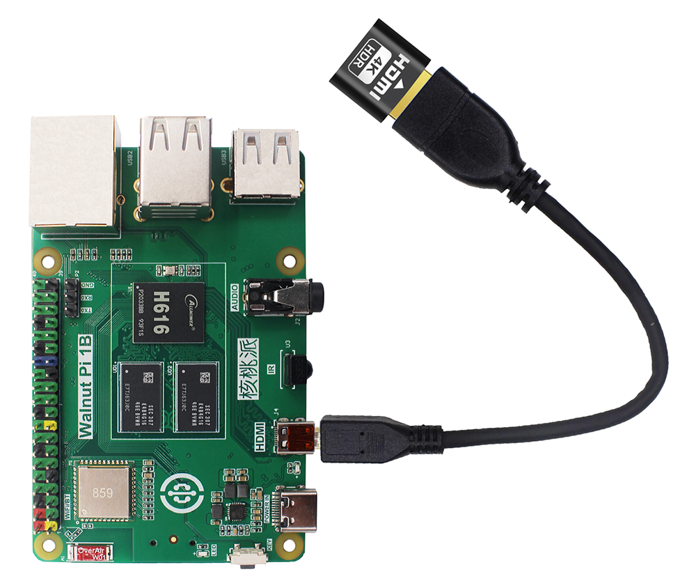
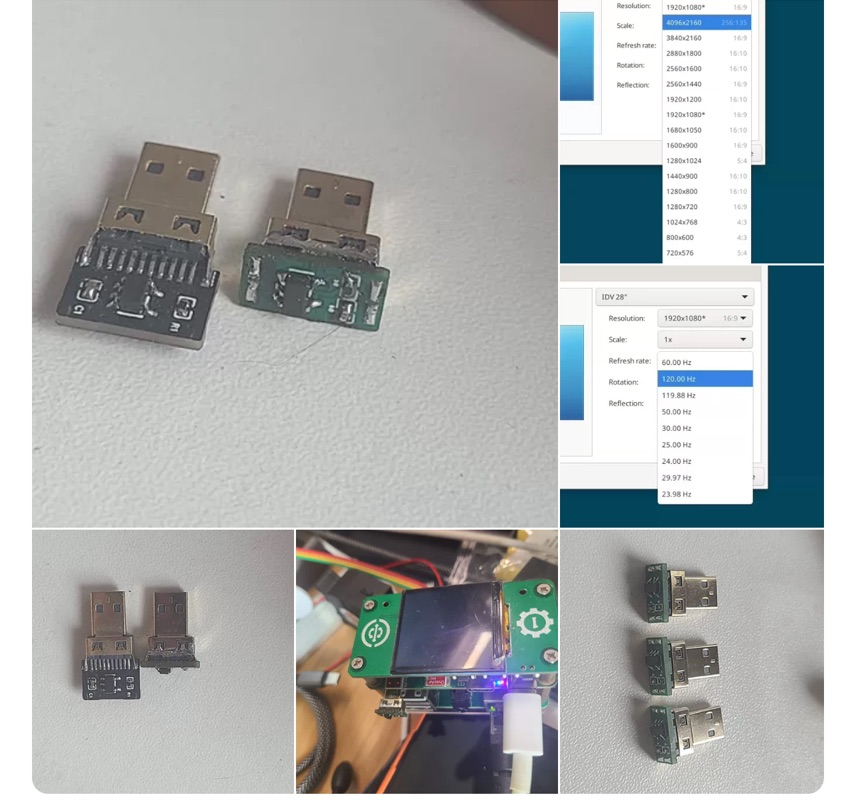
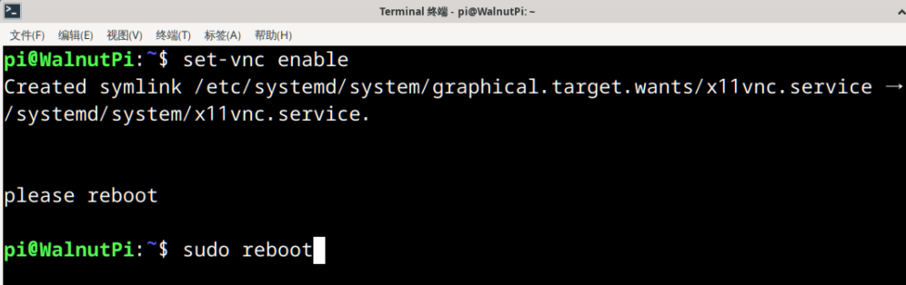
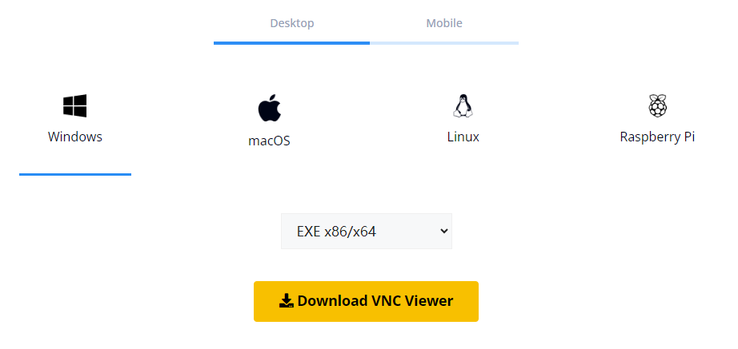
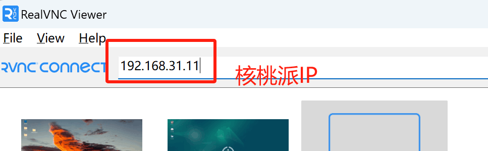
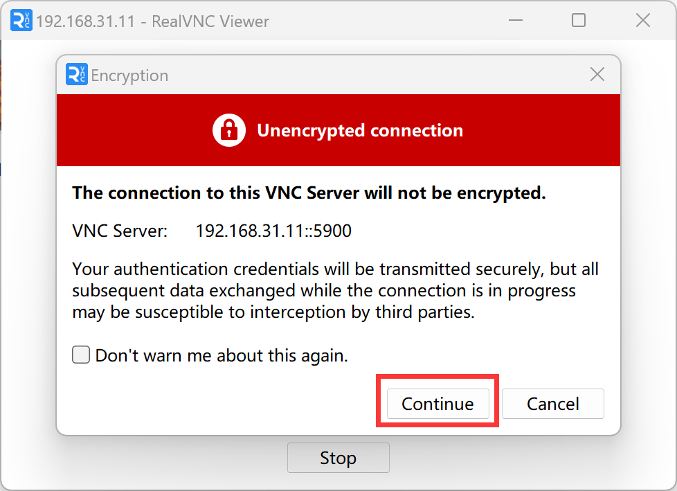

# VNC Remote Desktop

- **Video Tutorial**

<iframe src="//player.bilibili.com/player.html?isOutside=true&aid=1953508549&bvid=BV14C411n7TY&cid=1518749812&p=1" scrolling="no" border="0" frameborder="no" framespacing="0" allowfullscreen="true" width="100%" height="500"></iframe>

<br></br>
<br></br>

The Walnut Pi comes pre-installed with a VNC server. VNC is suitable for LAN-based desktop login (typically within the same router network). **Before using this service, make sure the Walnut Pi is connected to the router via Ethernet or WiFi.**

When using the Walnut Pi Desktop edition, you can use an HDMI display along with a keyboard and mouse for configuration and networking. Once the network and other parameters are set up, you can log into the Walnut Pi via remote desktop for computer-based control.

::::danger Warning
Currently, the Walnut Pi comes pre-installed with the X11VNC server. The advantage is that it directly remotes into the current desktop without consuming extra memory. However, during remote access, the Walnut Pi must remain connected to a display via HDMI; otherwise, you may experience lag or connection failures because the desktop hasn't fully loaded.

However, the whole point of using VNC is to save a display. A solution is to use a device called an **HDMI dummy plug**, which costs about 10+ yuan. Connect it to the Walnut Pi via a micro HDMI to HDMI female adapter to resolve the lag issue when no display is connected. [**Click to buy ->**](https://item.taobao.com/item.htm?spm=a213gs.success.result.1.6c854831c6UKif&id=741004778478) 
::::



In addition to the officially recommended one, you can also purchase a DIY HDMI dummy plug made by Walnut Pi users, which is more compact: [**Click to buy ->**](https://www.goofish.com/item?id=839752328610) 



## Enabling the VNC Service

Run the following command to enable it: (default password: **pi**, default port: **5900**)

```bash
set-vnc enable
```

After enabling, reboot the Walnut Pi:

```bash
sudo reboot
```




## Connecting to Walnut Pi via VNC from a PC

First, install VNC Viewer (the client, not the server) on your computer to connect to the Walnut Pi. Download link: https://www.realvnc.com/en/connect/download/viewer/



After installation, open the software and enter the Walnut Pi's IP address in the top bar. [How to obtain the IP address](../os_software/ip_get). **You do not need to enter a port number here, as the pre-installed VNC server on the Walnut Pi uses the default port 5900.**



Press Enter, then click "Continue" in the pop-up prompt:



The password is **pi**. You can check "Remember password" to avoid entering it again.


Click OK to log in successfully.


## Disabling the VNC Service

Once enabled, the VNC service starts automatically at boot. To disable it, use the following command and reboot for the change to take effect:

```bash
set-vnc disable
```

## Setting the Password

The default password is **pi**. For example, to set it to "12345678", use the following command:

```bash
set-vnc password 12345678
```

## Setting the Port

The default port is **5900**. For example, to change it to "5901", use the following command:

```bash
set-vnc port 5901
```

::::tip Note

Type "set-vnc " in the terminal and press the `Tab` key to view all available commands.

::::


