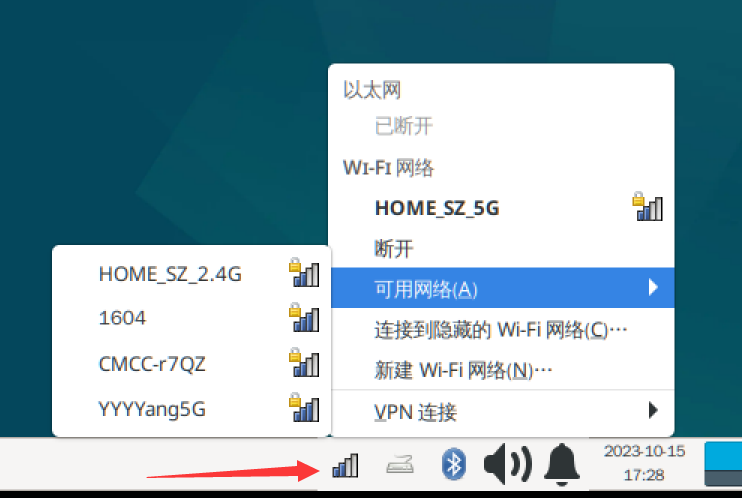

# WiFi Connection

- **Video Tutorial**

<iframe src="//player.bilibili.com/player.html?isOutside=true&aid=1303287491&bvid=BV16M4m1D7D4&cid=1511170283&p=1" scrolling="no" border="0" frameborder="no" framespacing="0" allowfullscreen="true" width="100%" height="500"></iframe>

<br></br>
<br></br>

Once the system is running, the first thing you'll probably want to do is connect to the internet. For Ethernet, simply plug in an Ethernet cable. Additionally, the Walnut Pi has an onboard dual-band WiFi module supporting both 2.4G and 5G WiFi networks.

## Connecting via Desktop Button

On the Desktop edition, simply click the network icon in the bottom-right corner, select **Available Networks**, choose your WiFi network, and enter the password to connect.




## Connecting via Command Line (Server Edition)

Connecting to WiFi via command line is suitable for the **Server edition** or for scenarios where you only access the system through the terminal. Here's how:

First, use the following command to get the list of available WiFi SSIDs:

```bash
nmcli dev wifi
```


::::danger Warning

You must first run the **nmcli dev wifi** command above to obtain WiFi information before proceeding with the connection.

::::
<br></br>

Press **Ctrl+C or Ctrl+Z** to interrupt the above command.

Next, use the following command to connect to a specific WiFi network (sudo root privileges are required). In the example below, "walnutpi" is the WiFi SSID and "88888888" is the password. Replace these with your own WiFi credentials.
```bash
sudo nmcli dev wifi connect walnutpi password 12345678
```
<br></br>

After a successful connection, you can use the following command to check the WiFi connection status. The presence of an IP address indicates a successful connection.
```bash
sudo ifconfig
```
wlan0 indicates the WiFi connection with an IP address shown below it, while eth0 indicates the Ethernet connection.


