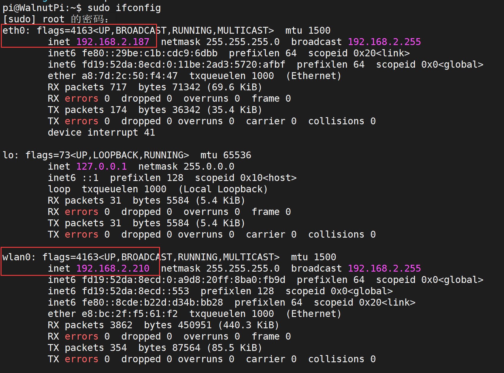

# WiFi连接

- **视频教程**

<iframe src="//player.bilibili.com/player.html?isOutside=true&aid=1303287491&bvid=BV16M4m1D7D4&cid=1511170283&p=1" scrolling="no" border="0" frameborder="no" framespacing="0" allowfullscreen="true" width="100%" height="500"></iframe>

<br></br>
<br></br>

系统运行后我们最想做的应该是连接到互联网了，以太网的话直接插入网线即可联网。除此之外核桃派板载双频WiFi模块，支持连接2.4G、5G WiFi网络。

## 桌面按钮连接

带桌面系统可以直接点击右下角网络按钮，选择**可用网络**，选择自己的WiFi输入账号密码即可连接。


## 指令连接（无桌面系统）

通过指令连接WiFi适用于**无桌面版系统**或只使用终端登录系统的场景。方法如下：

先通过下面命令来获取当前可连接WiFi SSID：

```bash
nmcli dev wifi
```


:::danger 警告

务必先执行上方 **nmcli dev wifi** 指令获取WiFi信息后才能进行下一步开始连接。

:::
<br></br>

按**Ctrl+C或Ctrl+Z**中断上面指令。

接下来通过下面指令连接指定的WiFi(需要加sudo管理员权限)。下方 "walnutpi" 为wifi账号，"88888888" 为密码。你需要替换成你自己的WiFi账号密码。
```bash
sudo nmcli dev wifi connect walnutpi password 12345678
```
<br></br>

连接成功后可以使用下面指令查看wifi连接情况，有IP地址说明连接成功。
```bash
sudo ifconfig
```
wlan0表示WiFi连接，下方有IP地址，eth0则表示以太网口连接。




