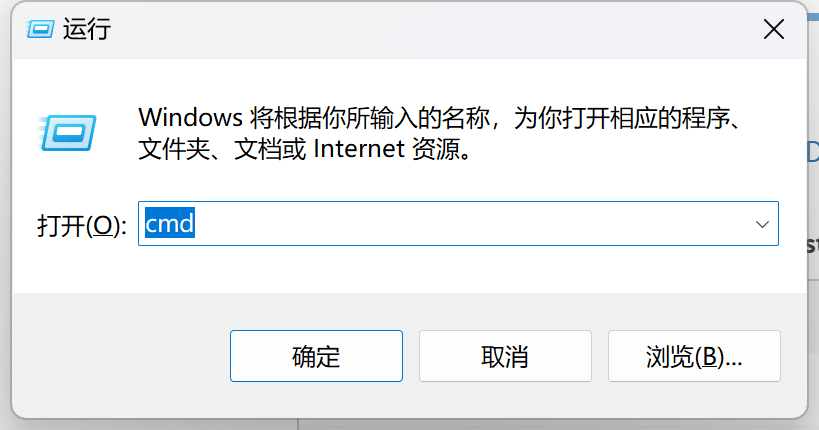
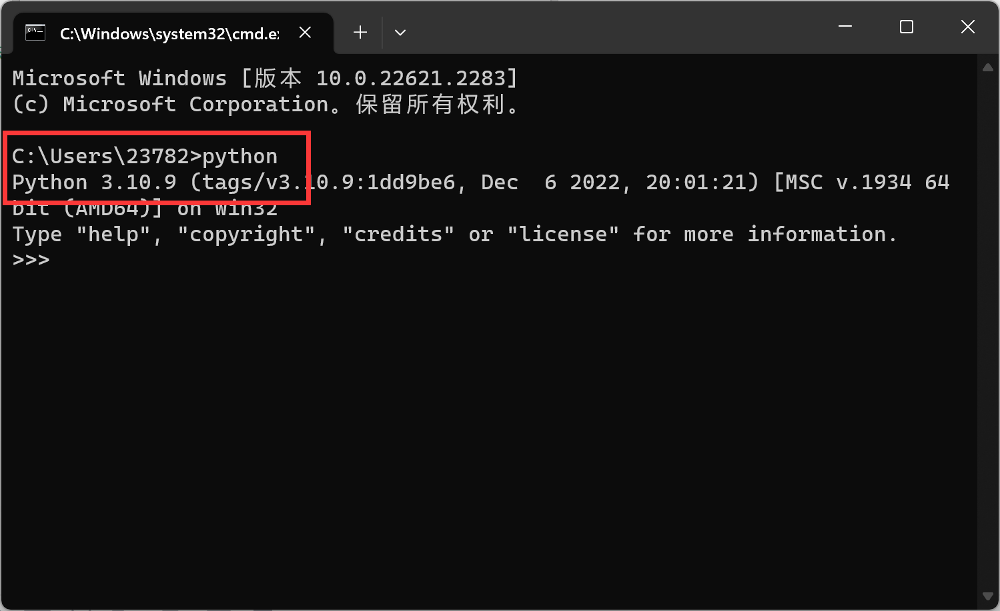
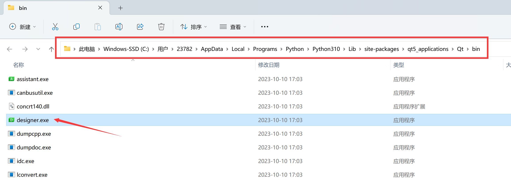

# Development Environment Setup

## WalnutPi

The WalnutPi factory system comes with PyQt5 pre-installed, and the desktop version comes pre-installed with QT Designer. QT Designer is a powerful visual GUI design tool that greatly improves development efficiency when designing GUIs.

:::tip Note

It is recommended to use the WalnutPi desktop version system for development, as it facilitates debugging.

:::

### PyQt5

PyQt5 can be verified with the following command:

Since PyQt5 is a series of Python libraries, first enter Python:

``` bash
python
``` 

Then import it, paying attention to letter case. If no error occurs, the system has it installed. If it says the library is not found, please re-flash the latest image.

``` python
import PyQt5
``` 


### Qt Designer

The WalnutPi system comes with QT Designer pre-installed, located in the **Start Menu--Development** directory:


After opening, the software interface looks like this:


## Windows

One of the great benefits of PyQt5 is its strong portability, meaning the code is universal across Windows, Mac, and Linux. If you want to develop on Windows and then use the code on WalnutPi, that's perfectly fine.

### Install Python

1. Make sure your computer has Python3 installed. Run the python command in the terminal to check:

In Windows, press `Win` + `R`, type cmd to quickly open the terminal:



If you can see the Python version after typing **python** in the terminal, it means it is installed.



If not installed, go to the [Python official download page](https://www.python.org/downloads/). Python 3.10 or above is recommended. Make sure to check the option to add to environment variables during installation.

### Install PyQt5

Install it in the Windows terminal with the following command:

``` bash
pip3 install pyqt5
```

### Install Qt Designer

Install it in the Windows terminal with the following command:

``` bash
pip3 install pyqt5-tools
```

After installation, the executable is located in the lib directory under the Python installation path:

C:\Users\User\AppData\Local\Programs\Python\Python310\Lib\site-packages\qt5_applications\Qt\bin

Since it is frequently used, you can drag it to create a shortcut on the desktop.



After opening, the software looks like this:


