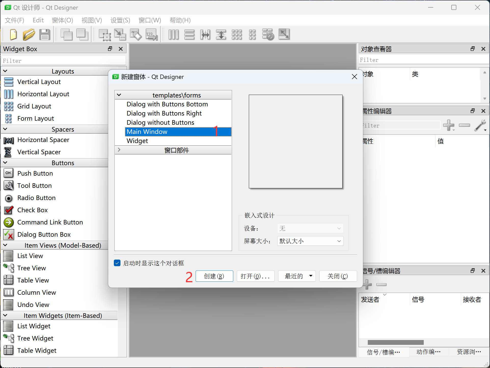
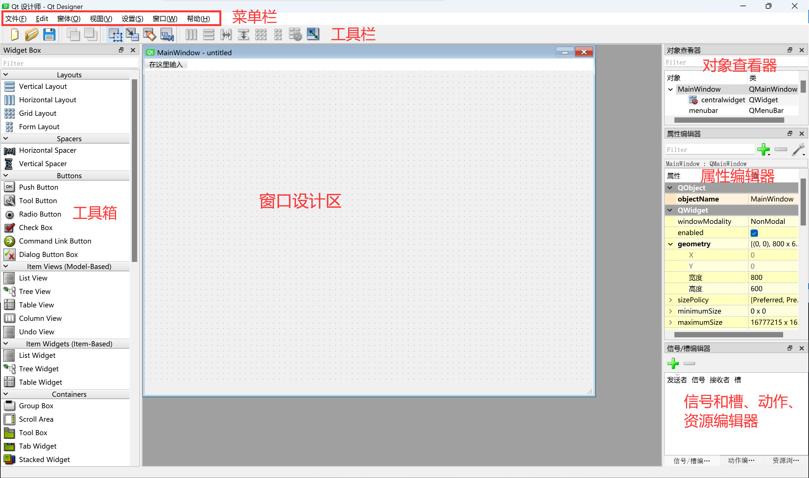
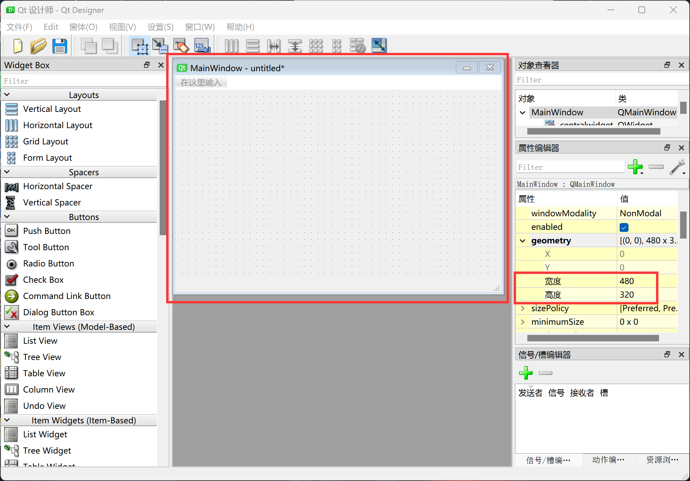
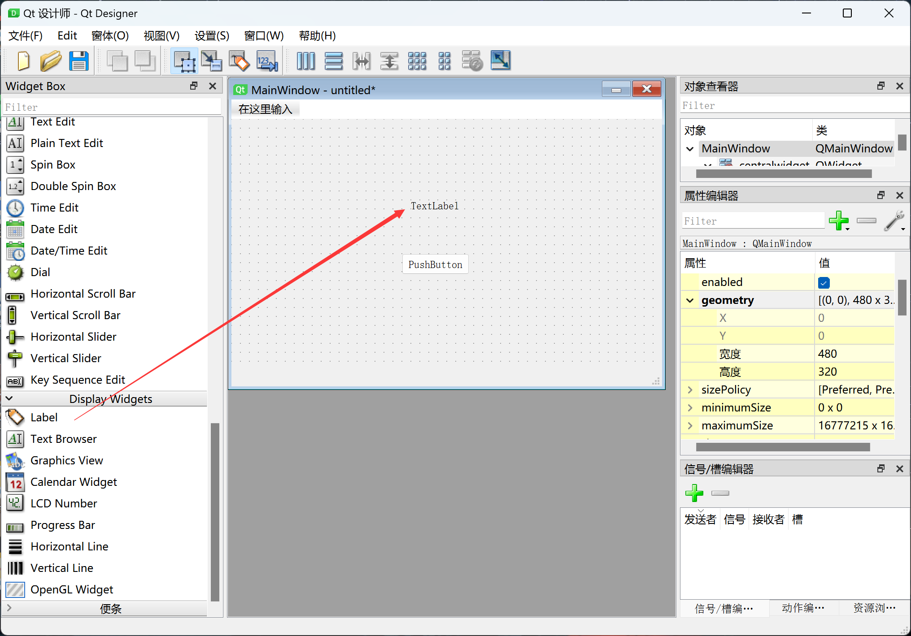
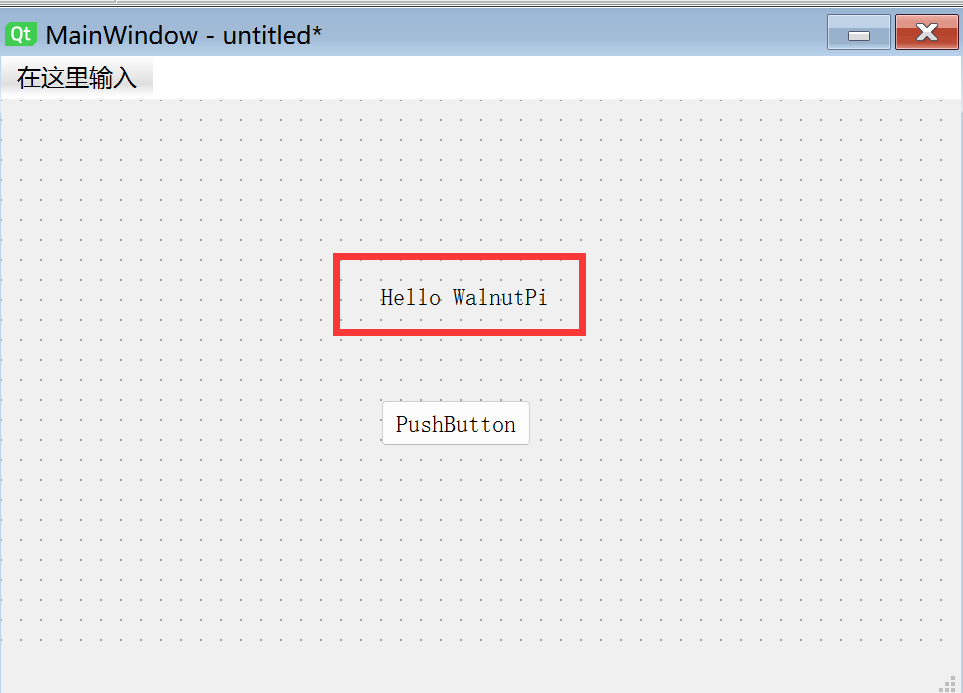
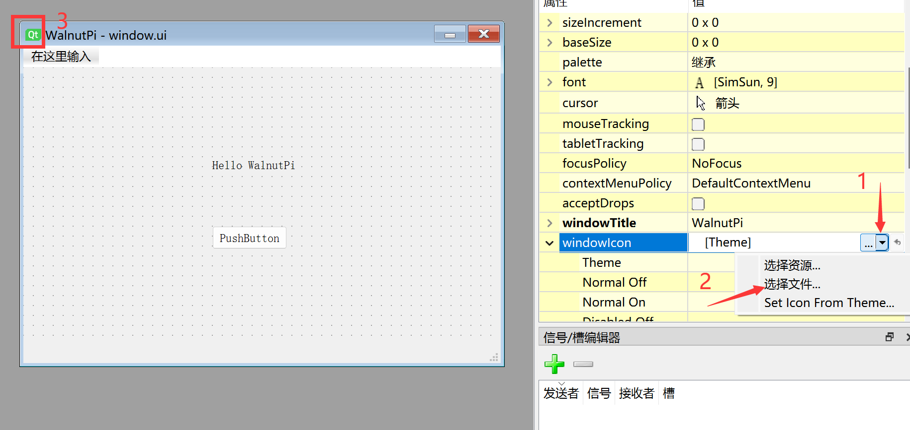
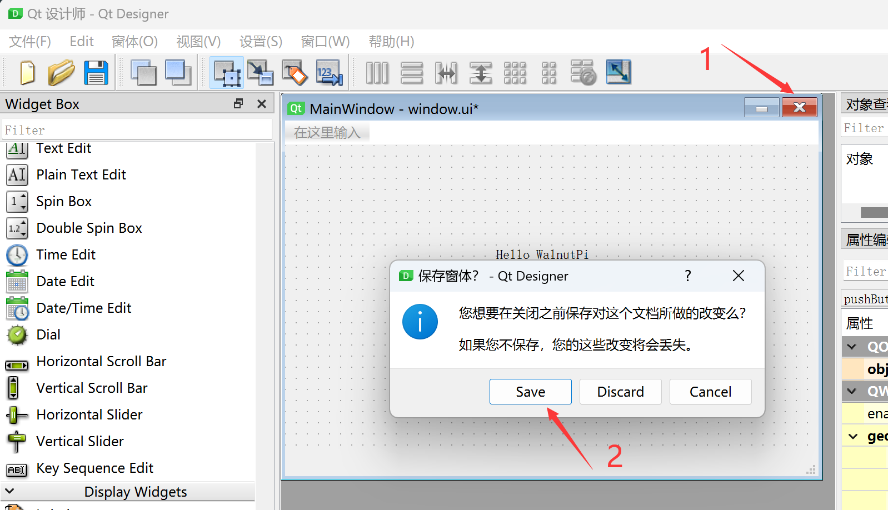
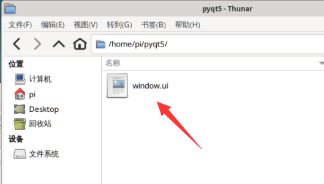

# First Window

In this section, we will create the simplest window to learn how to build our own GUI and run it on WalnutPi.

## Creating a Window with Qt Designer

:::tip Note

1. WalnutPi needs to be connected to an HDMI monitor, keyboard, and mouse for design, or operated via VNC remote desktop. Refer to: [VNC Remote Desktop](../os_software/vnc.md).

2. Due to PyQt5's excellent cross-platform features, the operations in this section also apply to Windows.

:::

Qt Designer is used to design PyQt5 windows. This section only demonstrates the basics. More detailed window settings and widget functions will be covered in later chapters.

Open Qt Designer. There are different window type options in the upper left corner. Generally, select **Main Window** by default, then click **Create**:



After creation, the interface looks like the following. The functions of each area of the software are as follows:



Considering that some users want to display on a 3.5-inch LCD, we can resize the window to 480x320 (WalnutPi 3.5-inch LCD resolution). Expand the **geometry** property in the right-side **Property Editor**, then adjust the width and height to 480 and 320.



Drag a PushButton widget to the window.


Drag a Label widget to the window.



Double-click the label to modify its content. Change the content to: Hello WalnutPi.



The **windowTitle** property can be used to change the window title bar name:


The **windowIcon** property can be used to change the window's top-left icon. Interested users can modify it themselves:



We will use this window as our first demo window. Click the menu bar **Form--Preview**:


You can see the window we just created in the preview. This feature allows you to check whether it matches the desired effect during development.


Click the menu bar **File--Save** or directly click the close button in the upper right corner of the new window to save the window. Name it whatever you like. Here we save it as "window.ui".



- Saving on WalnutPi



At this point, the design of the first window UI file is complete.

## Converting the Window UI File to a Python Code File

We need to convert the designed window UI file into Python code so that it can be executed by the Python program on WalnutPi. This can be done directly via terminal commands:

In the terminal, navigate to the directory of the window.ui file and execute the following command. This command generates a window.py file from the window.ui file:

```bash
python -m PyQt5.uic.pyuic window.ui -o window.py
```

After execution, you can see the generated .py file:


Opening the window.py file, you can see the generated Python code, which mainly consists of window name, position coordinates, and other attribute settings. You can modify the window or button property values, then regenerate the .py code and compare, to intuitively understand how each object is used.

```python

# -*- coding: utf-8 -*-

# Form implementation generated from reading ui file 'window.ui'
#
# Created by: PyQt5 UI code generator 5.15.9
#
# WARNING: Any manual changes made to this file will be lost when pyuic5 is
# run again.  Do not edit this file unless you know what you are doing.

from PyQt5 import QtCore, QtGui, QtWidgets

class Ui_MainWindow(object):
    def setupUi(self, MainWindow):
        MainWindow.setObjectName("MainWindow")
        MainWindow.resize(480, 250)
        self.centralwidget = QtWidgets.QWidget(MainWindow)
        self.centralwidget.setObjectName("centralwidget")
        self.pushButton = QtWidgets.QPushButton(self.centralwidget)
        self.pushButton.setGeometry(QtCore.QRect(190, 160, 75, 23))
        self.pushButton.setObjectName("pushButton")
        self.label = QtWidgets.QLabel(self.centralwidget)
        self.label.setGeometry(QtCore.QRect(190, 90, 91, 16))
        self.label.setObjectName("label")
        MainWindow.setCentralWidget(self.centralwidget)
        self.menubar = QtWidgets.QMenuBar(MainWindow)
        self.menubar.setGeometry(QtCore.QRect(0, 0, 480, 22))
        self.menubar.setObjectName("menubar")
        MainWindow.setMenuBar(self.menubar)
        self.statusbar = QtWidgets.QStatusBar(MainWindow)
        self.statusbar.setObjectName("statusbar")
        MainWindow.setStatusBar(self.statusbar)

        self.retranslateUi(MainWindow)
        QtCore.QMetaObject.connectSlotsByName(MainWindow)

    def retranslateUi(self, MainWindow):
        _translate = QtCore.QCoreApplication.translate
        MainWindow.setWindowTitle(_translate("MainWindow", "WalnutPi"))
        self.pushButton.setText(_translate("MainWindow", "PushButton"))
        self.label.setText(_translate("MainWindow", "Hello WalnutPi"))
```

As you can see, the generated code only defines classes and functions, so it cannot be run directly. Some additional code needs to be added to display the window, which will be covered in the next section.
