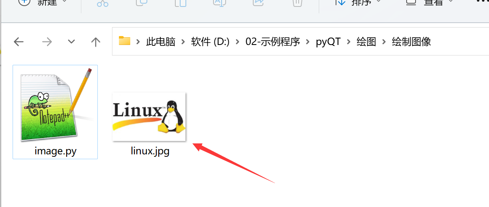
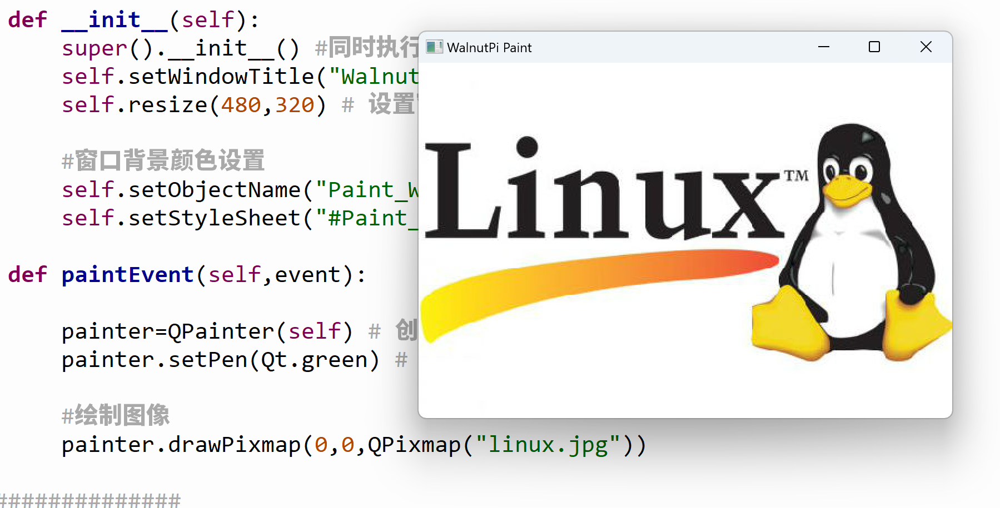

# Drawing Images

The function for drawing images is similar to drawing shapes earlier - only one function is needed:

## Function

```python
drawPixmap(x, y, width, height, QPixmap("xx.jpg"))
```
Draw an image.
- `x, y` : Starting coordinates, top-left corner of the image;
- `width` : Width. If left blank, defaults to the image width;
- `height` : Height. If left blank, defaults to the image height;
- `QPixmap("xx.jpg")` : Image path. Supports common formats such as BMP, JPG, JPEG, PNG;

## Programming Method

We will use code to draw an image:

Let's run the final code first, then explain it:

```python
# -*- coding: utf-8 -*-

# pyQT5 For WalnutPi

from PyQt5 import QtCore, QtGui, QtWidgets

from PyQt5.QtCore import Qt
from PyQt5.QtGui import QPainter, QPixmap
from PyQt5.QtWidgets import QWidget

class Window(QWidget):
    
    def __init__(self):
        super().__init__() # Also execute the parent QWidget's initialization
        self.setWindowTitle("WalnutPi Paint") # Set window title
        self.resize(480,320) # Set window size
        
        # Window background color setting
        self.setObjectName("Paint_Window")
        self.setStyleSheet("#Paint_Window{background-color: black}") # Black

    def paintEvent(self,event):
        
        painter=QPainter(self) # Create drawing object
        painter.setPen(Qt.green) # Set pen, green
        
        # Draw image
        painter.drawPixmap(0,0,QPixmap("linux.jpg"))
        
#################
#   Main Program Code   #
#################
import sys

#【Optional Code】Allow Thonny remote execution
import os
os.environ["DISPLAY"] = ":0.0"

#【Optional Code】Fix display issues on monitors with 2K+ resolution
QtCore.QCoreApplication.setAttribute(QtCore.Qt.AA_EnableHighDpiScaling)

# Program entry point: build the window and display it
app = QtWidgets.QApplication(sys.argv)
window = Window() # Build window object
window.show() # Display window
#window.showFullScreen() # Fullscreen display window

#【Recommended Code】Allow terminal to interrupt window with ctrl+c for easier debugging
import signal
signal.signal(signal.SIGINT, signal.SIG_DFL)
timer = QtCore.QTimer()
timer.start(100)  # You may change this if you wish.
timer.timeout.connect(lambda: None)  # Let the interpreter run each 100 ms

sys.exit(app.exec_()) # Exit process when program closes

```

First, place the image you want to display in the same directory as the code:



Run the code, and you will see the following result:



<br></br>

Now let's look at the implementation principle of the code:

The main program entry code is similar to before, creating a new window:

```python
# Program entry point: build the window and display it
app = QtWidgets.QApplication(sys.argv)
window = Window() # Build window object
window.show() # Display window
```

The newly created window initializes the window title and size, and also sets the background color to black for easier observation of results.
```python
class Window(QWidget):
    
    def __init__(self):
        super().__init__() # Also execute the parent QWidget's initialization
        self.setWindowTitle("WalnutPi Paint") # Set window title
        self.resize(480,320) # Set window size
        
        # Window background color setting
        self.setObjectName("Paint_Window")
        self.setStyleSheet("#Paint_Window{background-color: black}") # Black
```

**def paintEvent(self,event):** is a fixed format. This function is automatically executed after the window is built, so the QPainter object initialization and drawing functions are placed inside it.

```python
    def paintEvent(self,event):
        
        painter=QPainter(self) # Create drawing object
        painter.setPen(Qt.green) # Set pen, green
        
        # Draw image
        painter.drawPixmap(0, 0, QPixmap("linux.jpg"))
```

Modify the image drawing code as follows:
```python
    def paintEvent(self,event):
        
        ...

        # Draw image
        painter.drawPixmap(0, 0, 150, 100, QPixmap("linux.jpg"))
```

Run again, and you will see the image has been resized to 150x100:


