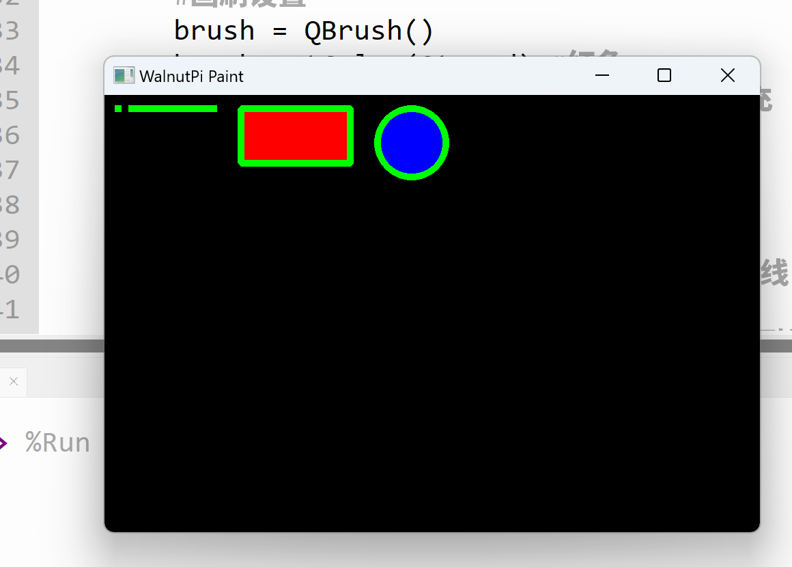

# Pen and Brush Settings

In the previous section, we learned the basic drawing of shapes. In this section, we will learn about pen and brush settings.

## Pen Object (QPen)

The pen is mainly used to set the thickness, color, style, etc., of shape outlines.

|  Common Pen Methods |  Description |
|  :---:  | --- | 
| setColor()  |  Set pen color  | 
| setWidth()  |  Set pen width  | 
| setStyle()  |  Set style:<br></br>● Qt.SolidLine: Normal solid line  | 

## Brush Object (QBrush)

The brush is mainly used to fill geometric shapes with color.

|  Common Brush Methods |  Description |
|  :---:  | --- | 
| setColor()  |  Set brush color  |
| setStyle()  |  Set style:<br></br>● Qt.SolidPattern: Solid fill  |  

## Usage Example

**Example: For the shapes drawn in the previous section, set the line width to 5, fill the rectangle with red, and fill the circle with blue.**

The implementation code is as follows:

```python
# -*- coding: utf-8 -*-

# pyQT5 For WalnutPi

from PyQt5 import QtCore, QtGui, QtWidgets

from PyQt5.QtCore import Qt
from PyQt5.QtGui import QPainter,QPen,QBrush
from PyQt5.QtWidgets import QWidget

class Window(QWidget):
    
    def __init__(self):
        super().__init__() # Also execute the parent QWidget's initialization
        self.setWindowTitle("WalnutPi Paint") # Set window title
        self.resize(480,320) # Set window size
        
        # Window background color setting
        self.setObjectName("Paint_Window")
        self.setStyleSheet("#Paint_Window{background-color: black}") # Black

    def paintEvent(self,event):
        
        painter=QPainter(self) # Create drawing object
        
        # Pen settings:
        pen = QPen()
        pen.setColor(Qt.green) # Green
        pen.setWidth(5) # Width 5
        painter.setPen(pen)
        
        # Brush settings
        brush = QBrush()
        brush.setColor(Qt.red) # Red
        brush.setStyle(Qt.SolidPattern) # Fill
        painter.setBrush(brush) 
        
        painter.drawPoint(10,10) # Draw point
        
        painter.drawLine(20, 10, 80, 10) # Draw line
        
        painter.drawRect(100, 10, 80, 40) # Draw rectangle
        
        # Reset brush to blue
        brush.setColor(Qt.blue)
        painter.setBrush(brush) 
        painter.drawEllipse(200, 10, 50, 50) # Draw circle
        

#################
#   Main Program Code   #
#################
import sys

#【Optional Code】Allow Thonny remote execution
import os
os.environ["DISPLAY"] = ":0.0"

#【Optional Code】Fix display issues on monitors with 2K+ resolution
QtCore.QCoreApplication.setAttribute(QtCore.Qt.AA_EnableHighDpiScaling)

# Program entry point: build the window and display it
app = QtWidgets.QApplication(sys.argv)
window = Window() # Build window object
window.show() # Display window
#window.showFullScreen() # Fullscreen display window

#【Recommended Code】Allow terminal to interrupt window with ctrl+c for easier debugging
import signal
signal.signal(signal.SIGINT, signal.SIG_DFL)
timer = QtCore.QTimer()
timer.start(100)  # You may change this if you wish.
timer.timeout.connect(lambda: None)  # Let the interpreter run each 100 ms

sys.exit(app.exec_()) # Exit process when program closes

```

The main difference between this code and the previous one is the addition of pen settings and brush settings:
```python

    def paintEvent(self,event):

        ...

        # Pen settings:
        pen = QPen()
        pen.setColor(Qt.green) # Green
        pen.setWidth(5) # Width 5
        painter.setPen(pen)
        
        # Brush settings
        brush = QBrush()
        brush.setColor(Qt.red) # Red
        brush.setStyle(Qt.SolidPattern) # Fill
        painter.setBrush(brush) 
```

Additionally, the brush was initially set to red, so before drawing the circle after the rectangle, it needs to be reset:
```python
    ...
        # Reset brush to blue
        brush.setColor(Qt.blue)
        painter.setBrush(brush) 
        painter.drawEllipse(200, 10, 50, 50) # Draw circle
```

The result is as follows:

