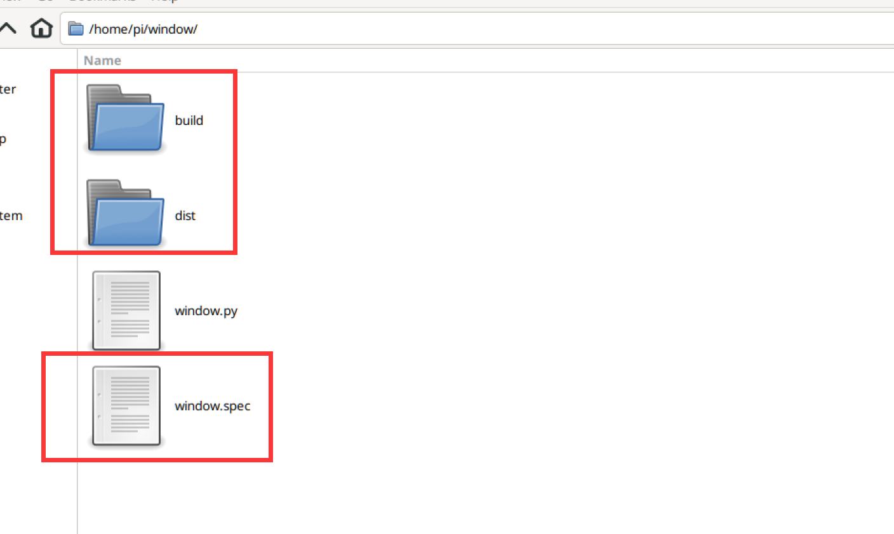
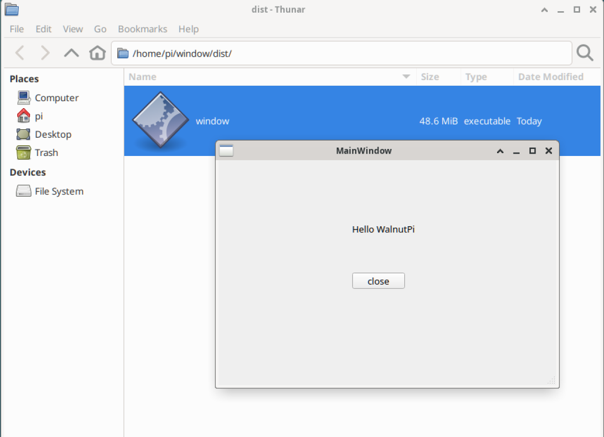

# Packaging and Publishing Programs

On the WalnutPi system, you can use PyInstaller to package Python code into an executable file. This is essentially an application that can be opened and executed directly by double-clicking.

:::tip Note

On the WalnutPi system, you can already open Python programs directly using the `python xx.py` command. The purpose of this feature is to protect the code and facilitate distribution and usage.

:::

Newer WalnutPi systems come with this application pre-installed. For system versions that do not have it installed, you can install it via the pip command:
```bash
sudo pip install pyinstaller
```
## Packaging Python Programs

Create a new folder named `window` in the `pi` directory, then copy your verified Python code file into it. Here we use the window.py from the previous First Window tutorial for demonstration.

Execute:
```bash
pyinstaller -F window.py
```


After execution, you can see 3 new items (directories and files) generated in the directory.

- dist: Location of the generated application;
- build: Log files and intermediate files from the packaging process;
- window.spec: Configuration required for packaging



Open the dist folder. The file inside is the executable, which can be opened by double-clicking.


If it cannot be opened, execute the following command to grant execution permissions to the program:

```bash
chmod +x window
```

After opening, you can see the window program:



