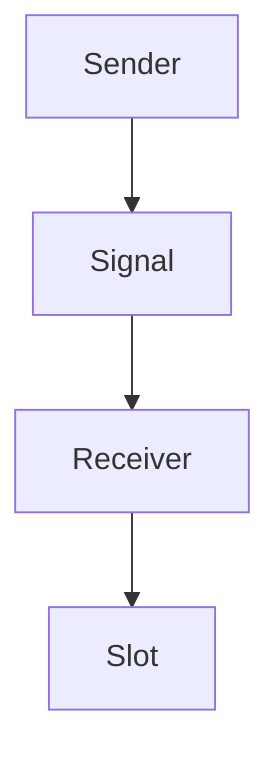
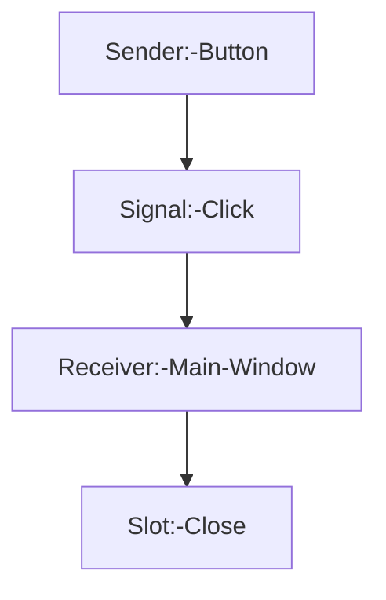
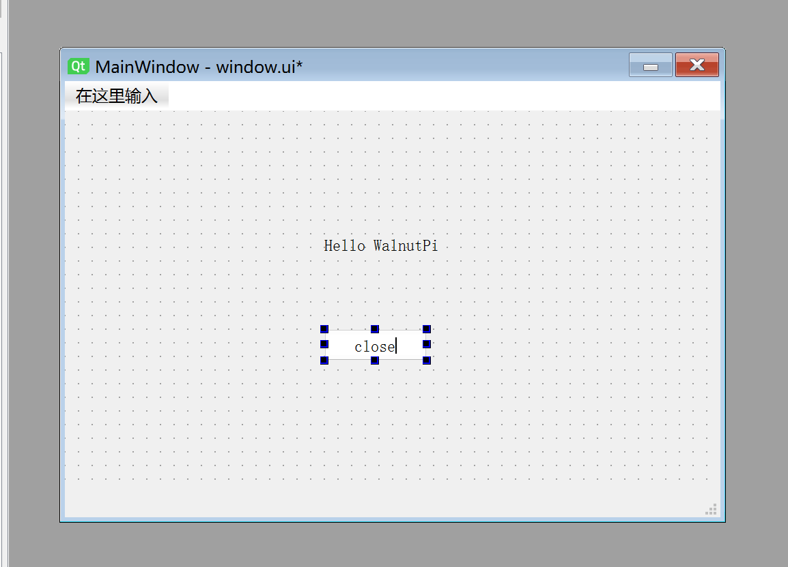
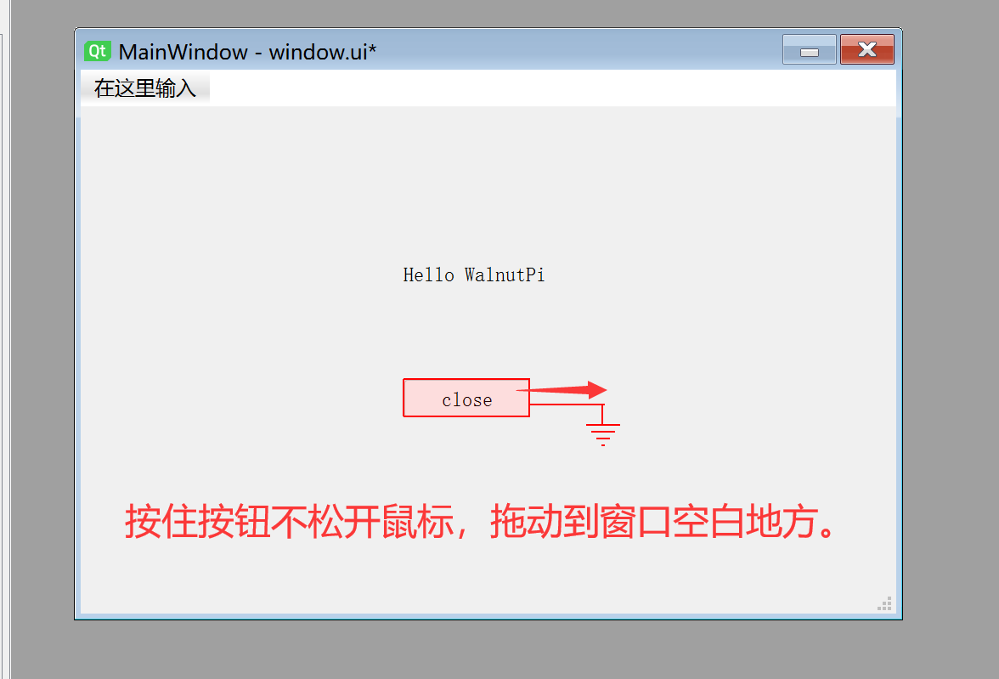
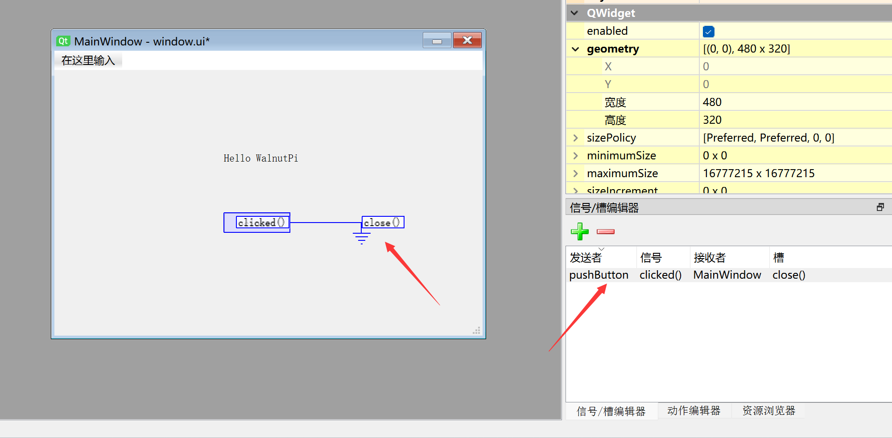
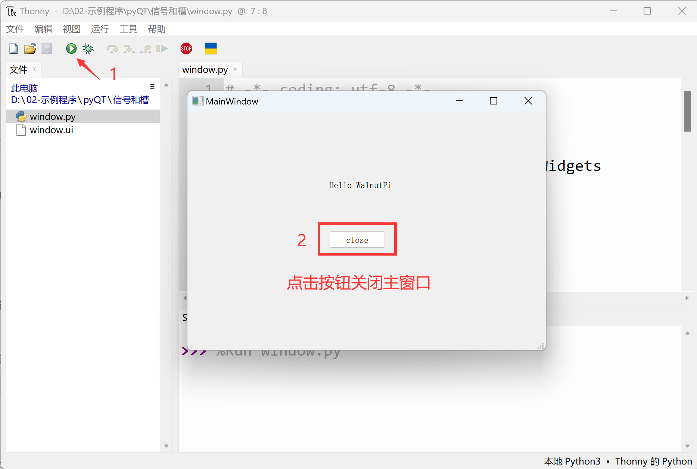

# Signals and Slots

## What Are Signals and Slots

Signals and slots are the communication bridge between PyQt5 objects. A complete signal and slot process involves 4 components: **Sender, Signal, Receiver, Slot.** The simplest flow between them is as follows:



<br></br>

For example: in the previous First Window section, we created a button, but it was isolated, meaning clicking the button produced no response.
<br></br>


At this point, if we want clicking the button to close the current window, we can achieve this by editing their signals and slots. The flow chart above then becomes:



<br></br>

From this, it is easy to understand that the signal and slot mechanism is primarily used for QObject objects (widgets and windows). The signal sent by the sender can be understood as an action (click), and upon receiving the signal, the receiver executes the corresponding slot function (close window).

**Characteristics of Signals and Slots in PyQt5:**

- A signal can be sent to multiple slots.
- A slot can receive multiple signals.

## Editing Signals and Slots

We will use signals and slots to implement the function of clicking a button to close the main window:

Use Qt Designer to open the window.ui file saved in the previous **First Window** section.


Double-click the PushButton and change the button name to close:



Next, click the menu bar **Edit--Edit Signals/Slots**


Now pay attention: click and hold the button with the mouse, drag it to an empty area of the window, then release. After releasing, it should look like this:



A configuration dialog will pop up. Check **Show signals and slots inherited** in the lower left corner:


On the left is the button widget, click **clicked()**; on the right is the main window, click **close()**, then click OK.


You can see the configured information appearing in both the main window and the Signal/Slot Editor area in the lower right corner:



Save the window, then use the terminal in the file directory to execute the following command to convert the window.ui file to a .py file:

```bash
python -m PyQt5.uic.pyuic window.ui -o window.py
```

Open window.py and add the main program code. The complete code after adding is as follows:

```python
# -*- coding: utf-8 -*-

# pyQT5 For WalnutPi

from PyQt5 import QtCore, QtGui, QtWidgets

#【Optional Code】Allow Thonny remote execution
import os
os.environ["DISPLAY"] = ":0.0"

class Ui_MainWindow(object):
    def setupUi(self, MainWindow):
        MainWindow.setObjectName("MainWindow")
        MainWindow.resize(480, 320)
        self.centralwidget = QtWidgets.QWidget(MainWindow)
        self.centralwidget.setObjectName("centralwidget")
        self.pushButton = QtWidgets.QPushButton(self.centralwidget)
        self.pushButton.setGeometry(QtCore.QRect(190, 160, 75, 23))
        self.pushButton.setObjectName("pushButton")
        self.label = QtWidgets.QLabel(self.centralwidget)
        self.label.setGeometry(QtCore.QRect(190, 90, 91, 16))
        self.label.setObjectName("label")
        MainWindow.setCentralWidget(self.centralwidget)
        self.menubar = QtWidgets.QMenuBar(MainWindow)
        self.menubar.setGeometry(QtCore.QRect(0, 0, 480, 22))
        self.menubar.setObjectName("menubar")
        MainWindow.setMenuBar(self.menubar)
        self.statusbar = QtWidgets.QStatusBar(MainWindow)
        self.statusbar.setObjectName("statusbar")
        MainWindow.setStatusBar(self.statusbar)

        self.retranslateUi(MainWindow)
        self.pushButton.clicked.connect(MainWindow.close) # Signal and slot definition
        QtCore.QMetaObject.connectSlotsByName(MainWindow)

    def retranslateUi(self, MainWindow):
        _translate = QtCore.QCoreApplication.translate
        MainWindow.setWindowTitle(_translate("MainWindow", "MainWindow"))
        self.pushButton.setText(_translate("MainWindow", "close"))
        self.label.setText(_translate("MainWindow", "Hello WalnutPi"))

#################
#   Main Program Code   #
#################
import sys

#【Optional Code】Allow Thonny remote execution
import os
os.environ["DISPLAY"] = ":0.0"

#【Optional Code】Fix display issues on monitors with 2K+ resolution
QtCore.QCoreApplication.setAttribute(QtCore.Qt.AA_EnableHighDpiScaling)

# Program entry point: build the window and display it
app = QtWidgets.QApplication(sys.argv)
MainWindow = QtWidgets.QMainWindow() # Build window object
ui = Ui_MainWindow() # Build PyQt5-designed window object
ui.setupUi(MainWindow) # Initialize window
MainWindow.show() # Display window

#【Recommended Code】Allow terminal to interrupt window with ctrl+c for easier debugging
import signal
signal.signal(signal.SIGINT, signal.SIG_DFL)
timer = QtCore.QTimer()
timer.start(100)  # You may change this if you wish.
timer.timeout.connect(lambda: None)  # Let the interpreter run each 100 ms

sys.exit(app.exec_()) # Exit process when program closes

```

As you can see from the code above, the added line is the one below, which implements the signal and slot between the button and the main window:

```python

self.pushButton.clicked.connect(MainWindow.close) # Signal and slot definition

```

Run the code and click the **close** button in the pop-up window. You will see the window close.


