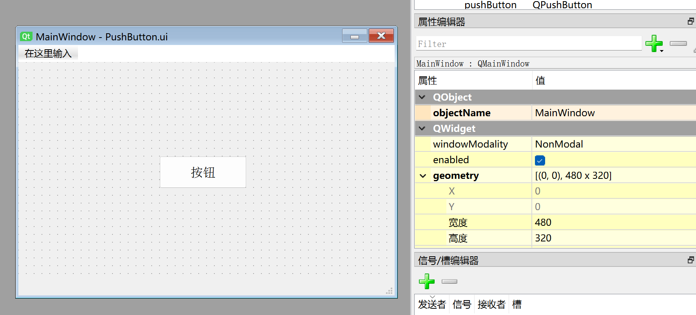

# PushButton（按钮）

## 介绍

PushButton控件很常用，称为按钮控件。带按下和松开效果。


按钮的编辑很简单，双击可以修改按钮文字内容，拖动边缘可以放大缩小按钮。还有字体大小、增加图标等这些在右边属性栏都可以设置。



该窗口生成的py代码如下：
```python

# -*- coding: utf-8 -*-

from PyQt5 import QtCore, QtGui, QtWidgets


class Ui_MainWindow(object):
    def setupUi(self, MainWindow):
        MainWindow.setObjectName("MainWindow")
        MainWindow.resize(480, 320)
        self.centralwidget = QtWidgets.QWidget(MainWindow)
        self.centralwidget.setObjectName("centralwidget")
        self.pushButton = QtWidgets.QPushButton(self.centralwidget)
        self.pushButton.setGeometry(QtCore.QRect(180, 120, 111, 41))
        font = QtGui.QFont()
        font.setFamily("Agency FB")
        font.setPointSize(12)
        self.pushButton.setFont(font)
        self.pushButton.setObjectName("pushButton")
        MainWindow.setCentralWidget(self.centralwidget)
        self.menubar = QtWidgets.QMenuBar(MainWindow)
        self.menubar.setGeometry(QtCore.QRect(0, 0, 480, 22))
        self.menubar.setObjectName("menubar")
        MainWindow.setMenuBar(self.menubar)
        self.statusbar = QtWidgets.QStatusBar(MainWindow)
        self.statusbar.setObjectName("statusbar")
        MainWindow.setStatusBar(self.statusbar)

        self.retranslateUi(MainWindow)
        QtCore.QMetaObject.connectSlotsByName(MainWindow)

    def retranslateUi(self, MainWindow):
        _translate = QtCore.QCoreApplication.translate
        MainWindow.setWindowTitle(_translate("MainWindow", "MainWindow"))
        self.pushButton.setText(_translate("MainWindow", "按钮"))

```

其中跟按钮相关的代码如下：

```python
# -*- coding: utf-8 -*-

from PyQt5 import QtCore, QtGui, QtWidgets


class Ui_MainWindow(object):
    def setupUi(self, MainWindow):
        ...
        self.pushButton = QtWidgets.QPushButton(self.centralwidget) #在窗口中构建一个按键控件；
        self.pushButton.setGeometry(QtCore.QRect(180, 120, 111, 41)) #按钮的x坐标、y坐标、宽度、高度；

        #设置按键字体和颜色
        font = QtGui.QFont()
        font.setFamily("Agency FB")
        font.setPointSize(12)
        self.pushButton.setFont(font)
        
        self.pushButton.setObjectName("pushButton") #设置按钮对象名称，非显示名称。


    def retranslateUi(self, MainWindow):
        ...
        self.pushButton.setText(_translate("MainWindow", "按钮")) #显示名称改成“按钮”

```
## QPushButton对象

|  常用方法 |  说明 |
|  :---:  | --- | 
| setText()  |  按钮显示的文本  | 
| Text()  |  获取按钮显示的文本内容  | 
| setEnabled()  |  参数为False时，按钮不可用  | 

<br></br>

|  常用信号 |  说明 |
|  :---:  | --- | 
| clicked  |  点击触发  | 


## 示例

**例：编程实现点击按钮执行自定义函数。**

按钮最常用的信号是点击，即clicked, 使用pushButton.clicked.connect()指定按钮被点击后执行指定函数。

参考信号和槽章节内容在self.retranslateUi(MainWindow)后面加入：

```python

self.pushButton.clicked.connect(self.fun) # 按键按下执行fun函数

```

然后在 Ui_MainWindow 类下加入要执行函数，这里让终端输出信息：

```python

#按钮按下执行函数
def fun(self):
    print('Button is Press!')

```

完整代码如下：

```python

# -*- coding: utf-8 -*-

from PyQt5 import QtCore, QtGui, QtWidgets


class Ui_MainWindow(object):
    def setupUi(self, MainWindow):
        MainWindow.setObjectName("MainWindow")
        MainWindow.resize(480, 320)
        self.centralwidget = QtWidgets.QWidget(MainWindow)
        self.centralwidget.setObjectName("centralwidget")
        self.pushButton = QtWidgets.QPushButton(self.centralwidget)
        self.pushButton.setGeometry(QtCore.QRect(180, 120, 111, 41))
        font = QtGui.QFont()
        font.setFamily("Agency FB")
        font.setPointSize(12)
        self.pushButton.setFont(font)
        self.pushButton.setObjectName("pushButton")
        MainWindow.setCentralWidget(self.centralwidget)
        self.menubar = QtWidgets.QMenuBar(MainWindow)
        self.menubar.setGeometry(QtCore.QRect(0, 0, 480, 22))
        self.menubar.setObjectName("menubar")
        MainWindow.setMenuBar(self.menubar)
        self.statusbar = QtWidgets.QStatusBar(MainWindow)
        self.statusbar.setObjectName("statusbar")
        MainWindow.setStatusBar(self.statusbar)

        self.retranslateUi(MainWindow)
        self.pushButton.clicked.connect(self.fun) # 按钮信号和槽定义
        QtCore.QMetaObject.connectSlotsByName(MainWindow)

    def retranslateUi(self, MainWindow):
        _translate = QtCore.QCoreApplication.translate
        MainWindow.setWindowTitle(_translate("MainWindow", "MainWindow"))
        self.pushButton.setText(_translate("MainWindow", "按钮"))
    
    #按钮按下执行函数
    def fun(self):
        print('Button is Press!')

#################
#   主程序代码   #
#################
import sys

#【可选代码】允许Thonny远程运行
import os
os.environ["DISPLAY"] = ":0.0"

#【可选代码】解决2K以上分辨率显示器显示缺失问题
QtCore.QCoreApplication.setAttribute(QtCore.Qt.AA_EnableHighDpiScaling)

#主程序入口，构建窗口并显示
app = QtWidgets.QApplication(sys.argv)
MainWindow = QtWidgets.QMainWindow() #构建窗口对象
ui = Ui_MainWindow() #构建pyQT5设计的窗口对象
ui.setupUi(MainWindow) #初始化窗口
MainWindow.show() #显示窗口

#【建议代码】允许终端通过ctrl+c中断窗口，方便调试
import signal
signal.signal(signal.SIGINT, signal.SIG_DFL)
timer = QtCore.QTimer()
timer.start(100)  # You may change this if you wish.
timer.timeout.connect(lambda: None)  # Let the interpreter run each 100 ms

sys.exit(app.exec_()) #程序关闭时退出进程

```

运行代码，每次按下按键可以看到终端输出'Button is Press!'信息。


你也可以结合前面Python嵌入式编程来实现按钮点亮LED等功能。