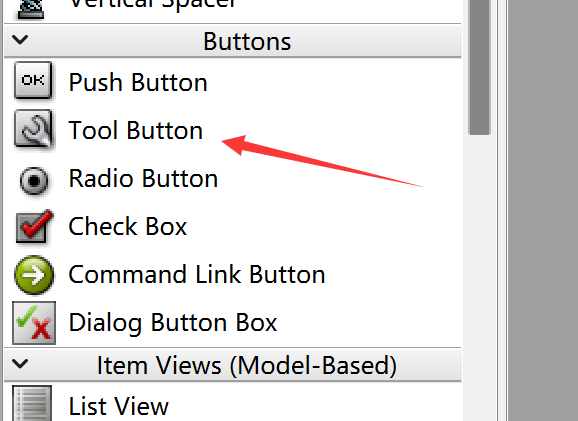
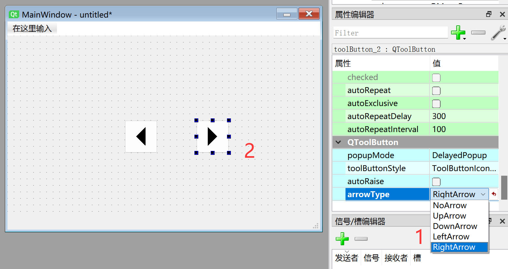
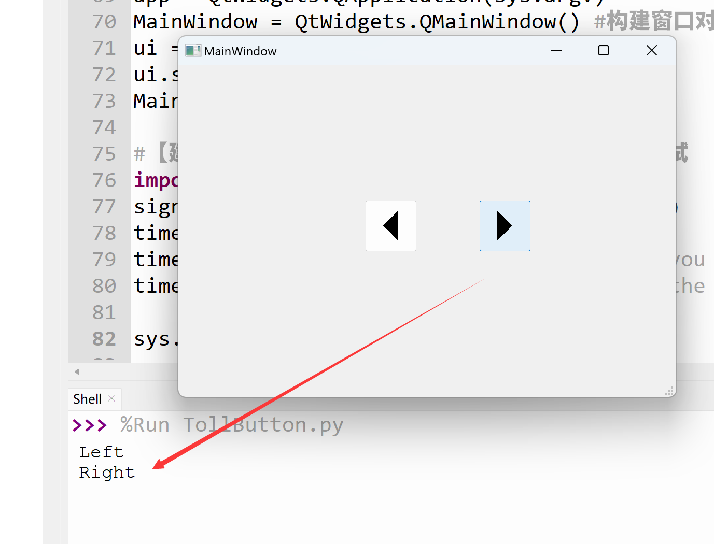

# ToolButton

## Introduction

The main difference between ToolButton and PushButton is that it can have a directional arrow.


<br></br>
Editing the tool button is simple. Double-click to modify the button text content, and drag the edges to resize the button. All other properties can be configured in the right-side properties panel.



The Python code generated from this window is as follows:
```python

# -*- coding: utf-8 -*-

from PyQt5 import QtCore, QtGui, QtWidgets


class Ui_MainWindow(object):
    def setupUi(self, MainWindow):
        MainWindow.setObjectName("MainWindow")
        MainWindow.resize(480, 320)
        self.centralwidget = QtWidgets.QWidget(MainWindow)
        self.centralwidget.setObjectName("centralwidget")
        self.toolButton = QtWidgets.QToolButton(self.centralwidget)
        self.toolButton.setGeometry(QtCore.QRect(180, 130, 50, 50))
        self.toolButton.setArrowType(QtCore.Qt.LeftArrow)
        self.toolButton.setObjectName("toolButton")
        self.toolButton_2 = QtWidgets.QToolButton(self.centralwidget)
        self.toolButton_2.setGeometry(QtCore.QRect(290, 130, 50, 50))
        self.toolButton_2.setArrowType(QtCore.Qt.RightArrow)
        self.toolButton_2.setObjectName("toolButton_2")
        MainWindow.setCentralWidget(self.centralwidget)
        self.menubar = QtWidgets.QMenuBar(MainWindow)
        self.menubar.setGeometry(QtCore.QRect(0, 0, 480, 22))
        self.menubar.setObjectName("menubar")
        MainWindow.setMenuBar(self.menubar)
        self.statusbar = QtWidgets.QStatusBar(MainWindow)
        self.statusbar.setObjectName("statusbar")
        MainWindow.setStatusBar(self.statusbar)

        self.retranslateUi(MainWindow)
        QtCore.QMetaObject.connectSlotsByName(MainWindow)

    def retranslateUi(self, MainWindow):
        _translate = QtCore.QCoreApplication.translate
        MainWindow.setWindowTitle(_translate("MainWindow", "MainWindow"))
        self.toolButton.setText(_translate("MainWindow", "..."))
        self.toolButton_2.setText(_translate("MainWindow", "..."))

```

The code related to the tool buttons is as follows:

```python
# -*- coding: utf-8 -*-

from PyQt5 import QtCore, QtGui, QtWidgets

class Ui_MainWindow(object):
    def setupUi(self, MainWindow):

        ...

        # Tool button (left arrow)
        self.toolButton = QtWidgets.QToolButton(self.centralwidget) 
        self.toolButton.setGeometry(QtCore.QRect(180, 130, 50, 50))
        self.toolButton.setArrowType(QtCore.Qt.LeftArrow) # Left arrow
        self.toolButton.setObjectName("toolButton")

        # Tool button (right arrow)
        self.toolButton_2 = QtWidgets.QToolButton(self.centralwidget)
        self.toolButton_2.setGeometry(QtCore.QRect(290, 130, 50, 50))
        self.toolButton_2.setArrowType(QtCore.Qt.RightArrow) # Right arrow
        self.toolButton_2.setObjectName("toolButton_2")

        ...

    def retranslateUi(self, MainWindow):

        ...

        self.toolButton.setText(_translate("MainWindow", "..."))
        self.toolButton_2.setText(_translate("MainWindow", "..."))

        ...

```
## QToolButton Object

|  Common Methods |  Description |
|  :---:  | --- | 
| setText()  |  Set the text displayed on the button  | 
| setArrowType()  |  Set arrow direction. Parameters:<br></br> ● QtCore.Qt.NoArrow : None<br></br> ● QtCore.Qt.UpArrow : Up <br></br> ● QtCore.Qt.DownArrow : Down <br></br> ● QtCore.Qt.LeftArrow : Left<br></br> ● QtCore.Qt.RightArrow : Right| 

<br></br>

|  Common Signals |  Description |
|  :---:  | --- | 
| clicked  |  Triggered on click  | 


## Example

**Example: Program two buttons to execute different functions when clicked.**

The most commonly used signal for buttons is click, i.e., clicked. Use pushButton.clicked.connect() to specify the function to execute when the button is clicked.

Referring to the Signals and Slots section, add the following after self.retranslateUi(MainWindow):

```python

self.toolButton.clicked.connect(self.fun1) # Execute fun1 function when pressed
self.toolButton_2.clicked.connect(self.fun2) # Execute fun2 function when pressed

```

Then add the functions to be executed inside the Ui_MainWindow class. Here, they print information to the terminal:

```python

# Function executed when tool button 1 is pressed
def fun1(self):
    print('Left')
        
# Function executed when tool button 2 is pressed
def fun2(self):
    print('Right')

```

The complete code is as follows:

```python
# -*- coding: utf-8 -*-

from PyQt5 import QtCore, QtGui, QtWidgets


class Ui_MainWindow(object):
    def setupUi(self, MainWindow):
        MainWindow.setObjectName("MainWindow")
        MainWindow.resize(480, 320)
        self.centralwidget = QtWidgets.QWidget(MainWindow)
        self.centralwidget.setObjectName("centralwidget")
        self.toolButton = QtWidgets.QToolButton(self.centralwidget)
        self.toolButton.setGeometry(QtCore.QRect(180, 130, 50, 50))
        self.toolButton.setArrowType(QtCore.Qt.LeftArrow)
        self.toolButton.setObjectName("toolButton")
        self.toolButton_2 = QtWidgets.QToolButton(self.centralwidget)
        self.toolButton_2.setGeometry(QtCore.QRect(290, 130, 50, 50))
        self.toolButton_2.setArrowType(QtCore.Qt.RightArrow)
        self.toolButton_2.setObjectName("toolButton_2")
        MainWindow.setCentralWidget(self.centralwidget)
        self.menubar = QtWidgets.QMenuBar(MainWindow)
        self.menubar.setGeometry(QtCore.QRect(0, 0, 480, 22))
        self.menubar.setObjectName("menubar")
        MainWindow.setMenuBar(self.menubar)
        self.statusbar = QtWidgets.QStatusBar(MainWindow)
        self.statusbar.setObjectName("statusbar")
        MainWindow.setStatusBar(self.statusbar)

        self.retranslateUi(MainWindow)
        self.toolButton.clicked.connect(self.fun1) # Execute fun1 function when pressed
        self.toolButton_2.clicked.connect(self.fun2) # Execute fun2 function when pressed
        QtCore.QMetaObject.connectSlotsByName(MainWindow)

    def retranslateUi(self, MainWindow):
        _translate = QtCore.QCoreApplication.translate
        MainWindow.setWindowTitle(_translate("MainWindow", "MainWindow"))
        self.toolButton.setText(_translate("MainWindow", "..."))
        self.toolButton_2.setText(_translate("MainWindow", "..."))
        
    # Function executed when tool button 1 is pressed
    def fun1(self):
        print('Left')
        
    # Function executed when tool button 2 is pressed
    def fun2(self):
        print('Right')

#################
#   Main Program Code   #
#################
import sys

#【Optional Code】Allow Thonny remote execution
import os
os.environ["DISPLAY"] = ":0.0"

#【Optional Code】Fix display issues on monitors with 2K+ resolution
QtCore.QCoreApplication.setAttribute(QtCore.Qt.AA_EnableHighDpiScaling)

# Program entry point: build the window and display it
app = QtWidgets.QApplication(sys.argv)
MainWindow = QtWidgets.QMainWindow() # Build window object
ui = Ui_MainWindow() # Build PyQt5-designed window object
ui.setupUi(MainWindow) # Initialize window
MainWindow.show() # Display window

#【Recommended Code】Allow terminal to interrupt window with ctrl+c for easier debugging
import signal
signal.signal(signal.SIGINT, signal.SIG_DFL)
timer = QtCore.QTimer()
timer.start(100)  # You may change this if you wish.
timer.timeout.connect(lambda: None)  # Let the interpreter run each 100 ms

sys.exit(app.exec_()) # Exit process when program closes

```

Run the code. Pressing the left arrow button prints "Left" and pressing the right arrow button prints "Right".


