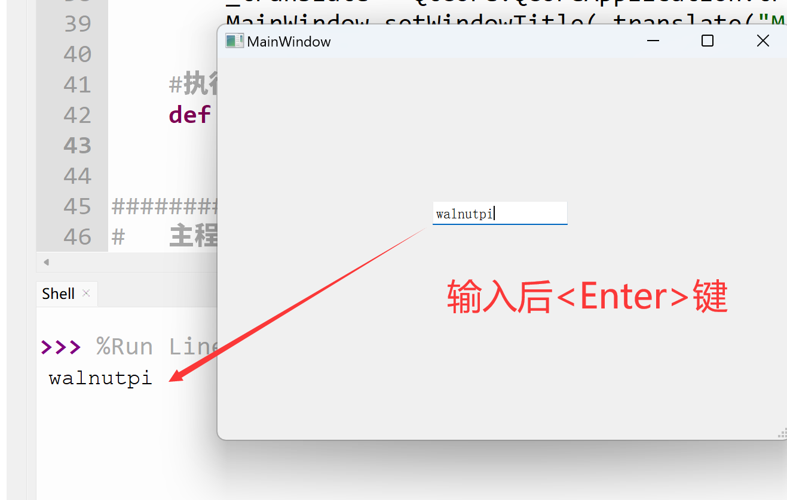

# LineEdit (Single-line Text Box)

## Introduction

The single-line text box allows users to input a single line of text.


Double-click to add preset display content to the text box, and drag the edges to resize. Font size and other properties can be configured in the right-side properties panel.


The Python code generated from this window is as follows:
```python
# -*- coding: utf-8 -*-

from PyQt5 import QtCore, QtGui, QtWidgets

class Ui_MainWindow(object):
    def setupUi(self, MainWindow):
        MainWindow.setObjectName("MainWindow")
        MainWindow.resize(480, 320)
        self.centralwidget = QtWidgets.QWidget(MainWindow)
        self.centralwidget.setObjectName("centralwidget")
        self.lineEdit = QtWidgets.QLineEdit(self.centralwidget)
        self.lineEdit.setGeometry(QtCore.QRect(180, 120, 113, 20))
        self.lineEdit.setObjectName("lineEdit")
        MainWindow.setCentralWidget(self.centralwidget)
        self.menubar = QtWidgets.QMenuBar(MainWindow)
        self.menubar.setGeometry(QtCore.QRect(0, 0, 480, 22))
        self.menubar.setObjectName("menubar")
        MainWindow.setMenuBar(self.menubar)
        self.statusbar = QtWidgets.QStatusBar(MainWindow)
        self.statusbar.setObjectName("statusbar")
        MainWindow.setStatusBar(self.statusbar)

        self.retranslateUi(MainWindow)
        QtCore.QMetaObject.connectSlotsByName(MainWindow)

    def retranslateUi(self, MainWindow):
        _translate = QtCore.QCoreApplication.translate
        MainWindow.setWindowTitle(_translate("MainWindow", "MainWindow"))

```

The code related to the single-line text box is as follows:

```python
# -*- coding: utf-8 -*-

from PyQt5 import QtCore, QtGui, QtWidgets


class Ui_MainWindow(object):
    def setupUi(self, MainWindow):
        ...
        self.lineEdit = QtWidgets.QLineEdit(self.centralwidget)
        self.lineEdit.setGeometry(QtCore.QRect(180, 120, 113, 20)) # Text box x, y, width, height
        self.lineEdit.setObjectName("lineEdit") # Set text box object name, not display name

```
## QLineEdit Object

|  Common Methods |  Description |
|  :---:  | --- | 
| setText()  |  Set text box content  | 
| Text()  |  Get text box content  | 
| clear()  |  Clear text box content | 
| setMaxLength()  |  Set maximum allowed input character length | 

<br></br>

|  Common Signals |  Description |
|  :---:  | --- | 
| textChanged  |  Triggered when text box content changes  | 
| editingFinished  |  Triggered when editing is finished by pressing the **Enter** key  | 

## Example

**Example: When the user finishes typing in the text box and presses Enter, print the input content to the terminal.**

Use the editingFinished signal to detect when input is complete. Add the following after self.retranslateUi(MainWindow):

```python

self.lineEdit.editingFinished.connect(self.fun) # Editing finished, triggered by pressing <Enter>

```

Then add the function to be executed inside the Ui_MainWindow class. Here, it prints information to the terminal:

```python

# Execution function
def fun(self):
    print(self.lineEdit.text())


```

The complete code is as follows:

```python

# -*- coding: utf-8 -*-

from PyQt5 import QtCore, QtGui, QtWidgets


class Ui_MainWindow(object):
    def setupUi(self, MainWindow):
        MainWindow.setObjectName("MainWindow")
        MainWindow.resize(480, 320)
        self.centralwidget = QtWidgets.QWidget(MainWindow)
        self.centralwidget.setObjectName("centralwidget")
        self.lineEdit = QtWidgets.QLineEdit(self.centralwidget)
        self.lineEdit.setGeometry(QtCore.QRect(180, 120, 113, 20))
        self.lineEdit.setObjectName("lineEdit")
        MainWindow.setCentralWidget(self.centralwidget)
        self.menubar = QtWidgets.QMenuBar(MainWindow)
        self.menubar.setGeometry(QtCore.QRect(0, 0, 480, 22))
        self.menubar.setObjectName("menubar")
        MainWindow.setMenuBar(self.menubar)
        self.statusbar = QtWidgets.QStatusBar(MainWindow)
        self.statusbar.setObjectName("statusbar")
        MainWindow.setStatusBar(self.statusbar)

        self.retranslateUi(MainWindow)
        #self.lineEdit.textChanged.connect(self.fun) # Text box content changed
        self.lineEdit.editingFinished.connect(self.fun) # Editing finished, triggered by pressing <Enter>
        QtCore.QMetaObject.connectSlotsByName(MainWindow)

    def retranslateUi(self, MainWindow):
        _translate = QtCore.QCoreApplication.translate
        MainWindow.setWindowTitle(_translate("MainWindow", "MainWindow"))

    # Execution function
    def fun(self):
        print(self.lineEdit.text())

#################
#   Main Program Code   #
#################
import sys

#【Optional Code】Allow Thonny remote execution
import os
os.environ["DISPLAY"] = ":0.0"

#【Optional Code】Fix display issues on monitors with 2K+ resolution
QtCore.QCoreApplication.setAttribute(QtCore.Qt.AA_EnableHighDpiScaling)

# Program entry point: build the window and display it
app = QtWidgets.QApplication(sys.argv)
MainWindow = QtWidgets.QMainWindow() # Build window object
ui = Ui_MainWindow() # Build PyQt5-designed window object
ui.setupUi(MainWindow) # Initialize window
MainWindow.show() # Display window

#【Recommended Code】Allow terminal to interrupt window with ctrl+c for easier debugging
import signal
signal.signal(signal.SIGINT, signal.SIG_DFL)
timer = QtCore.QTimer()
timer.start(100)  # You may change this if you wish.
timer.timeout.connect(lambda: None)  # Let the interpreter run each 100 ms

sys.exit(app.exec_()) # Exit process when program closes

```

Run the code. Type information into the text box and press the **Enter** key on your computer. You will see the typed information printed in the terminal.


