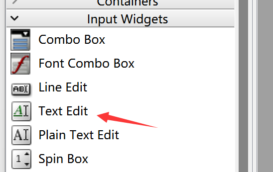
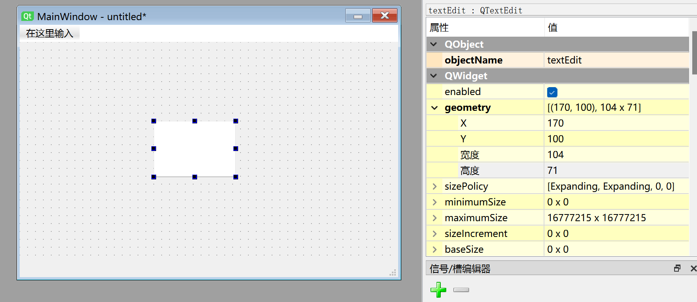
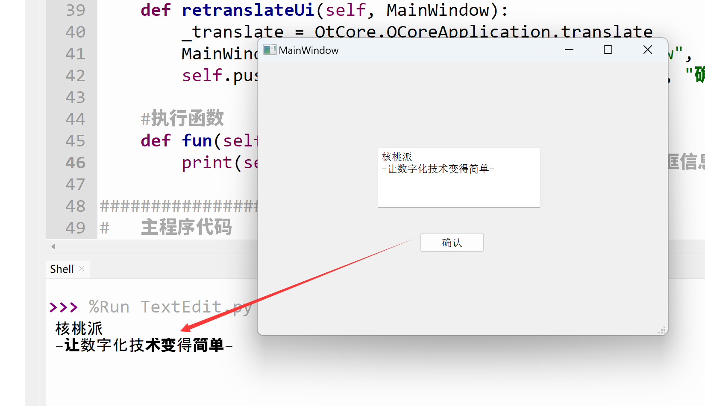

# TextEdit (Multi-line Text Box)

## Introduction

The multi-line text box allows users to input multiple lines of text.



Double-click to add preset display content to the text box, and drag the edges to resize. Font size and other properties can be configured in the right-side properties panel.



The Python code generated from this window is as follows:
```python
# -*- coding: utf-8 -*-

from PyQt5 import QtCore, QtGui, QtWidgets


class Ui_MainWindow(object):
    def setupUi(self, MainWindow):
        MainWindow.setObjectName("MainWindow")
        MainWindow.resize(480, 320)
        self.centralwidget = QtWidgets.QWidget(MainWindow)
        self.centralwidget.setObjectName("centralwidget")
        self.textEdit = QtWidgets.QTextEdit(self.centralwidget)
        self.textEdit.setGeometry(QtCore.QRect(170, 100, 104, 71))
        self.textEdit.setObjectName("textEdit")
        MainWindow.setCentralWidget(self.centralwidget)
        self.menubar = QtWidgets.QMenuBar(MainWindow)
        self.menubar.setGeometry(QtCore.QRect(0, 0, 480, 22))
        self.menubar.setObjectName("menubar")
        MainWindow.setMenuBar(self.menubar)
        self.statusbar = QtWidgets.QStatusBar(MainWindow)
        self.statusbar.setObjectName("statusbar")
        MainWindow.setStatusBar(self.statusbar)

        self.retranslateUi(MainWindow)
        QtCore.QMetaObject.connectSlotsByName(MainWindow)

    def retranslateUi(self, MainWindow):
        _translate = QtCore.QCoreApplication.translate
        MainWindow.setWindowTitle(_translate("MainWindow", "MainWindow"))

```

The code related to the multi-line text box is as follows:

```python
# -*- coding: utf-8 -*-

from PyQt5 import QtCore, QtGui, QtWidgets


class Ui_MainWindow(object):
    def setupUi(self, MainWindow):
        ...
        self.textEdit = QtWidgets.QTextEdit(self.centralwidget)
        self.textEdit.setGeometry(QtCore.QRect(170, 100, 104, 71)) # Text box x, y, width, height
        self.textEdit.setObjectName("textEdit") # Set text box object name, not display name

```
## QTextEdit Object

|  Common Methods |  Description |
|  :---:  | --- | 
| setPlainText()  |  Set text box content  | 
| toPlainText()  |  Get text box content  | 
| clear()  |  Clear text box content | 
| setTextColor()  |  Set text color. E.g., parameter QtGui.QColor(255,0,0) for red | 
| setTextBackgroundColor()  |  Set text background color. E.g., parameter QtGui.QColor(255,0,0) for red | 
| setWordWrapMode()  |  Set auto word wrap | 


## Example

**Example: Enter specified content in the multi-line text box, then click a button to print it to the terminal.**

Since the multi-line text box does not have a confirm input signal and the **Enter** key is used for line breaks, you can combine it with a [**Button**](../buttons/push_button.md) to print the multi-line text box content when the button is clicked.


The complete code is as follows:

```python

# -*- coding: utf-8 -*-

from PyQt5 import QtCore, QtGui, QtWidgets


class Ui_MainWindow(object):
    def setupUi(self, MainWindow):
        MainWindow.setObjectName("MainWindow")
        MainWindow.resize(480, 320)
        self.centralwidget = QtWidgets.QWidget(MainWindow)
        self.centralwidget.setObjectName("centralwidget")
        self.textEdit = QtWidgets.QTextEdit(self.centralwidget)
        self.textEdit.setGeometry(QtCore.QRect(140, 100, 191, 71))
        self.textEdit.setObjectName("textEdit")
        self.pushButton = QtWidgets.QPushButton(self.centralwidget)
        self.pushButton.setGeometry(QtCore.QRect(190, 200, 75, 23))
        self.pushButton.setObjectName("pushButton")
        MainWindow.setCentralWidget(self.centralwidget)
        self.menubar = QtWidgets.QMenuBar(MainWindow)
        self.menubar.setGeometry(QtCore.QRect(0, 0, 480, 22))
        self.menubar.setObjectName("menubar")
        MainWindow.setMenuBar(self.menubar)
        self.statusbar = QtWidgets.QStatusBar(MainWindow)
        self.statusbar.setObjectName("statusbar")
        MainWindow.setStatusBar(self.statusbar)

        self.retranslateUi(MainWindow)
        self.pushButton.clicked.connect(self.fun) # Button signal and slot definition
        QtCore.QMetaObject.connectSlotsByName(MainWindow)

    def retranslateUi(self, MainWindow):
        _translate = QtCore.QCoreApplication.translate
        MainWindow.setWindowTitle(_translate("MainWindow", "MainWindow"))
        self.pushButton.setText(_translate("MainWindow", "Confirm"))

    # Execution function
    def fun(self):
        print(self.textEdit.toPlainText()) # Print multi-line text box content

#################
#   Main Program Code   #
#################
import sys

#【Optional Code】Allow Thonny remote execution
import os
os.environ["DISPLAY"] = ":0.0"

#【Optional Code】Fix display issues on monitors with 2K+ resolution
QtCore.QCoreApplication.setAttribute(QtCore.Qt.AA_EnableHighDpiScaling)

# Program entry point: build the window and display it
app = QtWidgets.QApplication(sys.argv)
MainWindow = QtWidgets.QMainWindow() # Build window object
ui = Ui_MainWindow() # Build PyQt5-designed window object
ui.setupUi(MainWindow) # Initialize window
MainWindow.show() # Display window

#【Recommended Code】Allow terminal to interrupt window with ctrl+c for easier debugging
import signal
signal.signal(signal.SIGINT, signal.SIG_DFL)
timer = QtCore.QTimer()
timer.start(100)  # You may change this if you wish.
timer.timeout.connect(lambda: None)  # Let the interpreter run each 100 ms

sys.exit(app.exec_()) # Exit process when program closes

```

Run the code. Type information into the multi-line text box and press the **Confirm** button. You will see the text box content printed in the terminal.


