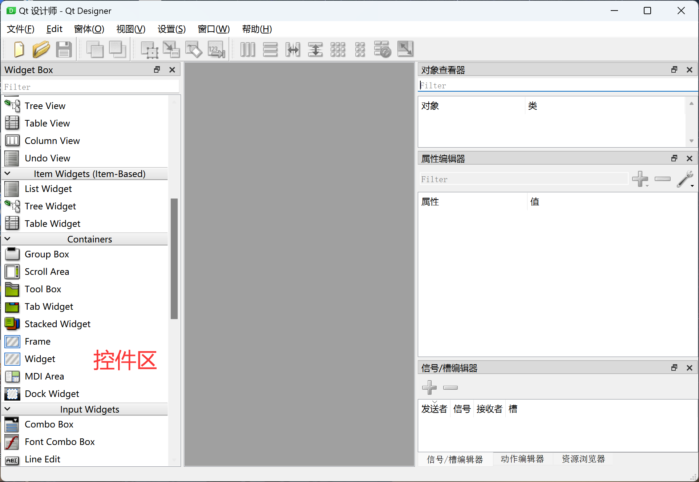

# Widgets Introduction

We have actually used widgets before. In the **First Window** tutorial, we used the PushButton and Label widgets. These are the most commonly used features in PyQt5 development. Windows and widgets together make up a GUI program. Different widgets or widgets and windows are connected through signals and slots to implement various logic and functions. This chapter will explain the usage of common widgets.

- The widget area is located on the left side of Qt Designer.

