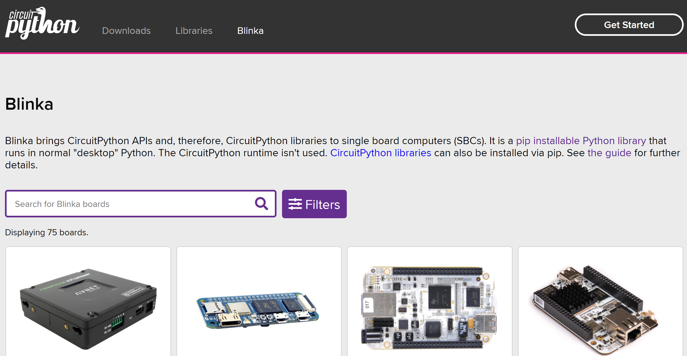

# Blinka (Python Library) Introduction

In the MCU field, we can use MicroPython or CircuitPython for Python embedded programming. For Linux single-board computers, there is an open-source project initiated by Adafruit called Blinka, which aims to provide a universal Python library for GPIO-based embedded programming on Linux boards. Currently, Blinka already supports many Linux development boards on the market, such as Raspberry Pi and Jetson Nano.

Open-source project: https://circuitpython.org/blinka

In short, once Blinka is installed on the Walnut Pi, you can easily use Python libraries to work with various GPIO peripherals on the development board. The factory system of the Walnut Pi comes with Blinka pre-installed, located in the **/usr/lib/walnutpi/Adafruit_Blinka** directory:

:::tip

The Blinka library pre-installed on the Walnut Pi has been customized and adapted for the Walnut Pi's CPU.

:::
