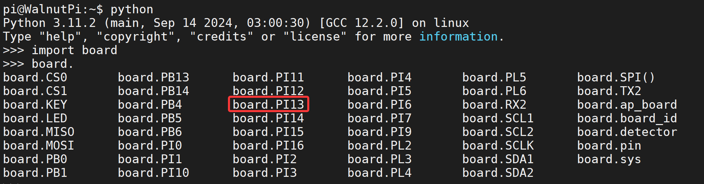
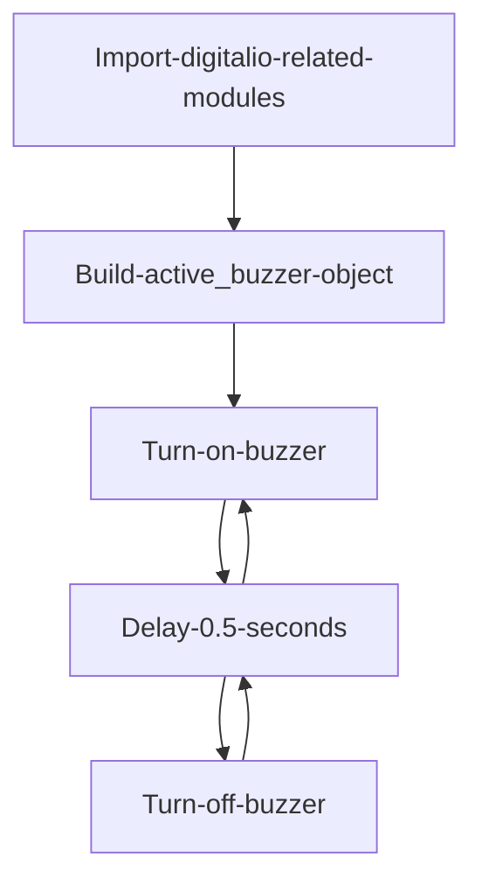
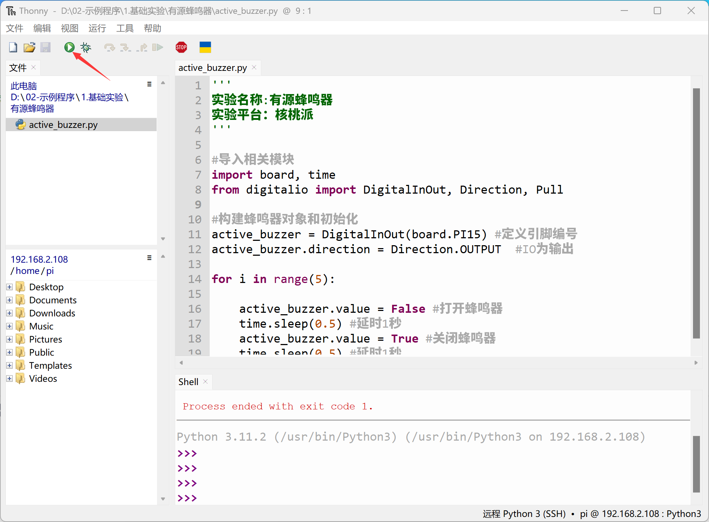
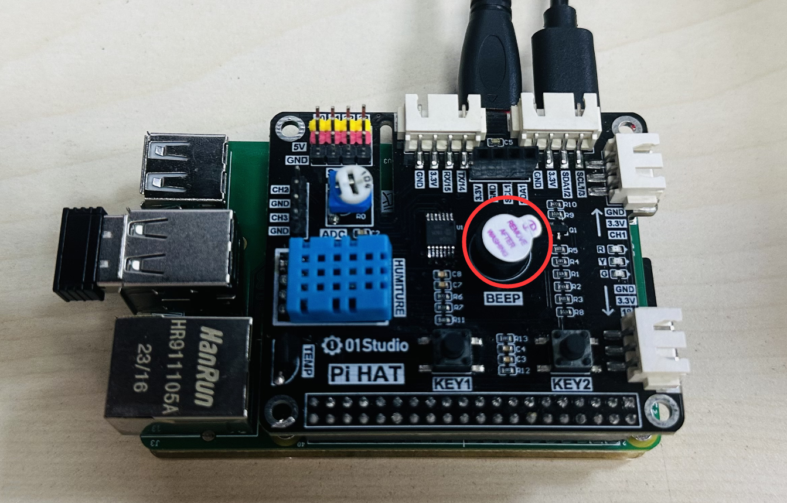

# Active Buzzer

## Introduction
In daily life, many electronic devices sound an alarm when a fault occurs, and sound often attracts attention more effectively than indicator lights. In this section, we will learn how to drive an active buzzer with the Walnut Pi.

## Experiment Objective
Program the buzzer to make beeping sounds.

## Experiment Explanation

Buzzers are mainly divided into active buzzers and passive buzzers. Active buzzers produce sound through high/low level control (fixed frequency), while passive buzzers are controlled by PWM signals (can produce sounds at different frequencies). In this section, we will explain how to use an active buzzer.

Using an active buzzer is similar to using an LED — just supply a high level to make it sound.

Connection of the active buzzer to the Walnut Pi: GND--GND, VCC -- 3.3V, IO -- PI13 (you can also change to any GPIO you prefer)

 <br></br>

The name of Walnut Pi PI13 in the Python library is **board.PI13**:

 <br></br><br></br>

## digitalio Object

In CircuitPython, you can directly use the digitalio module to program I/O output for high/low level output. Details are as follows:

### Constructor
```python
active_buzzer=digitalio.DigitalInOut(pin)
```
Parameter description:
- `pin` Development board pin number. Example: board.PI15

### Usage
```python
active_buzzer.direction = value
```
Defines pin as input/output. Value options:
- `digitalio.Direction.INPUT` : Input.
- `digitalio.Direction.OUTPUT` : Output.

<br></br>

## time Object

time can be used for delays.

### Constructor
```python
import time
```
Time module, used by direct import:

### Usage
```python
time.sleep(value)
```
Delay.
- value refers to the delay time in seconds. A value of 1 means 1 second, a value of 0.1 means 0.1 seconds, i.e., 100ms.

<br></br>

An active buzzer, like an LED, uses the digitalio object in output mode. We can make the buzzer produce beeping sounds by toggling the high/low level output every 0.5 seconds.



## Reference Code

```python
'''
Experiment Name: Active Buzzer
Experiment Platform: Walnut Pi
'''

# Import related modules
import board, time
from digitalio import DigitalInOut, Direction, Pull

# Build buzzer object and initialize
active_buzzer = DigitalInOut(board.PI13) # Define pin number
active_buzzer.direction = Direction.OUTPUT  # IO as output

for i in range(5):
    
    active_buzzer.value = False # Turn on buzzer
    time.sleep(0.5) # Delay 1 second
    active_buzzer.value = True # Turn off buzzer
    time.sleep(0.5) # Delay 1 second   
```

## Experiment Results

Here we use Thonny to remotely run the above Python code on the Walnut Pi. For instructions on running Python code on the Walnut Pi, please refer to: [Running Python Code](../python_run.md)




Running the code, you can hear the active buzzer periodically beeping. The hardware used here is a PiHAT expansion board suitable for Raspberry Pi and Walnut Pi. [**Purchase link->**](https://item.taobao.com/item.htm?id=623492184275). Users can also connect an active buzzer using Dupont wires themselves.


