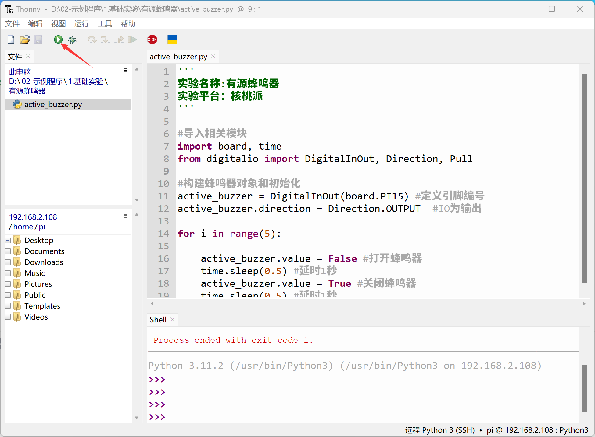

# 有源蜂鸣器

## 前言
日常生活中我们不少电子设备在遇到故障时都会报警，而声音比指示灯往往更容易引起人们的注意，本节我们来学习一下核桃派驱动有源蜂鸣器。

## 实验目的
编程实现蜂鸣器发出滴滴响声。

## 实验讲解

蜂鸣器主要分为有源蜂鸣器和无源蜂鸣器，有源蜂鸣器通过高低电平控制发出声音（频率固定），无源蜂鸣器通过PWN波控制（可以发出不同频率声音），这节我们讲解一下有源蜂鸣器的使用。

有源蜂鸣器的用法跟LED类似，只需要给蜂鸣器高电平就可以发声。

有源蜂鸣器跟核桃派的连接方式：GND--GND , VCC -- 3.3V, IO -- PI13（也可以改成自己想用的GPIO）

 <br></br>

核桃派PI13在Python库中的名称为**board.PI13** :

 <br></br><br></br>

## digitalio对象

在CircuitPython中可以直接使用 digitalio（数字 IO）模块编程实现IO输入从而实现高低电平输出。具体介绍如下表：

### 构造函数
```python
active_buzzer=digitalio.DigitalInOut(pin)
```
参数说明：
- `pin` 开发板引脚编号。例：board.PI15

### 使用方法
```python
active_buzzer.direction = value
```
引脚定义输入/输出。value匹配值如下：
- `digitalio.Direction.INPUT` ：输入。
- `digitalio.Direction.OUTPUT` ：输出。

<br></br>

## time对象

time可以用于延时。

### 构造函数
```python
import time
```
时间模块，直接import使用：

### 使用方法
```python
time.sleep(value)
```
延时。
- value指延时时间，单位秒，数值为1表示1秒，数值为0.1表示0.1秒，即100ms。

<br></br>

有源蜂鸣器跟LED一样用到digitalio对象，输出方式方式，我们可以通过代码实现每隔0.5秒输入高低电平变化实现蜂鸣器滴滴响声。

```mermaid
graph TD
    导入digitalio相关模块-->构建active_buzzer对象-->打开蜂鸣器-->延时0.5秒-->关闭蜂鸣器-->延时0.5秒-->打开蜂鸣器;
```

## 参考代码

```python
'''
实验名称:有源蜂鸣器
实验平台：核桃派
'''

#导入相关模块
import board, time
from digitalio import DigitalInOut, Direction, Pull

#构建蜂鸣器对象和初始化
active_buzzer = DigitalInOut(board.PI13) #定义引脚编号
active_buzzer.direction = Direction.OUTPUT  #IO为输出

for i in range(5):
    
    active_buzzer.value = False #打开蜂鸣器
    time.sleep(0.5) #延时1秒
    active_buzzer.value = True #关闭蜂鸣器
    time.sleep(0.5) #延时1秒   
```

## 实验结果

这里使用Thonny远程核桃派运行以上Python代码，关于核桃派运行python代码方法请参考： [运行Python代码](../python_run.md)




运行代码可以听到有源蜂鸣器周期性发出“滴滴”响声。这里使用的是一款适用于树莓派和核桃派的PiHAT扩展板，[**购买链接->**](https://item.taobao.com/item.htm?id=623492184275) 。用户也可以自己通过杜邦线连接有源蜂鸣器。

