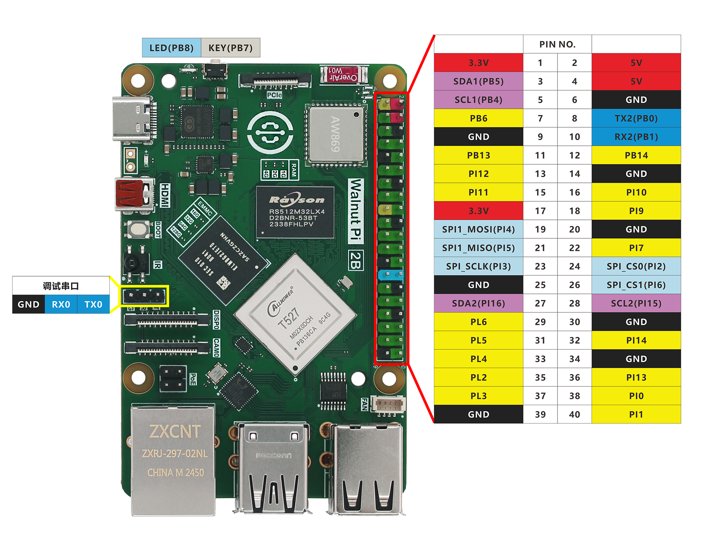
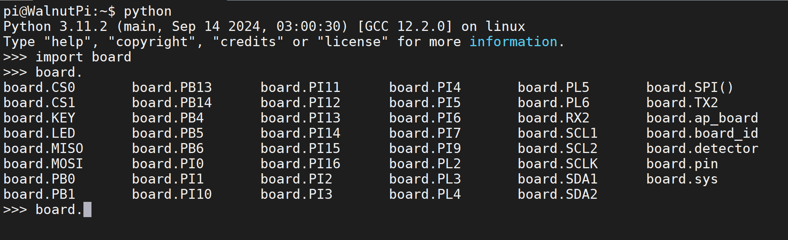

# GPIO Introduction

Before we start learning, let's take a detailed look at the Walnut Pi's GPIO pins, i.e., the 40-pin GPIO header mentioned earlier. The Walnut Pi is already a great single-board computer, but the GPIO design makes it easier for users to perform various DIY electronic projects, giving you an experience similar to using a powerful microcontroller development board.


Below is the Walnut Pi GPIO pinout diagram:


As shown in the table and diagram above, GPIO is similar to traditional microcontroller development. In addition to regular I/O pins, it also features I2C, UART, SPI and other bus interfaces. In future experiments, you will see that using Python to program on the Walnut Pi becomes very easy. We just need to be familiar with the object functions and usage of Python libraries to effortlessly work with Walnut Pi embedded programming.

We can check pin numbers through Python commands in the terminal.

Enter python in the terminal to start Python interactive mode:
```bash
python
```

Then enter:
```python
import board
```
Then enter:
```python
board.
```
Press the Tab key to autocomplete and see all Walnut Pi Python library pin names.



This will be used in later experiments.
