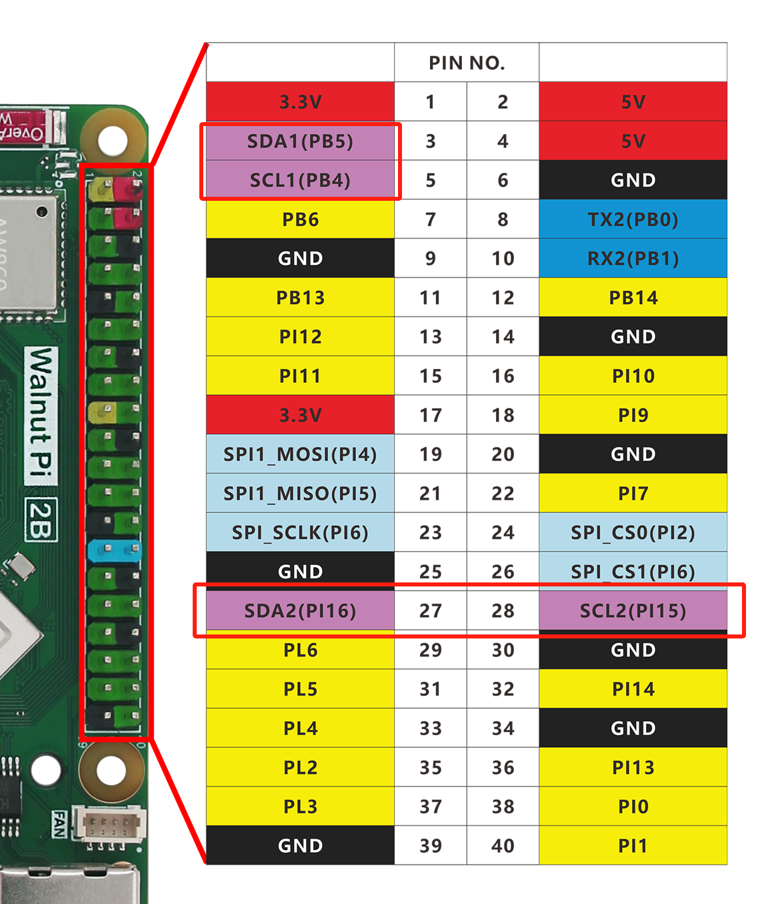
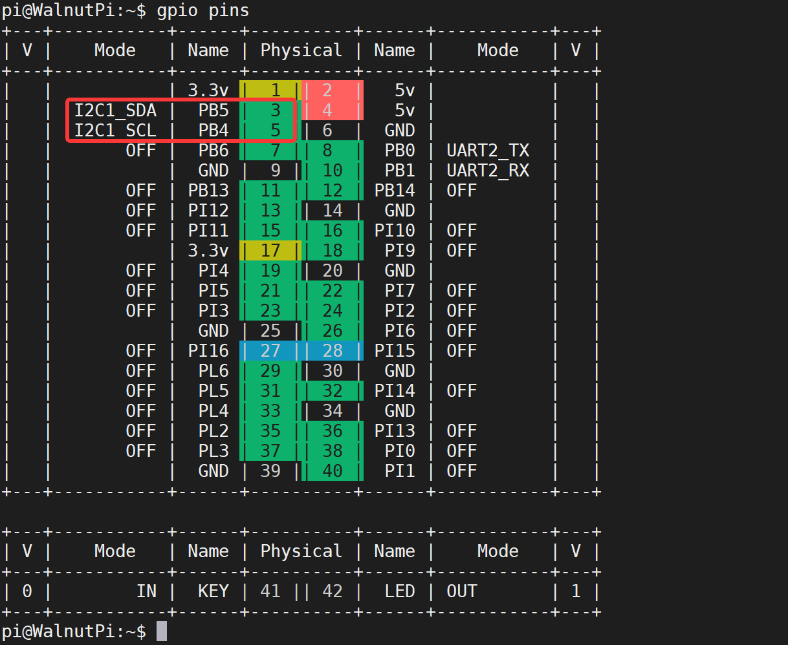
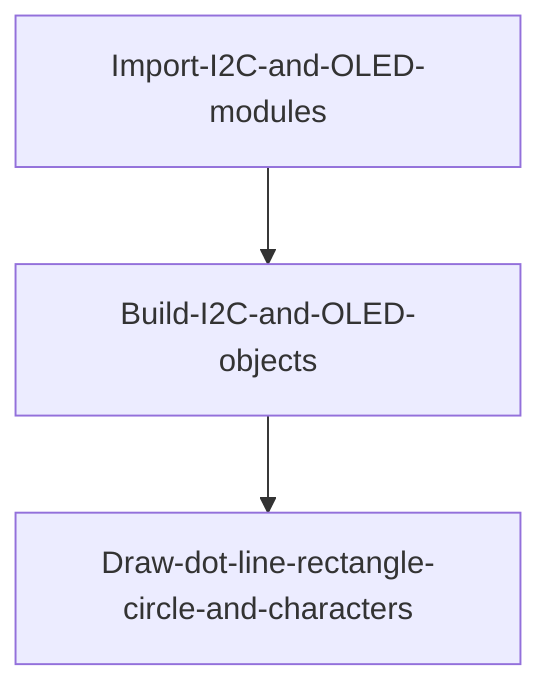
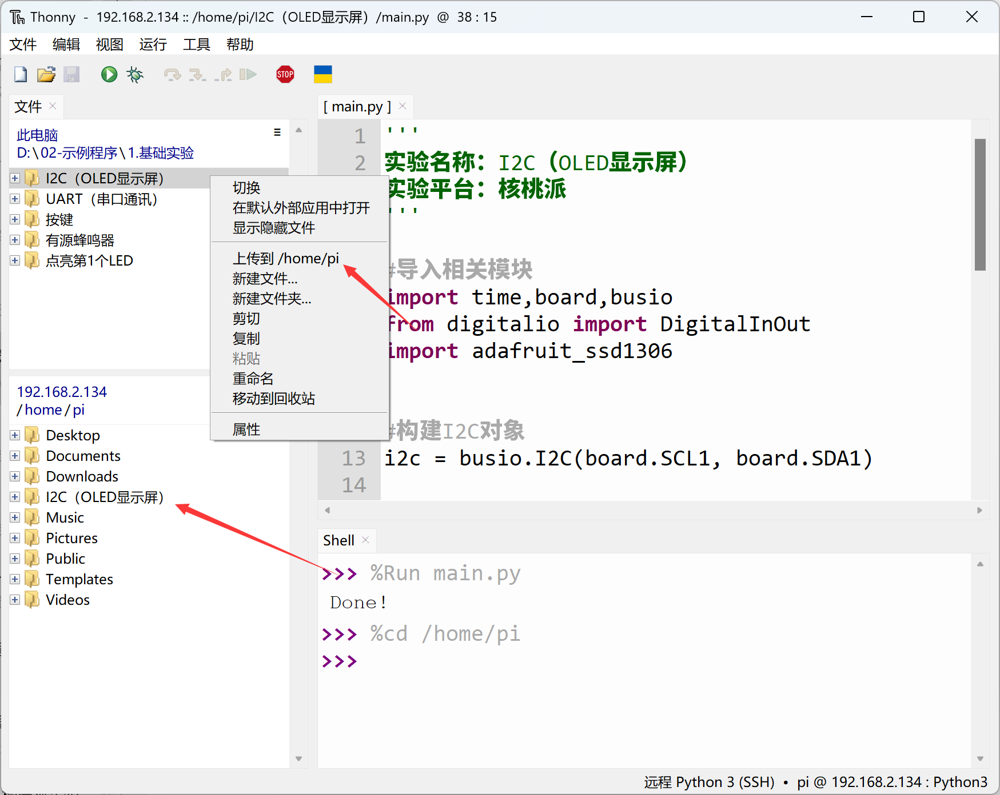
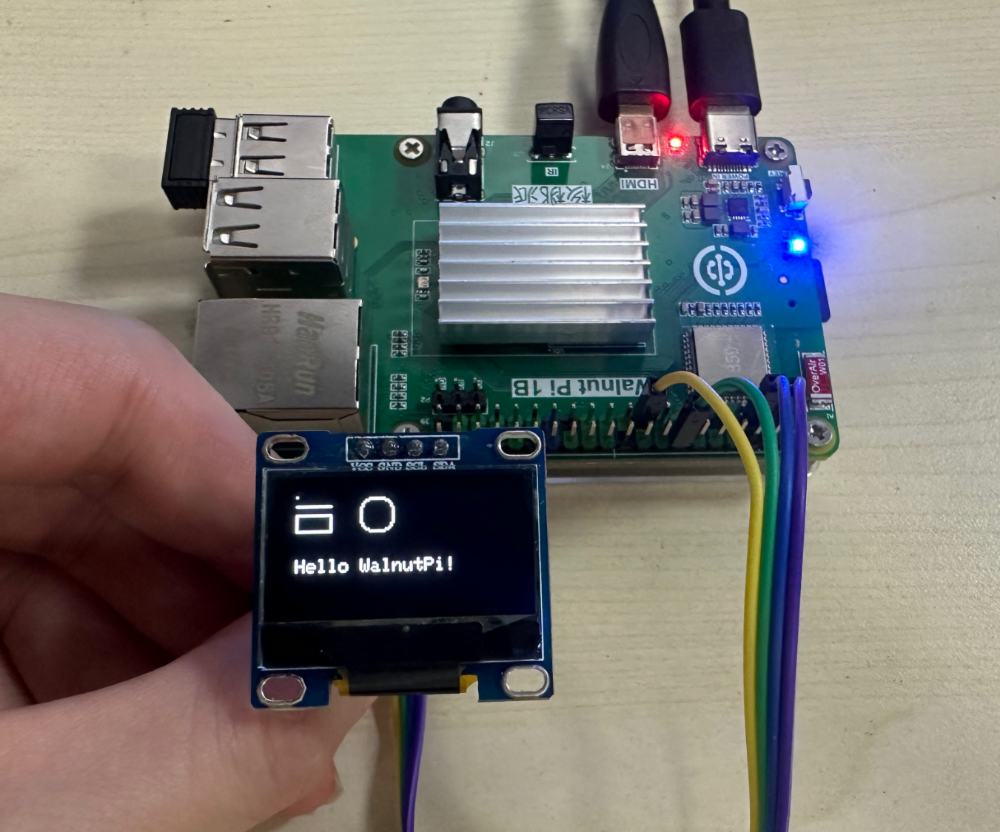

# I2C (OLED Display)

## Introduction
Previously we learned about various input/output devices. LED lights are also output devices because they tell us the hardware status. However, compared to LEDs that only have on/off states, OLED displays can show much more information, providing a better experience. This chapter's OLED display learning is actually about learning to use the Walnut Pi's I2C bus interface, because the Walnut Pi communicates with the OLED display via the I2C bus.

## Experiment Objective
Learn to use the Walnut Pi's I2C bus programming and OLED display.

## Experiment Explanation

**What is I2C?**
I2C is a two-wire protocol for communication between devices. At the physical level, it consists of 2 lines: SCL and SDA, which are the clock line and data line respectively. This means different devices can communicate through just these two wires.

**What is an OLED Display?**
OLED displays are self-illuminating and do not require a backlight like TFT LCDs. Therefore, they offer high visibility and brightness, low voltage requirements, high power efficiency, fast response, light weight, thin profile, simple construction, and low cost. Simply put, the difference from traditional LCDs is that the pixel material consists of individual light-emitting diodes. Due to low density, pixel resolution was initially low, so they were mainly used for outdoor LED billboards in the early days. As technology matured, integration density has increased, and small screens can now achieve higher resolutions. The OLED driver chip used in this experiment is the common SSD1306, which is readily available on the market.

Specifications: 0.91-inch / 128x64 resolution / white text on black background (3.3V power supply).


The Walnut Pi GPIO provides 2 I2C ports: I2C1 and I2C2, as shown below:



This experiment uses I2C1 to connect the OLED display, with wiring as follows:


## Enable I2C1

Enter the following command in the terminal:
```bash
sudo set-device enable i2c1
```

Restart the development board:
```bash
sudo reboot
```

Check the status after startup:
```bash
gpio pins
```

The following output indicates successful activation:


For more GPIO configuration tutorials, see: [GPIO Device Configuration](../../gpio/gpio_config.md)

## I2C Object

Generally, I2C communication speeds are not high, so we can use CircuitPython's software-simulated I2C. The object description is as follows:

### Constructor
```python
i2c=busio.I2C(scl,sda,frequency=100000,timeout=255)
```
Build a software I2C object.
- `scl` : Clock pin;
- `sda` : Data pin;
- `frequency` : Communication frequency, i.e., speed;
- `timeout` : Timeout duration.

### Usage
```python
i2c.scan()
```
Scan for devices on the I2C bus. Returns address, e.g., 0x3c;

<br></br>

```python
i2c.readfrom(address,buffer)
```
Read data from a specified address.
- `address` : Number of characters to read.
- `buffer` : Data content.

<br></br>

```python
i2c.writeto(address,buffer)
```
Write data to a specified address.
- `address` : Number of characters to read.
- `buffer` : Data content.

<br></br>

```python
i2c.deinit()
```
Deinitialize the I2C object.

<br></br>

For more I2C usage, see the official documentation: search **"busio.I2C"** at https://docs.circuitpython.org/.

## SSD1306_I2C Object

In addition to the I2C mentioned above, controlling the OLED screen also requires OLED-related Python libraries. These libraries have already been written by the Blinka project and provided as Python files. We just need to place the relevant files and the main code file in the same directory.

### Constructor

```python
display = adafruit_ssd1306.SSD1306_I2C(width, height, i2c, addr=0x3C)
```
Build an SSD1306-driven OLED display object.
- `width` : OLED horizontal resolution;
- `height` : OLED vertical resolution;
- `i2c` : Initialized I2C object;
- `addr` : OLED I2C address, varies by manufacturer. The screen used here has address 0x3C.

### Usage

```python
display.fill(value)
```
Clear screen.
- `value` : Color.
    - `0` : Black
    - `1` : White

<br></br>

```python
display.show()
```
Display refresh. After adding new display content, this command must be executed to display it.

<br></br>

```python
display.pixel(x,y,color)
```
Draw a dot.
- `x` : Horizontal coordinate.
- `y` : Vertical coordinate.
- `color` : Color:
    - `1` : White
    - `2` : Black

<br></br>

```python
display.hline(x,y,width,color)
```
Draw a horizontal line.
- `x` : Horizontal coordinate.
- `y` : Vertical coordinate.
- `width` : Length.
- `color` : Color:
    - `1` : White
    - `2` : Black

<br></br>

```python
display.rect(x,y,width,height,color,fill=false)
```
Draw a rectangle.
- `x` : Horizontal coordinate.
- `y` : Vertical coordinate.
- `width` : Length.
- `height` : Height.
- `color` : Color:
    - `1` : White
    - `2` : Black
- `fill` : Whether to fill.
    - `false` : Do not fill
    - `true` : Fill

<br></br>

```python
display.circle(center_x,center_y,radius,color)
```
Draw a circle.
- `center_x` : Center horizontal coordinate.
- `center_y` : Center vertical coordinate.
- `radius` : Radius.
- `color` : Color:
    - `1` : White
    - `2` : Black

<br></br>

```python
display.text(string,x,y,font_name='font5*8.bin',size=1)
```
Write characters at a specified position.
- `string` : Characters.
- `x` : Starting horizontal coordinate.
- `y` : Starting vertical coordinate.
- `font_name` : Font.
- `size` : Size.

For more usage, see the official documentation:
https://circuitpython.readthedocs.io/projects/framebuf/en/latest/api.html

After learning the I2C and OLED object usage, let's organize the programming flow:



## Reference Code

```python
'''
Experiment Name: I2C (OLED Display)
Experiment Platform: Walnut Pi
'''

# Import related modules
import time,board,busio
from digitalio import DigitalInOut
import adafruit_ssd1306


# Build I2C object
i2c = busio.I2C(board.SCL1, board.SDA1)

# Build OLED object, the matching OLED address is 0x3C
display = adafruit_ssd1306.SSD1306_I2C(128, 64, i2c, addr=0x3C)

# Clear screen
display.fill(0)
display.show()

# Draw dot (x,y,color)
display.pixel(5, 5, 1)

# Draw line (x, y, width, color)
display.hline(5,10,20,1)

# Draw rectangle (x, y, width, height, color, *, fill=False)
display.rect(5, 15, 20, 10, 1)

# Draw circle
display.circle(50, 15, 10, 1)

# Characters
display.text("Hello WalnutPi!", 5, 40, 1,font_name='font5x8.bin')

# Display
display.show()
print('Done!')
```

## Experiment Results

Enter the following command in the terminal to confirm I2C1 activation:
```bash
gpio pins
```

The following output indicates successful activation:


If not enabled, follow the steps above to enable: [Enable I2C1](#enable-i2c1)

Connect the OLED display to the Walnut Pi GPIO as follows:


Since the OLED code depends on other Python libraries, the entire example folder needs to be uploaded to the Walnut Pi:



After successful transfer, you need to open and run the main.py file from the remote directory (Walnut Pi), because running it will import other files within the folder. Therefore, this type of code cannot run locally on the computer.


Then use Thonny to remotely run the above Python code on the Walnut Pi. For instructions on running Python code on the Walnut Pi, please refer to: [Running Python Code](../python_run.md)


After running, you can see the OLED display showing the relevant content:


