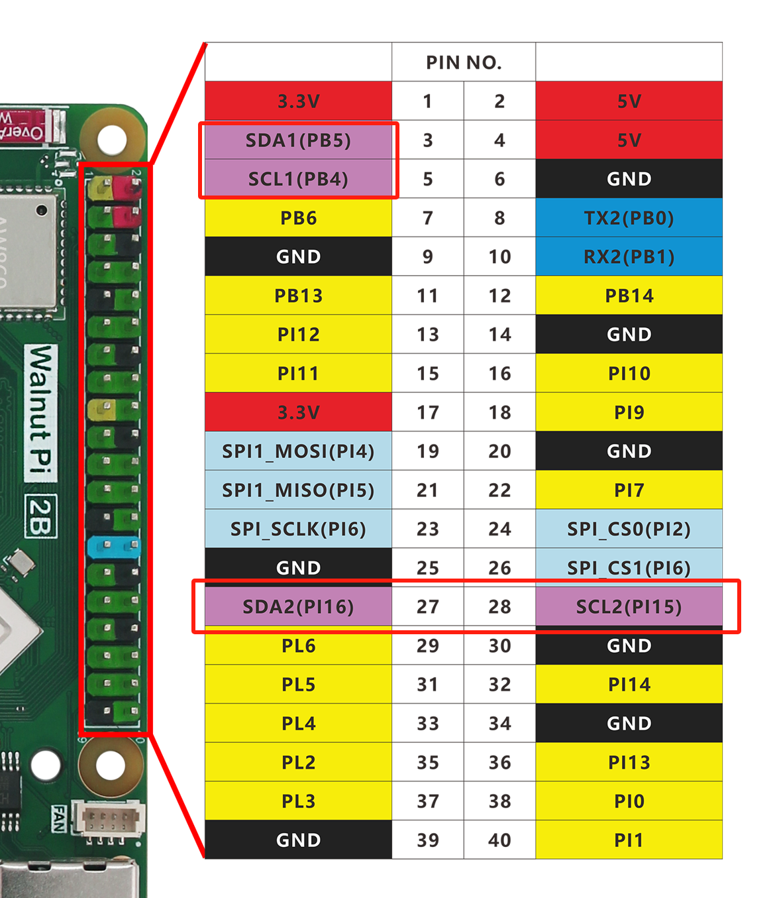
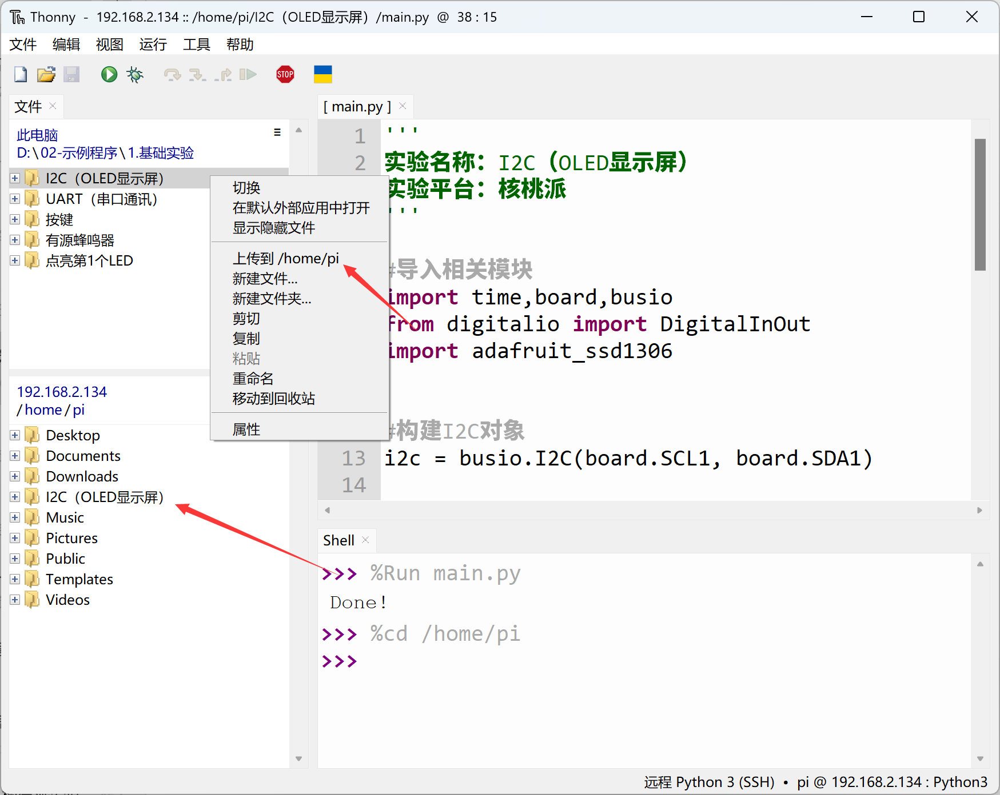
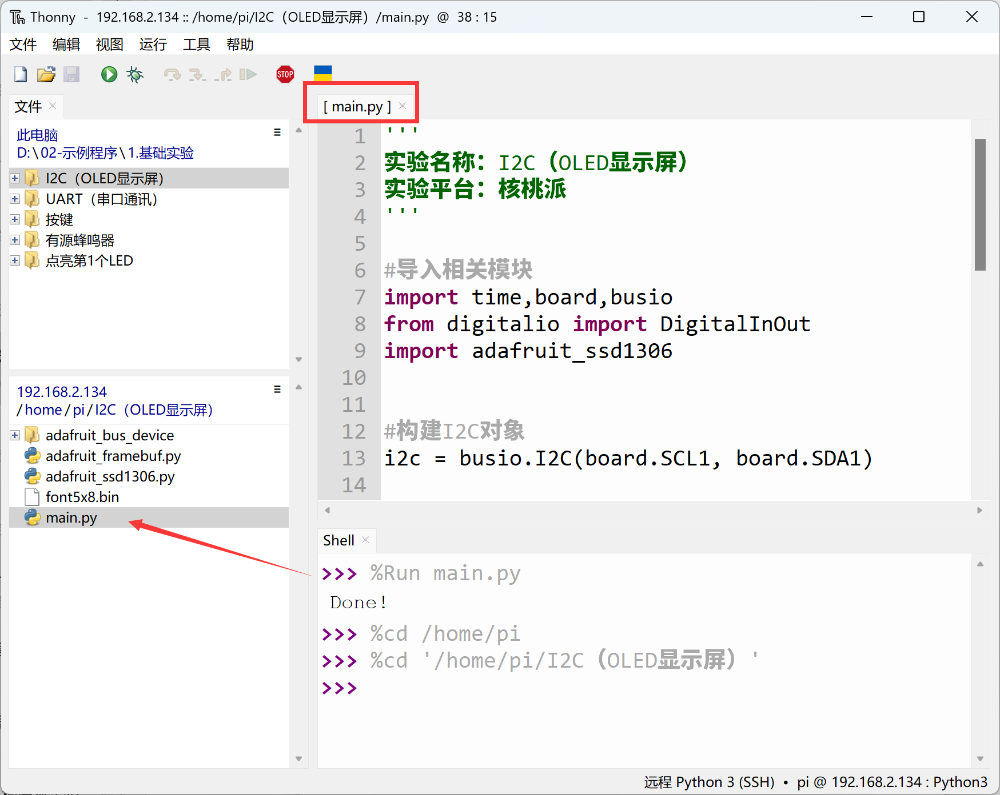
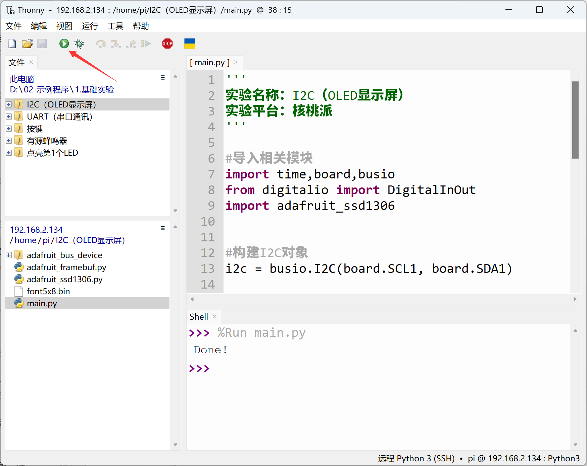
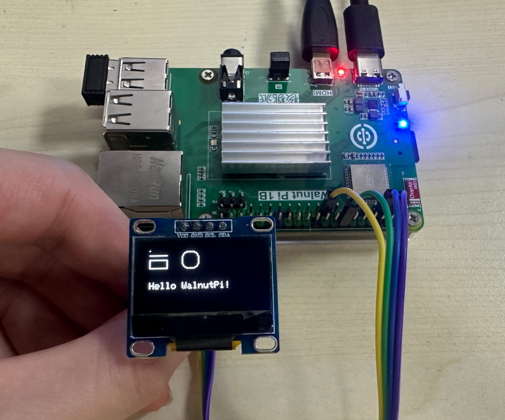

# I2C（OLED显示屏）

## 前言
在前面我们学习了不少输入输出设备，比如LED灯也算是输出设备，因为它们确切地告诉了我们硬件的状态。只是相对于只有亮灭的LED而言，oled显示屏可以显示更多的信息，体验更好。本章节OLED显示屏的学习，实际上是为了学习使用核桃派的I2C的总线接口，因为核桃派通过I2C总线与OLED显示屏通讯的。

## 实验目的
学习使用核桃派的I2C总线编程和OLED显示屏使用。

## 实验讲解

**什么是I2C？**
I2C是用于设备之间通信的双线协议，在物理层面，它由2条线组成：SCL和SDA，分别是时钟线和数据线。也就是说不同设备间通过这两根线就可以进行通信。

**什么是OLED显示屏？**
OLED的特性是自己发光，不像TFT LCD需要背光，因此可视度和亮度均高，其次是电压需求低且省电效率高，加上反应快、重量轻、厚度薄，构造简单，成本低等特点。简单来说跟传统液晶的区别就是里面像素的材料是由一个个发光二极管组成，因为密度不高导致像素分辨率低，所以早期一般用作户外LED广告牌。随着技术的成熟，使得集成度越来越高。小屏也可以制作出较高的分辨率。本实验使用的oled驱动芯片型号是常见的ssd1306，市面上也比较容易买到。

规格： 0.9寸/128*64分辨率/黑底白字（3.3V供电）。
 
 


核桃派的GPIO有引出2路I2C串口，分别是I2C1和I2C2，如下图：

 

本实验我们使用I2C1连接OLED屏，连线如下：

 

## 开启I2C1

在终端输入下面指令：
```bash
sudo set-device enable i2c1
```

重启开发板：
```bash
sudo reboot
```

启动后查看开启情况：
```bash
gpio pins
```

出现下图表示开启成功：
 

更多GPIO配置教程请看：[GPIO设备配置](../../gpio/gpio_config.md)

## I2C对象

一般来说I2C通讯速率不高，所以我们可以使用CircuitPython的软件模拟I2C，对象说明如下：

### 构造函数
```python
i2c=busio.I2C(scl,sda,frequency=100000,timeout=255)
```
构建软件I2C对象。
- `scl` :时钟引脚；
- `sda` :数据引脚；
- `frequency` :通讯频率，即速度；
- `timeout` :超时时间。

### 使用方法
```python
i2c.scan()
```
扫描I2C总线的设备。返回地址，如：0x3c；

<br></br>

```python
i2c.readfrom(address,buffer)
```
从指定地址读数据。
- `address` ：读取字符数量。
- `buffer` ：数据内容。

<br></br>

```python
i2c.writeto(address,buffer)
```
从指定地址写数据。
- `address` ：读取字符数量。
- `buffer` ：数据内容。

<br></br>

```python
i2c.deinit()
```
注销I2C对象。

<br></br>

更多I2C用法，请看官方文档：https://docs.circuitpython.org/ 下搜索 **"busio.I2C"**。

## SSD1306_I2C对象

除了前面的I2C外，控制OLED屏还需要OLED相关的python库，这些库Blinka项目已经写好，并以py文件方式给出，我们只需要把相关文件和主函数代码文件在同一目录下即可。

### 构造函数

```python
display = adafruit_ssd1306.SSD1306_I2C(width, height, i2c, addr=0x3C)
```
构建SSD1306驱动的OLED显示对象。
- `width` : OLED宽分辨率；
- `height` :OLED高分辨率；
- `i2c` :初始化好的I2C对象；
- `addr` : OLED的I2C地址，不同厂家不一样，这里用的屏地址是0x3C。

### 使用方法

```python
display.fill(value)
```
清屏。
- `value` : 颜色。
    - `0` : 黑屏
    - `1` : 白色

<br></br>

```python
display.show()
```
显示刷新。新增显示内容后需要执行此指令才能显示。

<br></br>

```python
display.pixel(x,y,color)
```
画点。
- `x` : 横坐标。
- `y` : 纵坐标。
- `color` : 颜色：
    - `1` : 白色
    - `2` : 黑色

<br></br>

```python
display.hline(x,y,width,color)
```
画横线。
- `x` : 横坐标。
- `y` : 纵坐标。
- `width` : 长度。
- `color` : 颜色：
    - `1` : 白色
    - `2` : 黑色

<br></br>

```python
display.rect(x,y,width,height,color,fill=false)
```
画矩形。
- `x` : 横坐标。
- `y` : 纵坐标。
- `width` : 长度。
- `height` : 高度。
- `color` : 颜色：
    - `1` : 白色
    - `2` : 黑色
- `fill` : 是否填充。
    - `false` : 不填充
    - `true` : 填充

<br></br>

```python
display.circle(center_x,center_y,radius,color)
```
画圆形。
- `center_x` : 圆心横坐标。
- `center_y` : 圆心纵坐标。
- `radius` : 半径。
- `color` : 颜色：
    - `1` : 白色
    - `2` : 黑色

<br></br>

```python
display.text(string,x,y,font_name=’font5*8.bin’,size=1)
```
将字符写在指定为位置。
- `string` : 字符。
- `x` : 起始横坐标。
- `y` : 起始纵坐标。
- `font_name` : 字体。
- `size` : 尺寸。

更多使用方法请看官方文档：
https://circuitpython.readthedocs.io/projects/framebuf/en/latest/api.html

学习了I2C、OLED对象用法后我们通过编程流程图来理顺一下思路：

```mermaid
graph TD
    导入I2C和OLED模块-->构建I2C和OLED对象-->画点,线,矩形,圆,字符;
```

## 参考代码

```python
'''
实验名称：I2C（OLED显示屏）
实验平台：核桃派
'''

#导入相关模块
import time,board,busio
from digitalio import DigitalInOut
import adafruit_ssd1306


#构建I2C对象
i2c = busio.I2C(board.SCL1, board.SDA1)

#构建oled对象,配套的OLED地址为0x3C
display = adafruit_ssd1306.SSD1306_I2C(128, 64, i2c, addr=0x3C)

#清屏
display.fill(0)
display.show()

#画点(x,y,color)
display.pixel(5, 5, 1)

#画线(x, y, width, color)
display.hline(5,10,20,1)

#画矩形(x, y, width, height, color, *, fill=False)
display.rect(5, 15, 20, 10, 1)

#画圆
display.circle(50, 15, 10, 1)

#字符
display.text("Hello WalnutPi!", 5, 40, 1,font_name='font5x8.bin')

#窗口打印
display.show()
print('Done!')
```

## 实验结果

终端输入下面指令确认I2C1开启情况：
```bash
gpio pins
```

出现下图表示开启成功：

 

如没开启请按前面内容打开：[开启I2C1](#开启i2c1)

将OLED显示屏按下面方式接到核桃派GPIO：

 

由于OLED代码依赖其它py库，所以需要将整个文件夹文件上传到核桃派：

 

发送成功后需要打开远程目录（核桃派）的main.py来运行，因为运行会导入文件夹里面的其它文件，因此这类型代码在电脑本地运行是无效的。

 

然后使用Thonny远程核桃派运行以上Python代码，关于核桃派运行python代码方法请参考： [运行Python代码](../python_run.md)

 

运行后可以看到OLED显示相关内容：

 