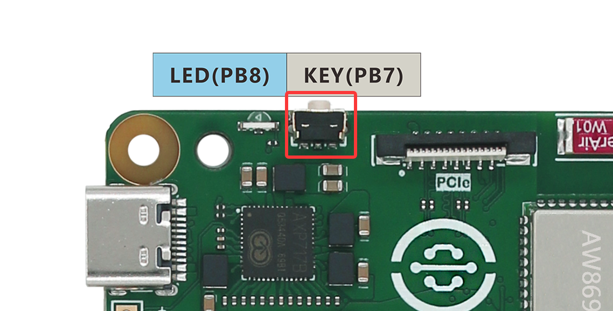
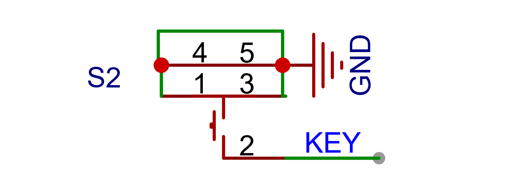
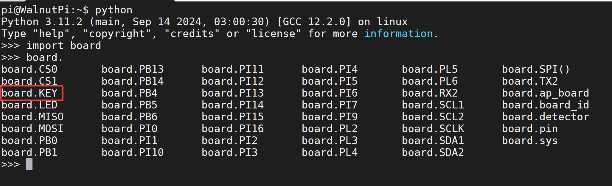
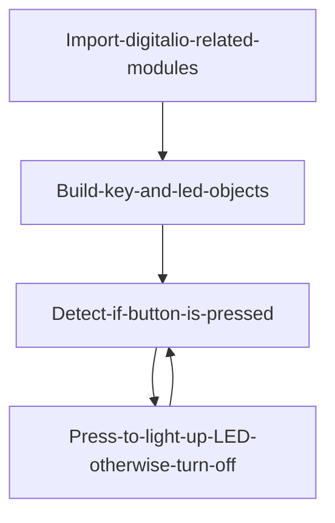
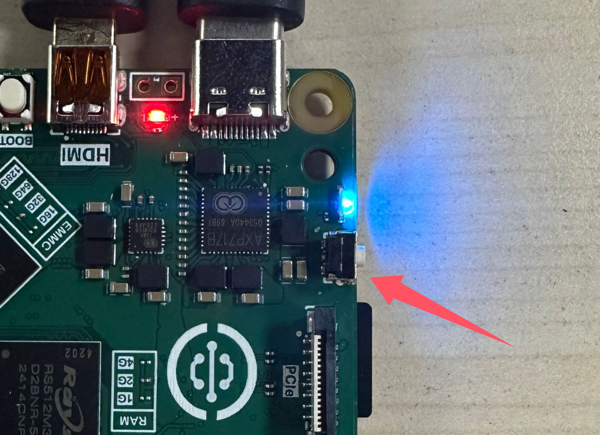
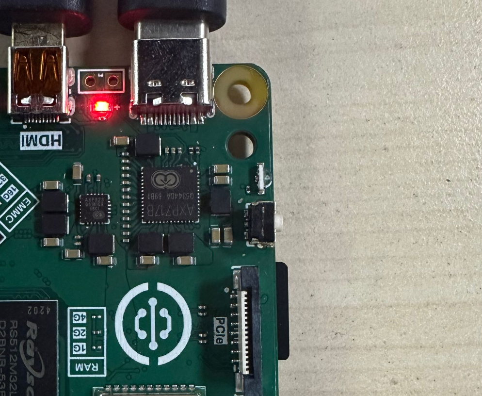

# Button

## Introduction
The button is the simplest and most common input device. Many products rely on buttons, including early iPhones. Today we'll learn how to write a button program using Python. With button input functionality, we can create many fun projects.

## Experiment Objective
Program to detect button input.

## Experiment Explanation

The Walnut Pi has an onboard button, located next to the Type-C power port:

  <br></br><br></br>

From the Walnut Pi schematic, we can see the button is connected to the main control pin PC12. When not pressed, it inputs a high level (1); when pressed, it connects to ground and outputs a low level (0):

 <br></br><br></br>


Since we are using a Python library, we only need to know the library pin name. The button's name in the Python library is **board.KEY**:

 <br></br><br></br>

## digitalio Object

In CircuitPython, you can directly use the digitalio module to program I/O input for detecting the button's input level. Details are as follows:

### Constructor
```python
key=digitalio.DigitalInOut(pin)
```
Parameter description:
- `pin` Development board pin number. Example: board.PC8

### Usage
```python
key.direction = value
```
Defines pin as input/output. Value options:
- `digitalio.Direction.INPUT` : Input.
- `digitalio.Direction.OUTPUT` : Output.

<br></br>

```python
key.pull = value
```
Set pull-up/pull-down resistor. Value options:
- `digitalio.Pull.UP` : Pull-up.
- `digitalio.Pull.DOWN` : Pull-down.

<br></br>

```python
value = key.value
```
Key input return value. Value return values:
- `True` or `1` : High level.
- `False` or `0` : Low level.

<br></br>

For more usage, please refer to the official documentation:<br></br>
https://docs.circuitpython.org/en/latest/shared-bindings/digitalio/index.html

KEY, like the LED in the previous section, also uses the digitalio object, but changed from output mode to input mode. We can write code to light up the blue LED when the button is pressed (input low level) and turn it off when released (input high level).



## Reference Code

```python
'''
Experiment Name: Button
Experiment Platform: Walnut Pi
'''

# Import related modules
import board
from digitalio import DigitalInOut, Direction, Pull

# Build LED object and initialize
led = DigitalInOut(board.LED) # Define pin number
led.direction = Direction.OUTPUT  # IO as output

# Build key object and initialize
key = DigitalInOut(board.KEY) # Define pin number
key.direction = Direction.INPUT # IO as input
key.pull = Pull.UP # Enable pull-up resistor

while True:

    if key.value == 0: # Button pressed
        led.value = 1 # Light up LED

    else: # Released
        led.value = 0 # Turn off LED
```

## Experiment Results

Here we use Thonny to remotely run the above Python code on the Walnut Pi. For instructions on running Python code on the Walnut Pi, please refer to: [Running Python Code](../python_run.md)


Press the button, LED lights up.



Release, LED turns off



Besides using the onboard button and LED, you can also build your own circuit. Just modify the GPIO pin number in the code accordingly.


The essence of the button is also GPIO operation. Besides the onboard LED and button, you can also connect to other GPIO pins (on the 40-pin header) using Dupont wires to use related functions.
