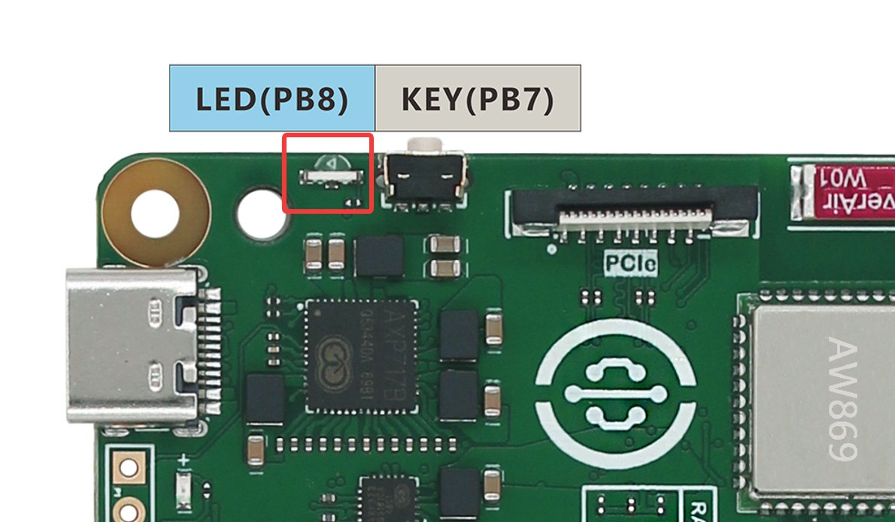
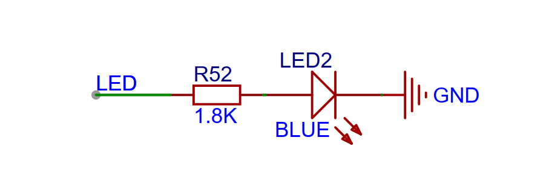
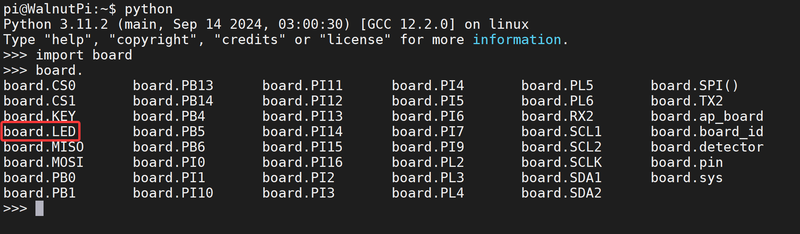
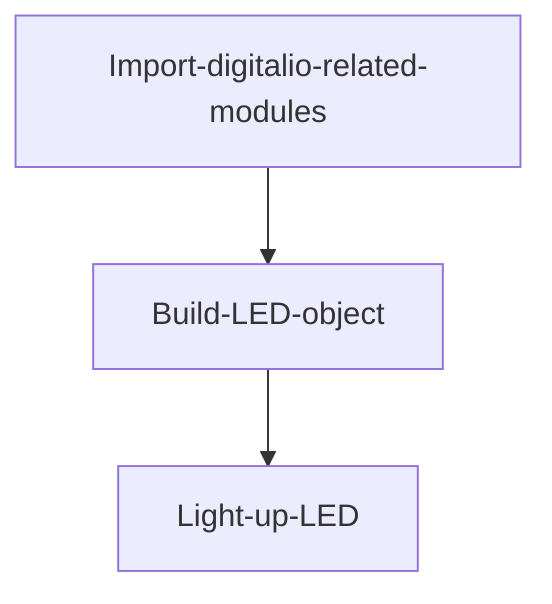
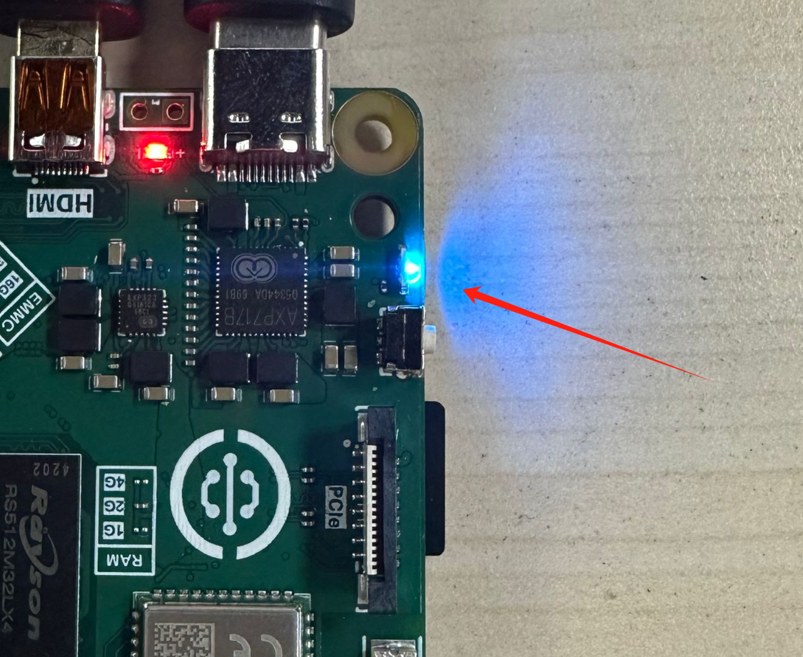
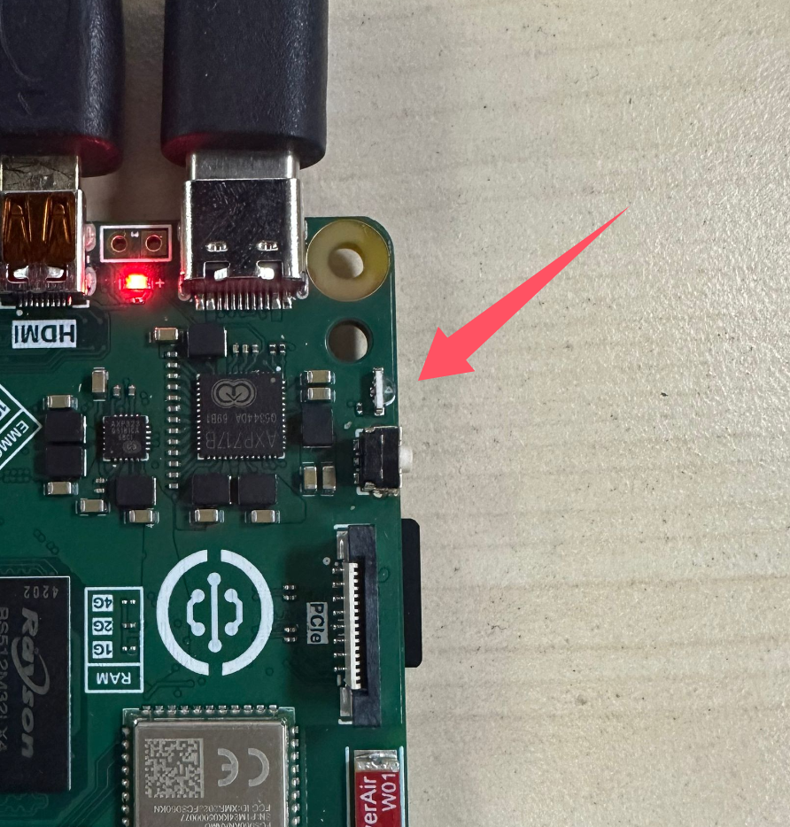
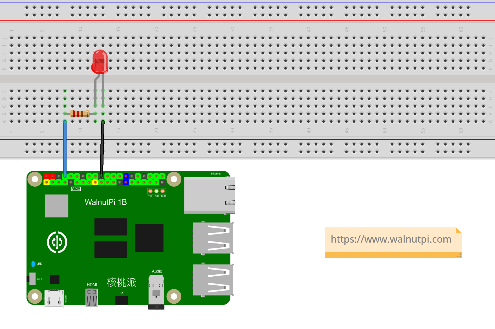

# Lighting the First LED

## Introduction
It's believed that most people start learning embedded MCU programming by lighting an LED, and learning on the Walnut Pi is no exception. Lighting the first LED will give you a certain understanding of Walnut Pi GPIO applications and programming methods, laying the foundation for future learning and larger programs while boosting confidence.

## Experiment Objective
Light up the onboard blue LED.

## Experiment Explanation

The Walnut Pi has an onboard programmable LED, located next to the button:


From the Walnut Pi schematic, we can see that the LED is connected to the main control pin PC13, which lights up when outputting a high level:


Since we are using a Python library, we only need to know the library pin name.

We can check the pin number through Python commands in the terminal.

Enter python in the terminal to start Python interactive mode:
```bash
python
```

Then enter:
```python
import board
```
Then enter:
```python
board.
```
Press the Tab key to autocomplete and see all Walnut Pi Python library pin names.

The LED's name in the Python library is **board.LED**:



## digitalio Object

In CircuitPython, you can directly use the digitalio module to program I/O output to light up the LED. Details are as follows:

### Constructor
```python
led=digitalio.DigitalInOut(pin)
```
Parameter description:
- `pin` Development board pin number. Example: board.LED, board.PB6

### Usage
```python
led.direction = value
```
Defines pin as input/output. Value options:
- `digitalio.Direction.INPUT` : Input.
- `digitalio.Direction.OUTPUT` : Output.

<br></br>

```python
led.pull = value
```
Set pull-up/pull-down resistor. Value options:
- `digitalio.Pull.UP` : Pull-up.
- `digitalio.Pull.DOWN` : Pull-down.

<br></br>

```python
led.value = value
```
GPIO output value. Value options:
- `True` or `1` : High level.
- `False` or `0` : Low level.

<br></br>

For more usage, please refer to the official documentation:<br></br>
https://docs.circuitpython.org/en/latest/shared-bindings/digitalio/index.html

The above describes CircuitPython's DigitalInOut object in detail. digitalio is the main module, and DigitalInOut, Direction, Pull, DriveMode are submodules under digitalio. In Python programming, there are two ways to reference related modules:

- Method 1: import digitalio, then operate via digitalio.DigitalInOut;
- Method 2: from digitalio import DigitalInOut, meaning directly import the DigitalInOut module from digitalio and then operate directly via DigitalInOut. Method 2 is clearly more intuitive and convenient. This experiment also uses Method 2 for programming. The code flow is as follows:



## Reference Code

```python
'''
Experiment Name: Lighting the First LED
Experiment Platform: Walnut Pi
'''

# Import related modules
import board
from digitalio import DigitalInOut, Direction

# Build LED object and initialize
led = DigitalInOut(board.LED) # Define pin number
led.direction = Direction.OUTPUT  # IO as output

led.value = 1 # Output high level, light up onboard blue LED

#led.value = 0 # Output low level, turn off onboard blue LED
```

## Experiment Results

Here we use Thonny to remotely run the above Python code on the Walnut Pi. For instructions on running Python code on the Walnut Pi, please refer to: [Running Python Code](../python_run.md)


The LED is lit. However, the Walnut Pi's blue LED is used as a system startup indicator by default (blue LED lit when system starts successfully), so the effect may not be noticeable.



You can modify the code to turn off the LED:
```python
led.value = 0 # Output low level, turn off onboard blue LED
```


Besides using the onboard LED, you can also build your own circuit. Just modify the GPIO pin number in the code accordingly.



From this first experiment, we can see that using Python to develop Walnut Pi hardware requires learning the constructor and usage of Python libraries, enabling programming operations on related objects. With the support of powerful Python libraries, the experiment only needed a few lines of code to light up the LED.
