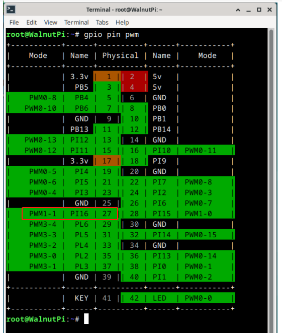

# PWM

## 前言

PWM常用于电机，舵机控制，核桃派2B有多路PWM引脚，用户可以通过扩展电机驱动板来控制各类舵机、电机。本节来讲解如何使用Python编程实现PWM输出。

## 实验目的

使用Python编程实现PWM输出。

## 实验讲解

Linux下一切皆文件，之前 [**GPIO应用 - pwm**](../../gpio/pwm.md) 章节中通过给指定的文件内写入数值来操作硬件pwm，如果想用python控制pwm，只要调用python提供的读写文件的函数去操作那些文件即可。

## 参考代码

```python
'''
实验名称：PWM输出
实验平台：核桃派2B
说明：在PWM1-1引脚输出一个100Hz,占空比为50%的方波。
'''

control_path = {
    0: "/sys/class/pwm/pwmchip0",
    1: "/sys/class/pwm/pwmchip16",
    2: "/sys/class/pwm/pwmchip20",
    3: "/sys/class/pwm/pwmchip22",
}

def write_to_file(path: str, value: str) -> None:
    with open(path, "w") as f:
        f.write(value)

def pwm_export(control: int, channel: int) -> None:
    """导出PWM通道
    @param control 控制器编号0 1 2 3
    @param channel PWM通道号
    """
    write_to_file(f"{control_path[control]}/export", str(channel))

def pwm_config(control: int, channel: int, period: int, duty_cycle: int) -> None:
    """配置PWM通道的参数。
    @param control 控制器编号0 1 2 3
    @param channel PWM通道号
    @param period PWM信号的周期，单位为纳秒。
    @param duty_cycle PWM信号的高电平时长。
    """
    write_to_file(f"{control_path[control]}/pwm{channel}/period", str(period))
    write_to_file(f"{control_path[control]}/pwm{channel}/duty_cycle", str(duty_cycle))
    write_to_file(f"{control_path[control]}/pwm{channel}/polarity", "normal")

def pwm_enable(control: int, channel: int) -> None:
    """启用PWM通道的输出。
    @param control 控制器编号0 1 2 3
    @param channel PWM通道号
    """
    write_to_file(f"{control_path[control]}/pwm{channel}/enable", "1")

def pwm_disable(control: int, channel: int) -> None:
    """关闭PWM通道的输出。
    @param control 控制器编号0 1 2 3
    @param channel PWM通道号
    """
    write_to_file(f"{control_path[control]}/pwm{channel}/enable", "0")

pwm_export(1, 1)  # 导出PWM通道
pwm_config(1, 1, 10000000, 5000000)  # 配置PWM周期和占空比
pwm_enable(1, 1)  # 启用PWM输出

```

上面代码中通过下面3个语句配置PWM输出。其中 **pwm_config(1, 1, 10000000, 5000000);** 

- (1,1) 表示定时器1，通道1
- 周期时间 10000000ns, 即10ms,  频率为：1s/10ms=100Hz; 
- 高电平时间 5000000ns, 即5ms, 占空比为：5ms/10ms = 50%

## 实验结果

下面为输出引脚和输出结果：




这里给了一个最基础的控制方式，用户可以自行Python封装成各类库用法。