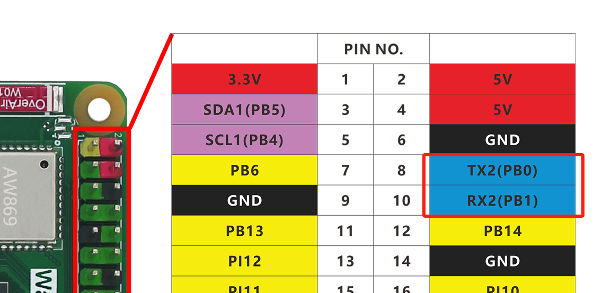
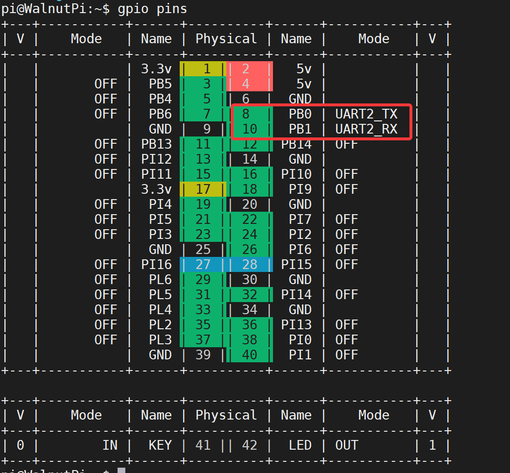
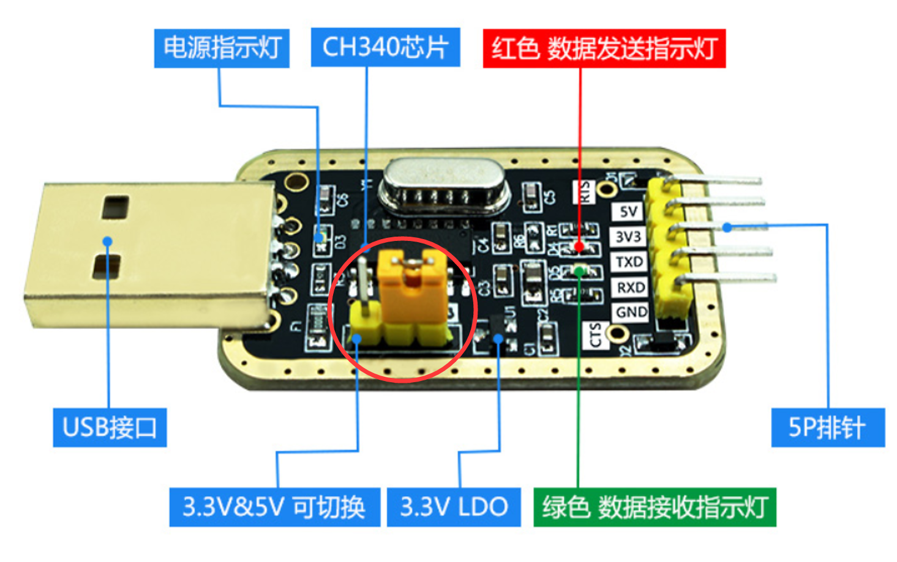
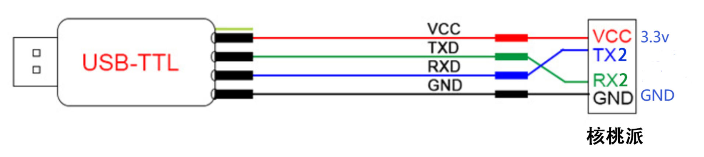
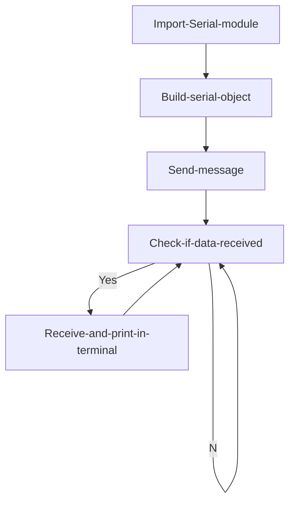

# UART (Serial Communication)

## Introduction
The serial port is a widely used communication interface. Many industrial control products and wireless transparent transmission modules use serial ports to send/receive commands and transfer data, allowing users to flexibly use various serial module functions without worrying about the underlying implementation. You can also communicate with other development boards via serial ports to exchange data, such as STM32, ESP32, Arduino, etc.

## Experiment Objective
Program serial port data transmission and reception.

## Experiment Explanation

The Walnut Pi GPIO header provides multiple serial ports. This tutorial uses UART2, i.e., PB0--TX2, PB1--RX2.


## Enable UART2

Enter the following command in the terminal:
```bash
sudo set-device enable uart2
```

Restart the development board:
```bash
sudo reboot
```

Check the status after startup:
```bash
gpio pins
```

The following output indicates successful activation:


For more GPIO configuration tutorials, see: [GPIO Device Configuration](../../gpio/gpio_config.md)

## Serial Object

Walnut Pi serial communication can use the Serial standard library built into the Linux system. Details are as follows:

### Constructor
```python
serial.Serial("dev",baudrate)
```
Build a UART object
- `"dev"` : Device number. For Walnut Pi, uart2 is "/dev/ttyS2";
- `baudrate` : Serial baud rate, can be set to commonly used values like 9600, 115200, etc.

### Usage
```python
Serial.inWaiting()
```
Returns the number of characters received and stored in the buffer, int type. Can be used to check if data has been received.

<br></br>

```python
Serial.read(num)
```
Read data, returns byte string.
- `num` : Number of characters to read.

<br></br>

```python
Serial.write(b'str')
```
Send data, requires byte string format.
- `b'str'` : Content to send.

<br></br>

For more Python usage of Serial, see the official documentation:
https://pyserial.readthedocs.io/en/latest/pyserial_api.html#module-serial

After understanding the UART object usage, we can use a USB-to-TTL tool along with a computer serial assistant (terminal software) to communicate with the Walnut Pi via serial port. These tools are generally similar. **Note: if the tool has 3.3V and 5V level switching, the jumper cap should be set to 3.3V, because the Walnut Pi GPIO level is 3.3V.**



This experiment uses UART2, i.e., TX2(PI5) and RX2(PI6). The wiring diagram is as follows: **(3.3V can be left unconnected)**




In this experiment, we first initialize the serial port, then send a message so that the PC serial assistant displays it in the receive area. Then enter a loop: when the Walnut Pi detects receivable data, it reads and prints the data via the terminal. The code flow chart is as follows:



## Reference Code

```python
'''
Experiment Name: UART (Serial Communication)
Experiment Platform: Walnut Pi
'''

# Import related modules
import serial,time

# Configure serial port
com = serial.Serial("/dev/ttyS2", 115200)

# Send prompt characters
com.write(b'Hello WalnutPi!')

while True:

    # Get the number of characters in the receive buffer, int
    count = com.inWaiting()
    
    if count != 0: # Data received
        
        # Read content and print
        recv = com.read(count)
        print(recv)
        
        # Send data back
        com.write(recv)
        
        # Clear receive buffer
        com.flushInput()
        
    # Delay 100ms, receive interval
    time.sleep(0.1)
```

## Experiment Results

Enter the following command in the terminal to confirm UART2 activation:
```bash
gpio pins
```

The following output indicates successful activation:


If not enabled, follow the steps above to enable: [Enable UART2](#enable-uart2)

Use a USB-to-TTL tool to connect the Walnut Pi and the computer.


On the computer, open the serial assistant, select the COM port corresponding to the USB-to-TTL, baud rate 115200. Click open and wait to receive data:


Here we use Thonny to remotely run the above Python code on the Walnut Pi. For instructions on running Python code on the Walnut Pi, please refer to: [Running Python Code](../python_run.md)


After running, you can see the computer serial assistant receiving the message:


Enter a message in the serial assistant's send field and click send. You can see the received data printed in the Thonny terminal below (data received by the Walnut Pi development board):


Serial data communication is widely used. Besides communicating with a computer as in this example, it can also communicate with other microcontroller development boards or serial module devices.
