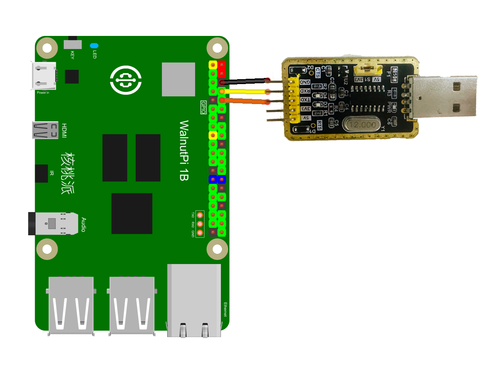
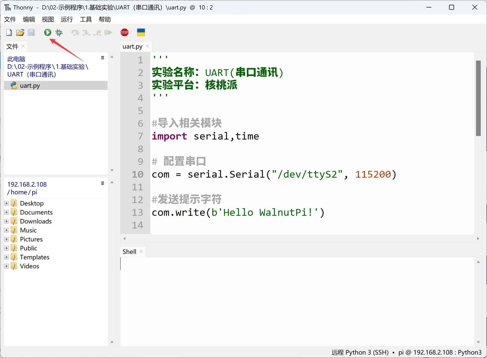
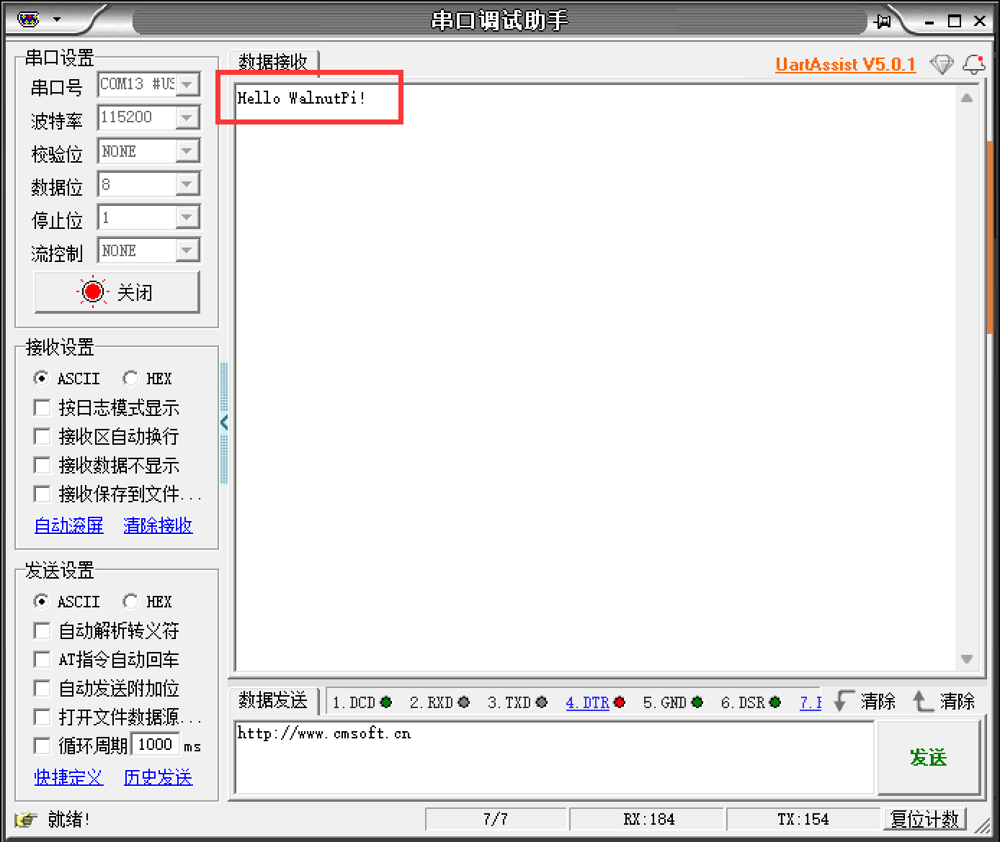
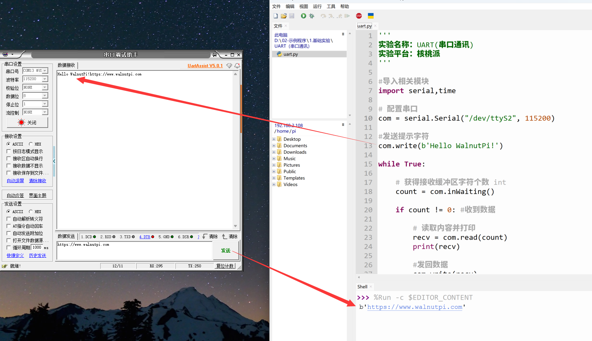

# UART（串口通讯）

## 前言
串口是应用广泛的通讯接口，很多工控产品、无线透传模块都是使用串口来收发指令和传输数据，这样用户就可以在无须考虑底层实现原理的前提下将各类串口功能模块灵活应用起来。你也可以可以通过串口跟其它开发通讯实现数据交互，如STM32、ESP32、Arudio等。

## 实验目的
编程实现串口收发数据。

## 实验讲解

核桃派的GPIO有引出多路串口，本教程使用UART2, 即PB0--TX2, PB1--RX2。
 

## 开启串口2

在终端输入下面指令：
```bash
sudo set-device enable uart2
```

重启开发板：
```bash
sudo reboot
```

启动后查看开启情况：
```bash
gpio pins
```

出现下图表示开启成功：
 

更多GPIO配置教程请看：[GPIO设备配置](../../gpio/gpio_config.md)

## Serial对象

核桃派串口通讯可以使用linux系统自带的Serial标准库编程。具体介绍如下：

### 构造函数
```python
serial.Serial(“dev”,baudrate)
```
构建UART对象
- `”dev”` :设备号，核桃派的uart2是”/dev/ttyS2”；
- `baudrate` :串口波特率，可以设置为常用的9600、115200等。

### 使用方法
```python
Serial.inWaiting()
```
返回串口接收并存放在缓冲区的字符个数，int型。可以用来判断是否有接收到数据。

<br></br>

```python
Serial.read(num)
```
读取数据，返回字节字符串。
- `num` ：读取字符数量。

<br></br>

```python
Serial.write(b'str')
```
发送数据，要求格式为字节字符串。
- `b'str'` ：发送内容。

<br></br>

更多Serial的python用法，请看官方文档：
https://pyserial.readthedocs.io/en/latest/pyserial_api.html#module-serial

了解了UART对象用法后，我们可以用一个USB转TTL工具，配合电脑上位机【串口助手】来跟核桃派进行串口通信。这类工具大同小异，**需要注意的是如果带3.3V和5V电平切换的，需要将跳线帽打到3.3V，因为核桃派的GPIO电平是3.3V的。**

 

本实验我们使用UART2，也就是TX2(PI5)和RX2(PI6)，接线示意图如下：**（3.3V可以不用接）**

 


在本实验中我们可以先初始化串口，然后给串口发去一条信息，这样PC机的串口助手就会在接收区显示出来，然后进入循环，当核桃派检测到有数据可以接收时候就将数据接收并打印，并通过终端打印显示。代码编写流程图如下：

```mermaid
graph TD
    导入Serial模块-->构建串口对象-->发送信息-->判断是否有信息--是-->接收并在终端打印-->判断是否有信息;
    判断是否有信息--否-->判断是否有信息;
```

## 参考代码

```python
'''
实验名称：UART(串口通讯)
实验平台：核桃派
'''

#导入相关模块
import serial,time

# 配置串口
com = serial.Serial("/dev/ttyS2", 115200)

#发送提示字符
com.write(b'Hello WalnutPi!')

while True:

    # 获得接收缓冲区字符个数 int
    count = com.inWaiting()
    
    if count != 0: #收到数据
        
        # 读取内容并打印
        recv = com.read(count)
        print(recv)
        
        #发回数据
        com.write(recv)
        
        # 清空接收缓冲区
        com.flushInput()
        
    # 延时100ms,接收间隔
    time.sleep(0.1)
```

## 实验结果

终端输入下面指令确认UART2开启情况：
```bash
gpio pins
```

出现下图表示开启成功：

 

如没开启请按前面内容打开：[开启串口2](#开启串口2)

使用USB转TTL工具链接核桃派和电脑。

 

电脑打开串口助手，选择USB转TTL对应的COM，波特率115200。点击打开，等待接收数据：

 

这里使用Thonny远程核桃派运行以上Python代码，关于核桃派运行python代码方法请参考： [运行Python代码](../python_run.md)

 

运行后可以看到电脑串口助手接收到信息：

 

在串口助手发送栏输入信息，点击发送，可以看到thonny下方终端打印接收到的数据（核桃派开发板接收到的数据）：

 


串口数据收发应用非常广泛，除了本例程跟电脑通讯外，还可以跟其它单片机开发板或者串口模块设备通讯。