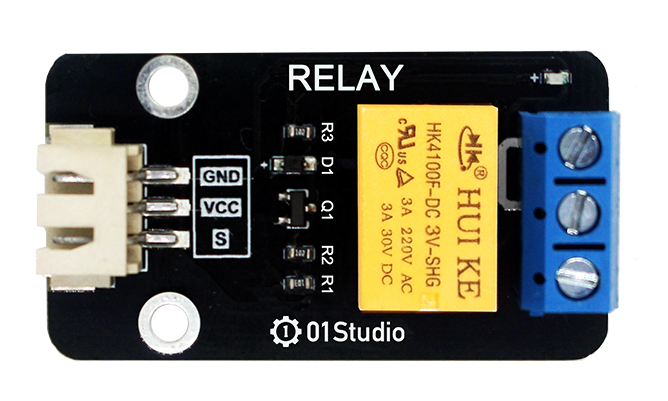
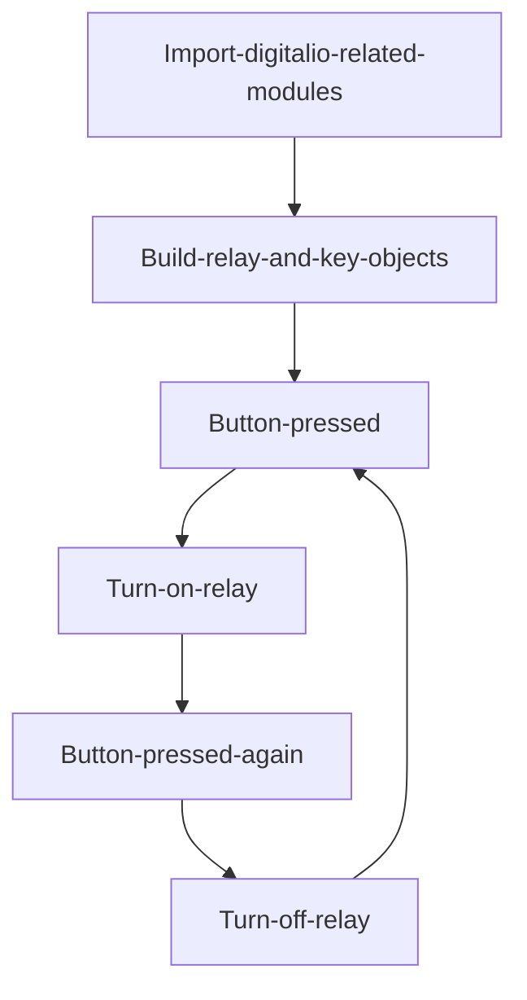
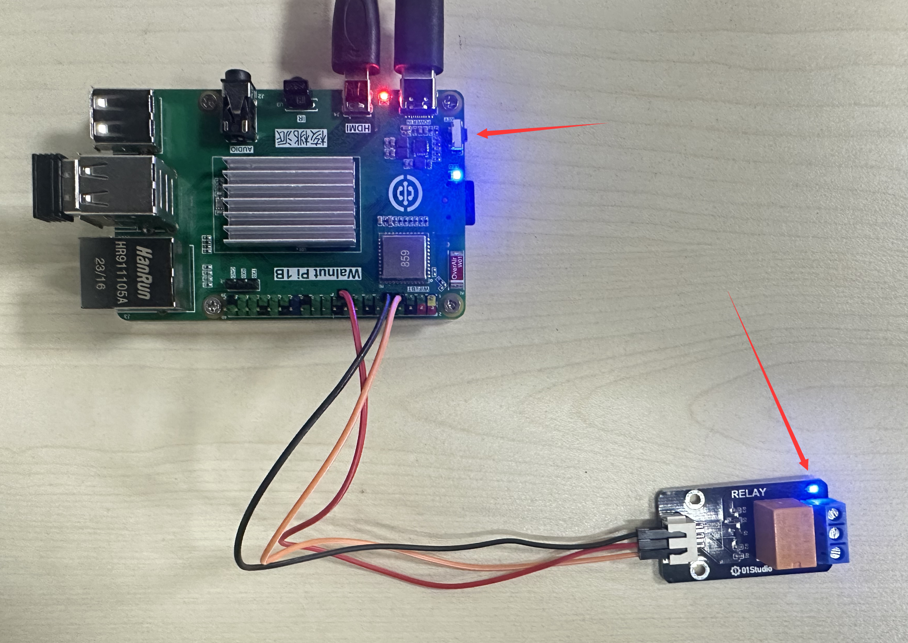
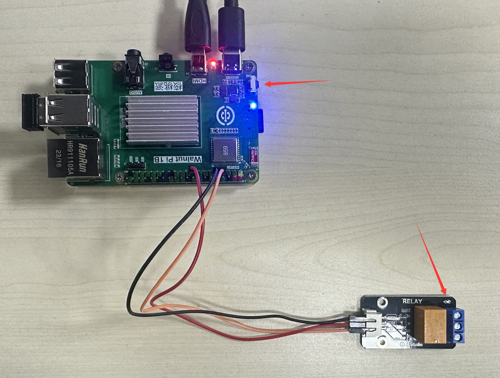

# Relay

## Introduction
We know that the GPIO output level of the Walnut Pi development board is 3.3V, which cannot directly control high-voltage devices such as light bulbs (220V). In this case, we can use a commonly used low-voltage control high-voltage module — the relay.

## Experiment Objective
Use a button to control relay on/off.

## Experiment Explanation

The image below shows a commonly used relay module. The left low-voltage control interface mainly includes power pins and signal control pins (supply voltage is generally 3.3V, subject to manufacturer specifications). The right blue section is the high-voltage part, which can connect to 220V appliances.
:::tip

It is recommended to use a relay with 3.3V level control, because the Walnut Pi GPIO output is 3.3V. Using a 5V-controlled relay improperly may damage the Walnut Pi development board.

:::



The image below shows the appliance connection diagram — left side is the low-voltage control part, right side is the high-voltage control part **(pay attention to electrical safety when wiring)**:


The relay operates similarly to the LED in the previous GPIO chapters. Simply connect the module signal pin to the Walnut Pi, then program to control the high/low level changes of the Walnut Pi GPIO pin to control the relay, thereby controlling the high-voltage switch on/off.

## digitalio Object

In CircuitPython, you can directly use the digitalio module to program I/O input for detecting the input level. Details are as follows:

### Constructor
```python
relay=digitalio.DigitalInOut(pin)
```
Parameter description:
- `pin` Development board pin number. Example: board.PB6

### Usage
```python
relay.direction = value
```
Defines pin as input/output. Value options:
- `digitalio.Direction.INPUT` : Input.
- `digitalio.Direction.OUTPUT` : Output.

<br></br>

```python
relay.pull = value
```
Set pull-up/pull-down resistor. Value options:
- `digitalio.Pull.UP` : Pull-up.
- `digitalio.Pull.DOWN` : Pull-down.

<br></br>

```python
relay.value = value
```
GPIO output value. Value options:
- `True` or `1` : High level.
- `False` or `0` : Low level.

<br></br>

For more usage, please refer to the official documentation:<br></br>
https://docs.circuitpython.org/en/latest/shared-bindings/digitalio/index.html


In this experiment, we use a button to control relay on/off: press once to turn on, press again to turn off, and repeat. The code flow chart is as follows:



## Reference Code

```python
'''
Experiment Name: Relay
Experiment Platform: Walnut Pi 2B
'''

# Import related modules
import board,time
from digitalio import DigitalInOut, Direction, Pull

# Build relay object and initialize
relay = DigitalInOut(board.PB6) # Define pin number
relay.direction = Direction.OUTPUT  # IO as output
relay.value = 1 # Initialize relay to off

# Build key object and initialize
switch = DigitalInOut(board.KEY) # Define pin number
switch.direction = Direction.INPUT # IO as input

state = 1 # Relay initial state, high level means off

while True:

    if switch.value == 0: # Button pressed
        time.sleep(0.01) # Delay 10ms debounce
        if switch.value == 0: # Button pressed
            state = not state # Toggle state
            relay.value = state # Change relay state
            
            # Wait for button release
            while switch.value ==0:
                pass
```

## Experiment Results

Here we use Thonny to remotely run the above Python code on the Walnut Pi. For instructions on running Python code on the Walnut Pi, please refer to: [Running Python Code](../python_run.md)


When the sensor detects a person, the blue LED lights up.



When no person is detected, the blue LED turns off.



