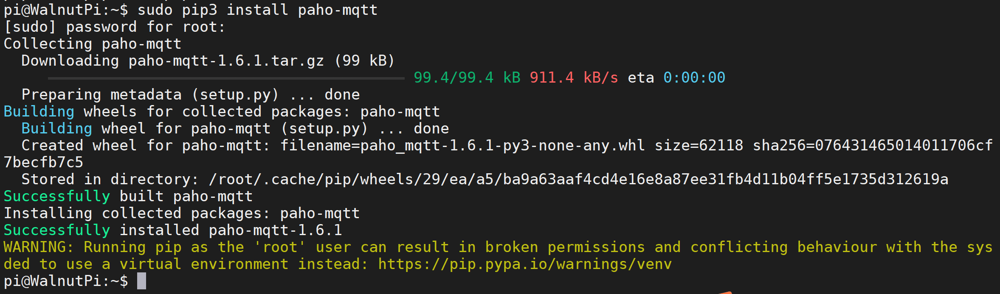
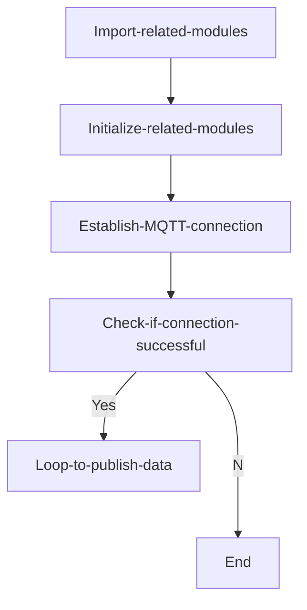
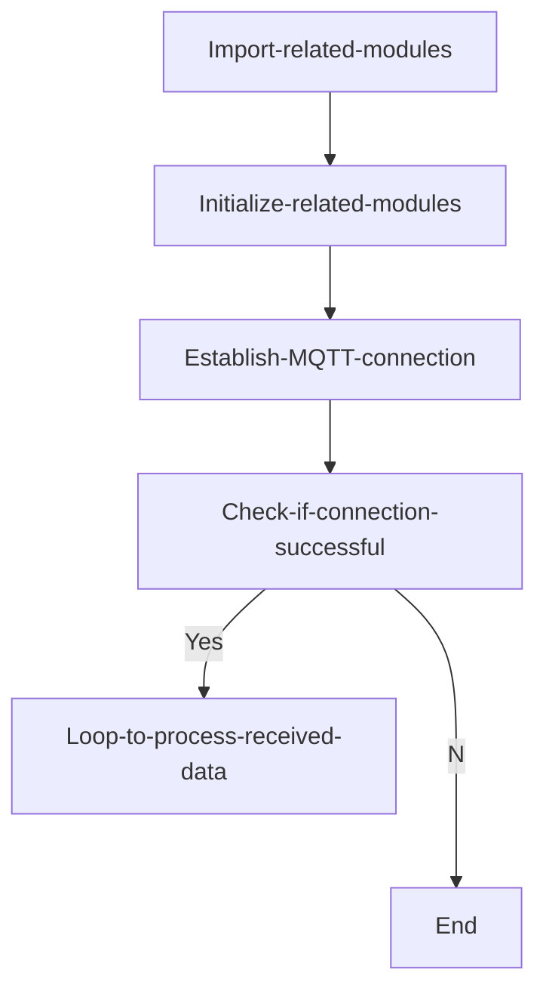
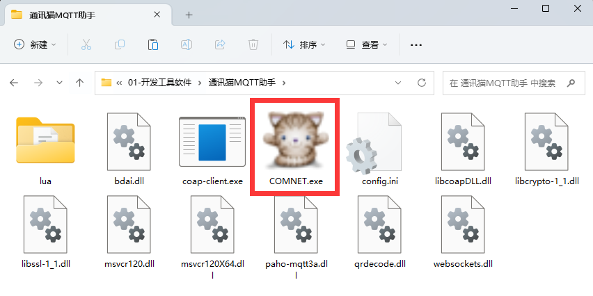
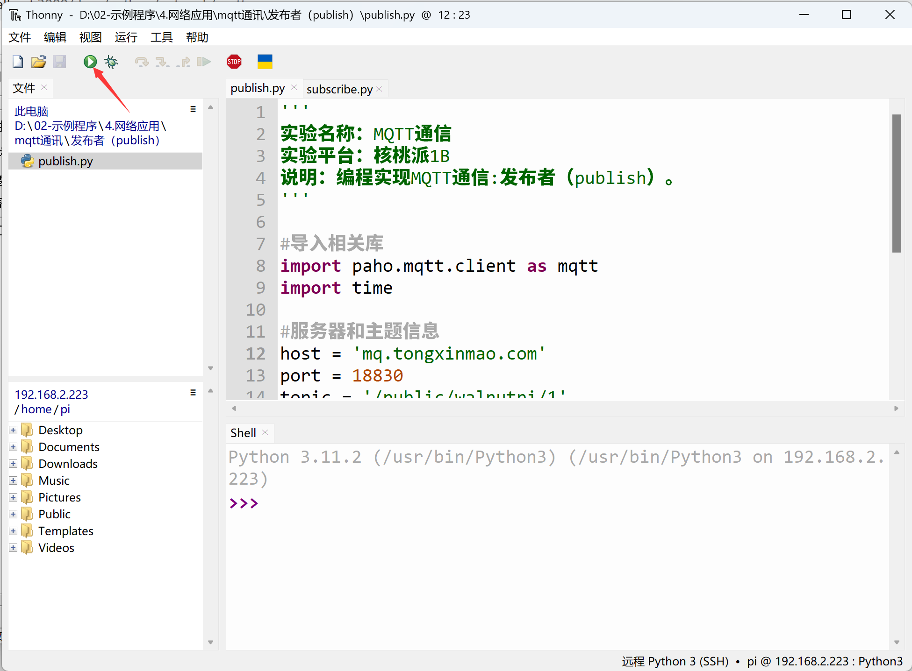
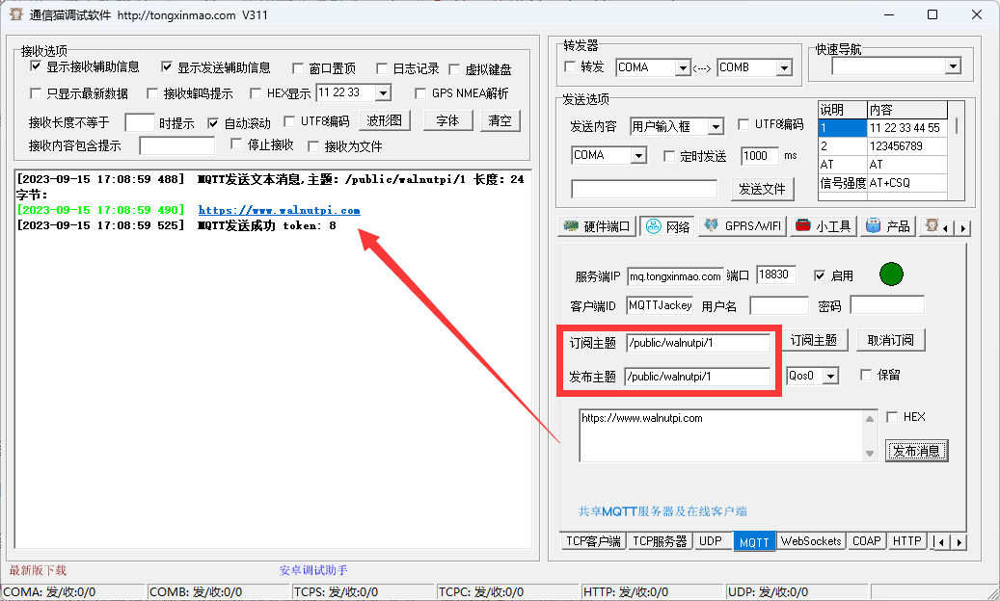

# MQTT Communication

## Introduction
In the previous section, we learned about Socket communication. When a server and client establish a connection, they can communicate with each other. In internet applications, WebSocket interfaces are mostly used to transmit data. However, in IoT applications, the following scenario often occurs: massive numbers of sensors need to stay online at all times, transmitting very low amounts of data, with a large user base. If sockets were still used for communication, the server load and communication framework design would become extremely complex as the number of devices increases!

So, is there a framework protocol to solve this problem? The answer is yes. That is MQTT (Message Queuing Telemetry Transport).


## Experiment Objective
Program the Walnut Pi to publish and subscribe (receive) MQTT protocol messages.

## Experiment Explanation
MQTT was proposed by IBM in 1999. Like HTTP, it belongs to the application layer and works on top of the TCP/IP protocol suite, typically calling the socket interface. It is a publish/subscribe messaging transport protocol based on a client-server model. Its characteristics are lightweight, simple, open, and easy to implement, making it widely applicable in many scenarios, including constrained environments such as Machine-to-Machine (M2M) communication and the Internet of Things (IoT). It is already widely used in satellite link communication sensors, occasionally connected medical devices, smart homes, and some miniaturized devices.
In summary, MQTT has the following features/advantages:
- Asynchronous messaging protocol
- Oriented towards long connections
- Bidirectional data transmission
- Lightweight protocol
- Passive data acquisition


From the diagram above, we can see that MQTT communication has two roles: server and client. The server is only responsible for forwarding data, not storing it; the client can be a message publisher or subscriber, or both simultaneously. As shown below:


After establishing the roles, how is data transmitted? The diagram below shows the most basic MQTT data frame format. For example, a temperature sensor publishes the topic "Temperature" with the message "25" (representing temperature). Then all clients (mobile apps) that have subscribed to this topic will receive the relevant information, thus achieving communication. As shown in the table below:


Due to the unique publish/subscribe mechanism, the server does not need to store data (although you can create a client on the server device to subscribe and save information). Therefore, it is very suitable for massive device transmission.

Life is short, and Python has already encapsulated MQTT client libraries. This makes our applications simple and elegant. We use the paho.mqtt Python library, maintained by Eclipse with a large community of developers. You can install it using pip by running the following command in the terminal:

```bash
sudo pip3 install paho-mqtt
```



## paho-mqtt Object

### Constructor
```python
import paho.mqtt.client as mqtt
client = mqtt.Client()
```
Import MQTT library and build a client object.

### Usage
```python
client.connect(host,port,keepalive)
```
Connect to MQTT server.
- `host` : Server address;
- `port` : Port, usually 1883;
- `keepalive` : Keep alive, default 60 seconds.

<br></br>

```python
client.publish(topic,message)
```
Publish message.
- `topic` : Topic name;
- `message` : Message content, e.g.: 'Hello WalnutPi!'

<br></br>

```python
client.subscribe(topic)
```
Subscribe.
- `topic` : Topic name.

<br></br>

```python
client.on_connect = on_connect
```
Connect using callback function. See subscriber example code for usage.

<br></br>

```python
client.on_message = on_message
```
Callback function for receiving messages. See subscriber example code for usage.

<br></br>

For more usage, see the official documentation: https://github.com/eclipse/paho.mqtt.python#eclipse-paho-mqtt-python-client

Since clients play the roles of publisher and subscriber, to help everyone understand better, this experiment is divided into two cases for programming: publisher and subscriber. Combined with the MQTT network debugging assistant for testing, the code flow is as follows:

**Publisher code flow:**


<br></br>

**Subscriber code flow:**



## Reference Code

### Publisher

```python
'''
Experiment Name: MQTT Communication
Experiment Platform: Walnut Pi 2B
Description: Program MQTT communication: Publisher.
'''

# Import related libraries
import paho.mqtt.client as mqtt
import time

# Server and topic information
host = 'mq.tongxinmao.com'
port = 18830
topic = '/public/walnutpi/1'

# Build MQTT client object
client = mqtt.Client()

# Initiate connection
client.connect(host,port)

while True:
    
    # Publish message
    client.publish(topic,'Hello WalnutPi!')
    
    time.sleep(1) # Delay 1 second, sending interval
```

### Subscriber

```python
'''
Experiment Name: MQTT Communication
Experiment Platform: Walnut Pi 2B
Description: Program MQTT communication: Subscriber.
'''

# Import related libraries
import paho.mqtt.client as mqtt
import time

# Server and topic information
host = 'mq.tongxinmao.com'
port = 18830
topic = '/public/walnutpi/1'

# Callback function executed when the client receives a CONNACK response from the server.
def on_connect(client, userdata, flags, rc):
    print("Connected with result code "+str(rc))
    # Subscribing in on_connect() means that if we lose the connection and reconnect, subscriptions will be renewed.
    client.subscribe(topic)

# Callback function executed when a published message is received from the server.
def on_message(client, userdata, msg):
    print(msg.topic+" "+str(msg.payload))

# Build MQTT client
client = mqtt.Client()

# Configure connection and message receive callback functions
client.on_connect = on_connect
client.on_message = on_message

# Connect to server
client.connect(host, port)

# Blocking call that processes network traffic, dispatches callbacks and handles reconnecting.
client.loop_forever()
```

## Experiment Results

### Publisher Test

Open the Tongxinmao MQTT assistant on the computer, ensuring the computer is connected to the internet:



Next, configure the MQTT assistant as shown below.

1. Click Network;

2. Click MQTT;

3. Click Start;

4. Enter the subscription topic, here fill in the sender's topic "/public/walnutpi/1";

5. Click the Subscribe topic button and wait to receive messages;

6. After successful subscription, the left side prompts subscription success.


Use Thonny to remotely run the above publisher code on the Walnut Pi. For instructions on running Python code on the Walnut Pi, please refer to: [Running Python Code](../python_run)




After running, you can see the MQTT network assistant receiving the message sent by the Walnut Pi:


### Subscriber Test


The "Subscriber" code test method is the opposite of the "Publisher". In the MQTT assistant, change the publish topic to: '/public/01Studio/2'.


Run the subscriber code:


You can see the received data printed in the Thonny terminal below (data actually received by the Walnut Pi development board).


Of course, you can also test the publish and subscribe functions on the same MQTT online assistant to do some tests. Just set the topics to be consistent, as shown below:



Through this section, we have understood the principles of MQTT communication and successfully implemented it. This experiment connects to the Tongxinmao server, so it supports remote data transmission. That means you can use Walnut Pi A at home to subscribe to Walnut Pi B in your company or school lab, enabling data transmission for sensors and more. Currently, most IoT cloud platforms on the market support MQTT, and the principles are essentially the same. You can develop based on different platform protocols to implement remote connections for your own IoT devices.
