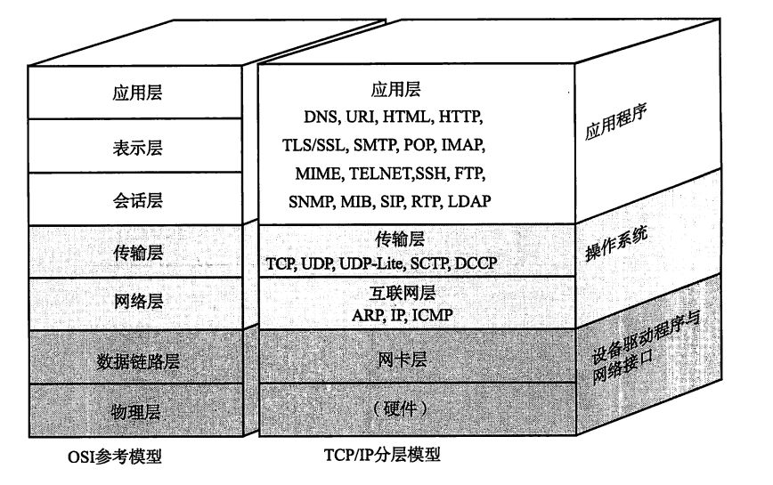
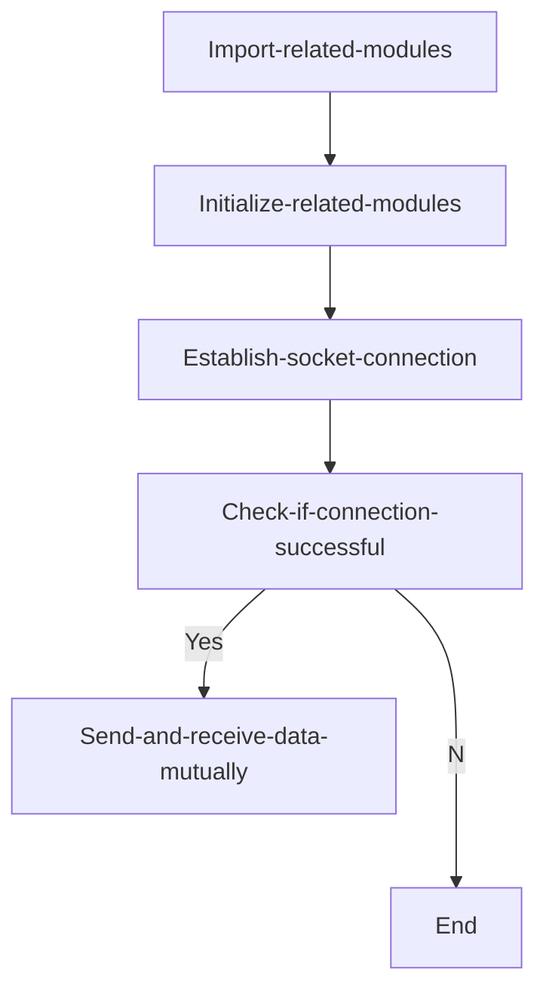
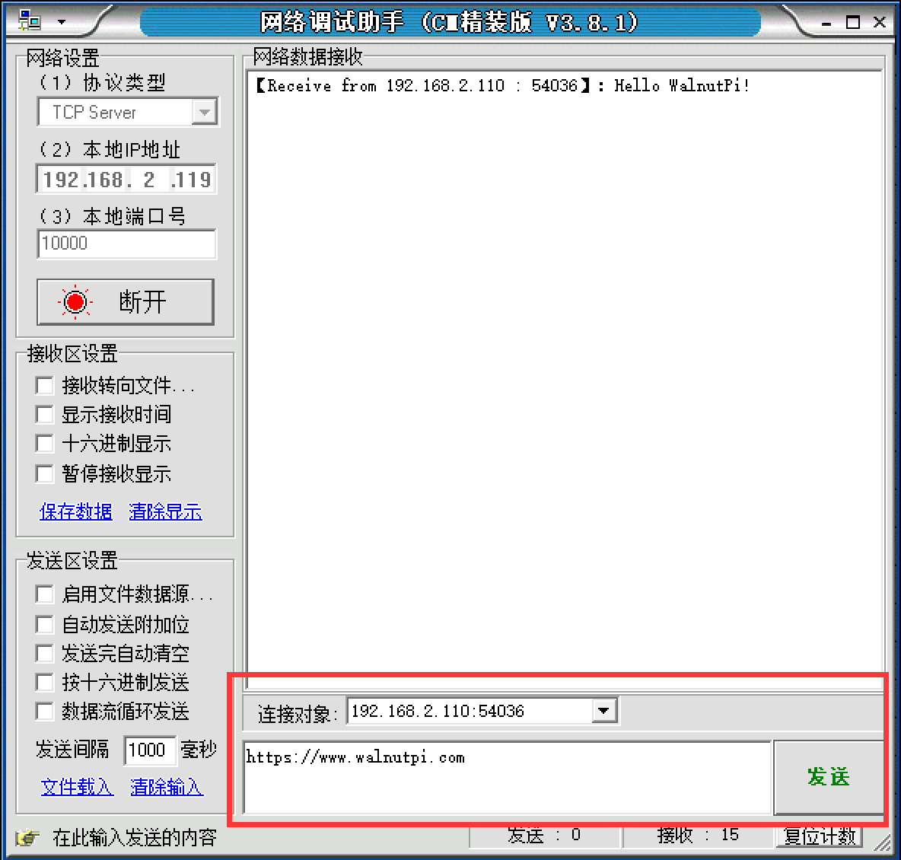
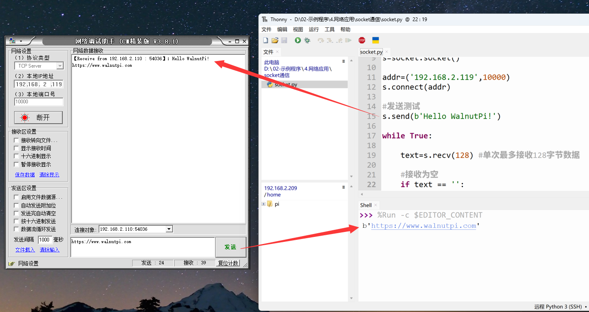

# Socket Communication

## Introduction
In today's era of the Internet of Everything, smart device connectivity is becoming increasingly common. However, most devices ultimately connect to local or online servers through traditional internet mechanisms. The Walnut Pi has WiFi (2.4G/5G) and Ethernet connectivity, which are automatically established after the operating system starts, so we can focus on communication programming. And running on a Linux system, the Walnut Pi can even serve as a lightweight local server.

In this section, we'll learn about the most common Socket communication experiment. Socket is essentially the foundation of all internet communication.

## Experiment Objective
Use Socket programming to establish a connection between the Walnut Pi and a computer network assistant server, enabling mutual data transmission and reception.

## Experiment Explanation
We've heard about Socket a lot, but because network engineering is a systematic discipline involving a vast range of knowledge and many concepts, and any single knowledge point can fill thick books, we often get confused. Here, we try to explain Socket in the easiest way to understand. For a comprehensive understanding, you can consult relevant materials on your own.

Let's first look at the network layer model diagram, which is the foundation of network communication:



Let's examine the transport layer and application layer of the TCP/IP model. Familiar concepts at the transport layer are TCP and UDP. The UDP protocol essentially does not process IP layer data at all. TCP protocol, on the other hand, adds more complex transmission control, such as sliding data send windows (Slice Window), as well as reception acknowledgment and retransmission mechanisms, to achieve reliable data transmission. At the application layer, HTTP is commonly used for web pages. So let's first analyze the relationship between TCP and HTTP.

We know that network communication fundamentally relies on IP and ports, and HTTP generally defaults to port 80. Let's take a simple example: when we browse Taobao, the browser sends a request to the Taobao website address (essentially IP) and port. The Taobao server responds by returning relevant web page data to our phone, realizing the web interaction process. This introduces the issue of multi-user connections — many people access Taobao, and in practice, the connection is disconnected after receiving the web page information. Otherwise, the Taobao server could not support so many long-term connections, and even if it could, it would be very resource-intensive.

That is to say, when the application layer's HTTP communicates data through the transport layer, TCP encounters the problem of providing concurrent services for multiple application processes simultaneously. Multiple TCP connections or multiple application processes may need to transmit data through the same TCP protocol port. To distinguish between different application processes and connections, many computer operating systems provide a Socket interface for the interaction between applications and the TCP/IP protocol. The application layer and transport layer can use the Socket interface to differentiate communication from different application processes or network connections, achieving concurrent data transmission services.

Simply put, the Socket abstraction layer sits between the transport layer and application layer and is not necessarily tied to TCP/IP. The Socket programming interface was designed to also accommodate other network protocols.


A socket is the cornerstone of communication and the basic operational unit supporting TCP/IP network communication. It is an abstract representation of an endpoint in the network communication process, containing the five essential pieces of information for network communication: **the protocol used (typically TCP or UDP), local host IP address, local process protocol port, remote host IP address, remote process protocol port.**

So, the emergence of sockets simply makes it more convenient to use the TCP/IP protocol stack. Simply put, it abstracts TCP/IP into several basic function interfaces, such as **create, listen, accept, connect, read, and write**, etc. The following is the communication flow:


From the diagram above, establishing Socket communication requires a server and a client. In this experiment, the Walnut Pi acts as the client, and the computer uses a network debugging assistant as the server. Both sides use the TCP protocol for transmission. For the client, it only needs to know the computer's IP and port to establish a connection. (Ports can be user-defined, ranging from 0 to 65535, just be careful not to occupy commonly used ports like 80.)

In summary, for application-oriented users, the Walnut Pi only needs to know three pieces of information: **the communication protocol is TCP or UDP, the server's IP, and the port number**, to initiate a connection to the server and send information. It's that simple.

Generally, the operating system already includes a socket module. We can directly use Python programming to call it. The socket object is described as follows:

## socket Object

### Constructor
```python
s=socket.socekt(family=AF_INET, type=SOCK_STREAM)
```
Parameter description:
- `family` IPV type
    - `socket.AF_INET` IPV4
    - `socket.AF_INET6` IPV6

- `type` Communication type
    - `socket.SCOK_STREAM` TCP
    - `socket.SOCK_DGRAM` UDP

### Usage
```python
addr=socket.getaddrinfo('www.baidu.com', 80)[0][-1]
```
Get Socket communication format address. Returns: ('14.215.177.38',80)
<br></br>

```python
s.connect(address)
```
Create connection.
- `address` : Address format is IP + port. Example: ('192.168.1.115',10000)

<br></br>

```python
s.send(bytes)
```
Send data.
- `bytes`: Content to send in byte format.

<br></br>

```python
s.recv(bufsize)
```
Receive data.
- `bufsize`: Maximum number of bytes to receive at once.

<br></br>

```python
s.bind(address)
```
Bind, used for server role.

<br></br>

```python
s.listen([backlog])
```
Listen, used for server role.
- `backlog`: Number of allowed connections, must be greater than 0.

<br></br>

```python
s.accept()
```
Accept connection, used for server role.

<br></br>

For more usage, please read the Python socket official documentation:
https://docs.python.org/zh-cn/3.7/library/socket.html#functions

In this experiment, the Walnut Pi acts as the client, so only client-side functions are needed. The experiment code flow is as follows:




## Reference Code

```python
'''
Experiment Name: Socket Communication
Version: v1.0
Date: 2023.8
Platform: Walnut Pi
Description: Socket communication with computer network assistant
'''
import socket
import time

# Build socket object s
s=socket.socket()

addr=('192.168.1.111',10000)
s.connect(addr)

# Send test
s.send(b'Hello 01Studio!')

while True:
    
    text=s.recv(128) # Receive up to 128 bytes at a time
    
    # Receive empty
    if text == '':
        pass
    
    # Received data, print and send back
    else:
        print(text) 
        s.send(text)
        
    time.sleep(0.1) # 100ms query interval
```

## Experiment Results

Ensure the computer and Walnut Pi are on the same network segment (usually connected to the same router), and it's best to turn off the computer firewall. Use the "sudo ifconfig" command to [get the Walnut Pi IP address](../../os_software/ip_get)

Open the network debugging assistant on the computer:


Select TCP Server, fill in the computer's IP address, use port 10000 for testing, click connect, and wait to receive data:


Use Thonny to remotely run the above Python code on the Walnut Pi. For instructions on running Python code on the Walnut Pi, please refer to: [Running Python Code](../python_run)


After running, you can see the computer network assistant receiving the message sent by the Walnut Pi:


In the network assistant's send field, select the Walnut Pi's IP and port for the connection target, enter the message to send, and click send:



You can see the received data printed in the Thonny terminal below (data actually received by the Walnut Pi development board)



Through this section, we have understood the principles of socket communication and conducted communication experiments using Python socket programming. Thanks to excellent encapsulation, we can directly program socket objects to quickly implement socket communication, thereby developing more network applications, such as sending previously collected sensor data to other Walnut Pi development boards, computers, or remote servers.
