# Running Python Code

This section explains how to do Python programming and run Python code on the Walnut Pi. If you have never learned Python before, you can start by learning at this website.
- Python Basics Tutorial: [https://www.runoob.com/python/python-tutorial.html](https://www.runoob.com/python/python-tutorial.html)

## Running Python in Terminal
Let's first see how to write Python code and run Python programs using the most basic method — operating through the Walnut Pi terminal. This method is also suitable for systems without a desktop environment.

Open the Walnut Pi terminal and use the nano editor to create a new Python file:
```bash
nano hello_walnutpi.py
```


Enter the editing interface and type the simplest Python code:
```python
print('hello walnutpi!')
```


Press **Ctrl+X** to exit; it will prompt whether to save.

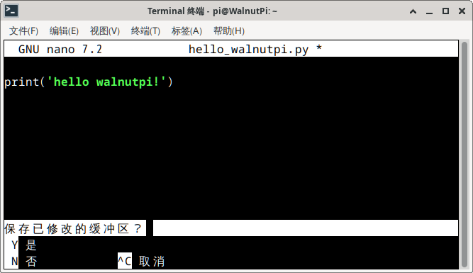

Press **Y** to bring up the file name to save. Just use the default here and press Enter to confirm.


Use the **ls** command to see that the **hello_walnutpi.py** file has been added to the current directory.


You can directly run the Python file using the python command. You can see the code ran successfully and printed the "hello walnutpi!" message!
```bash
python hello_walnutpi
```
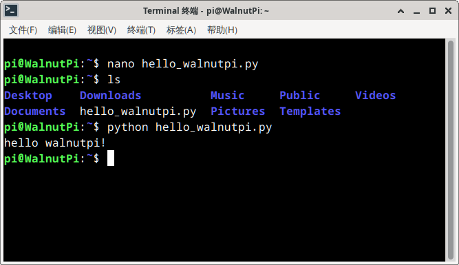

You can also directly enter the python command in the terminal to see the current Python version and enter Python interactive mode.


Press **Ctrl+Z** or **Ctrl+C** to exit.

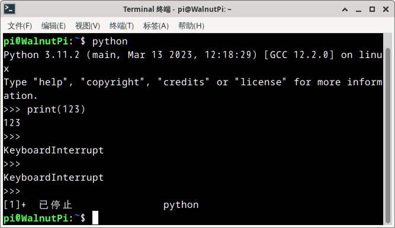

## Thonny IDE
If you are using the Walnut Pi with a desktop operating system, you can directly use the built-in Thonny IDE for programming, which is very convenient. You need to connect the Walnut Pi to a monitor via HDMI and attach a keyboard and mouse.

Open **Menu -- Development -- Thonny**

When running for the first time, you will be prompted to select a language. Click "Let's go!" to continue:


After entering, first bring up the file directory for easy viewing. Click **View -- Files**:


You can see an additional file directory of the current system on the left side of the IDE:


Next, create a new file:


Enter in the editing area:
```python
print('hello walnutpi!')
```
Then save.

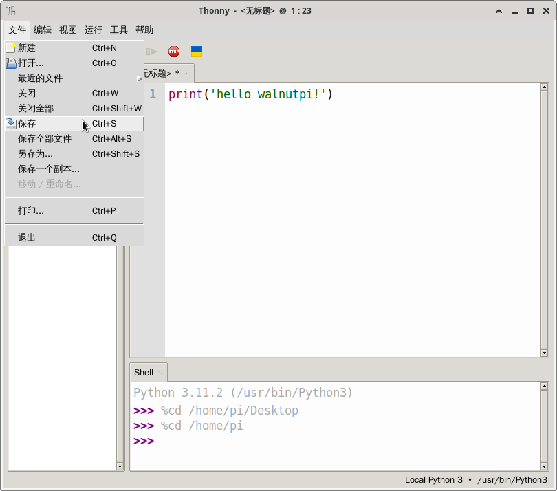

Click the green "Run" button to see the Python code executed directly:


Of course, you can also interact with Python commands directly in the Python terminal at the bottom of Thonny:


In the Thonny menu bar **Tools -- Options**, check **Use Tab key completion in editor** for convenient development.


Below, after typing **led.**, press the Tab key to autocomplete:


## Thonny Remote Connection (Windows-based)
Above we used the Thonny IDE inside the Walnut Pi system. Similarly, we can use Thonny IDE on Windows to remotely connect to the Walnut Pi for Python programming. The Walnut Pi factory system comes with SSH service pre-installed, allowing remote control via SSH. This method is suitable for remote development using your own computer.

:::tip

This method is recommended for users who only do Python programming and are accustomed to using a PC. It is also the main method used in this chapter's tutorials.

:::

Thonny IDE Windows version download link: https://thonny.org/

After downloading and installing, open Thonny. First, click **View -- Files** to bring up the file directory.


Next, connect to the Walnut Pi via SSH. Click **Run -- Configure Interpreter**:


In the configuration window that appears, configure as shown below:
1. Select Remote Python 3 (SSH)
2. Walnut Pi IP address
3. Walnut Pi username, enter **pi** here
4. Default password method is fine
5. Enter **Python3** here. Note the capital P, because walnutpi python3 (lowercase) has file permission issues, while Python3 (capital P) has already been granted appropriate permissions.

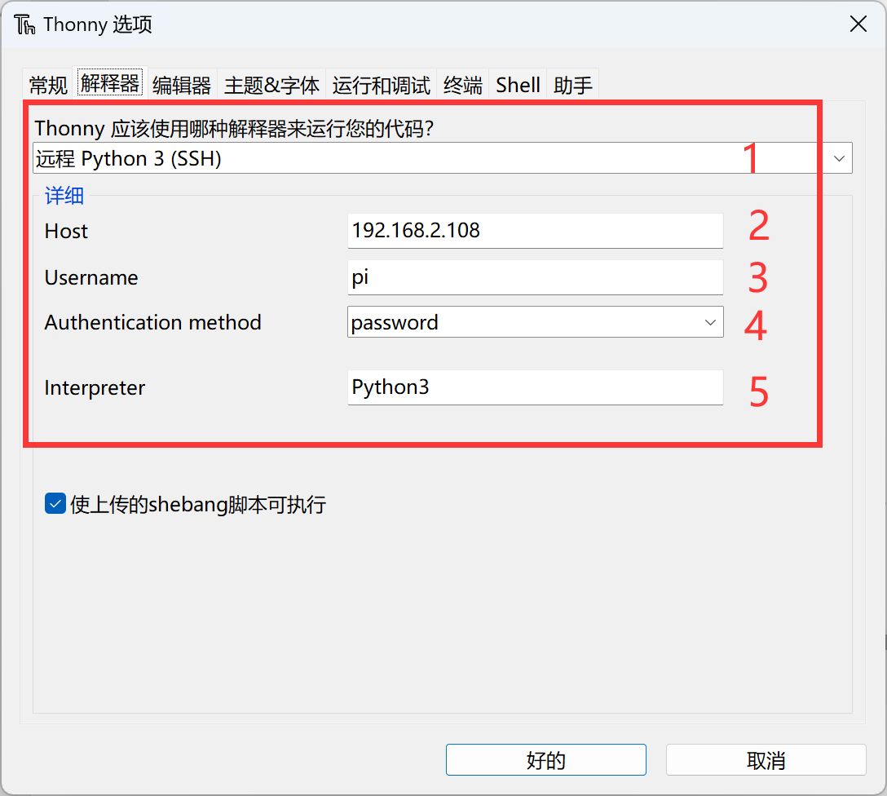

After configuration, click **Run -- Stop/Restart Backend** to start the connection:


Enter password **pi**:


Wait until the Walnut Pi file system directory appears at the bottom left of Thonny, indicating a successful connection:


You can use Python commands directly in the Python terminal (equivalent to operating on the Walnut Pi development board):


Then you can open either a local Windows Python file or a Walnut Pi Python file. After writing the code, simply click the **Run** button to execute the Python code.

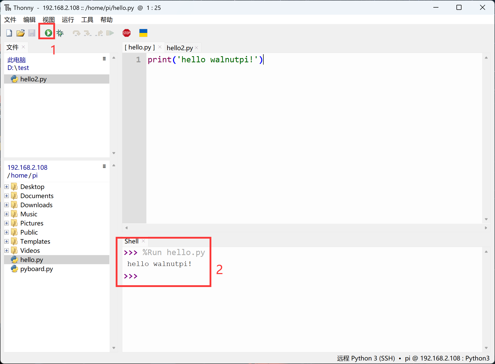

You can distinguish local and remote files by the file title above the code area:

- [ hello.py ] with "**[ ]**" indicates a Walnut Pi development board file (remote file);

- hello2.py without "**[ ]**" indicates a Windows file (local file).


You can upload/download files by right-clicking in the file directory on the left to transfer files between the Walnut Pi and Windows locally.

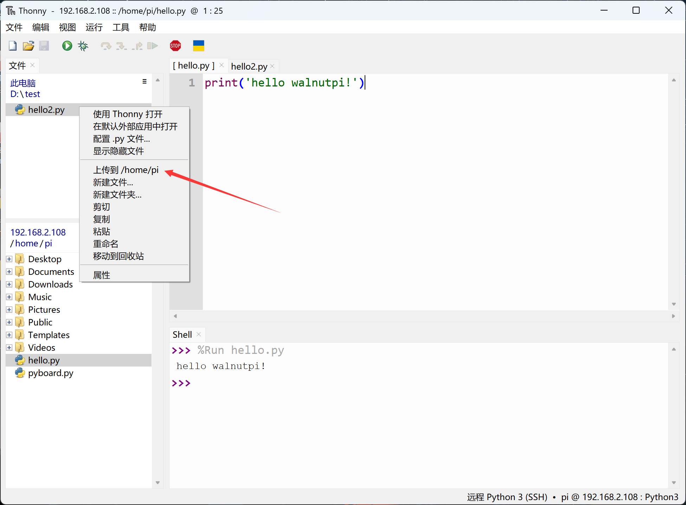

In the Thonny menu bar **Tools -- Options**, check **Use Tab key completion in editor** for convenient development. **The completion content is from the device connected to the interpreter; here, since it's remote, what gets completed are the Python libraries on the Walnut Pi.**


Below, after typing **led.**, press the Tab key to autocomplete:


## VSCode Remote Connection (Windows-based)

The Thonny IDE mentioned above is mainly used for Python programming. Some users may be accustomed to using VS Code, so here's how to use VS Code remotely. The advantage of VS Code is that it facilitates multi-language programming.
:::danger Warning

Using VS Code remotely will consume a significant amount of the Walnut Pi's memory. It is not recommended to run other memory-intensive applications on the Walnut Pi when using this method.

:::

First, install VS Code. Download link: https://code.visualstudio.com/download

After installation, search for the **ssh** extension in the VS Code extension panel and install it:


After the extension is installed, open it on the left and click the **+** button on the right to create a new remote connection:

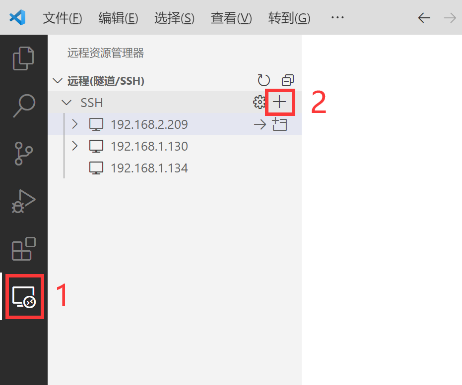

In the pop-up bar, enter: **pi@192.168.2.180**. pi is the default Walnut Pi user, followed by the IP address. You can use "sudo ifconfig" to check the Walnut Pi's IP address.

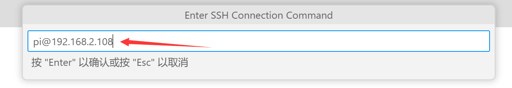

Next, choose which file to save the information to. The first option by default is fine:

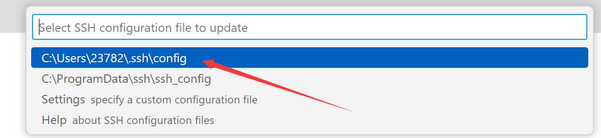

Then click the "Connect" button at the bottom right:


Next, select "Linux" at the top:

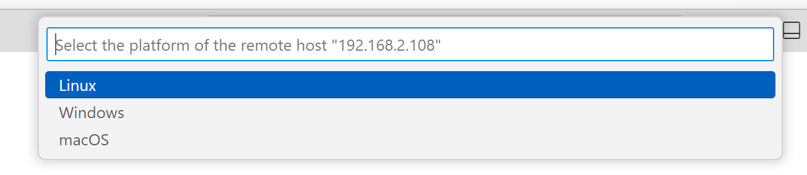

Select "Continue":


Enter the Walnut Pi pi user password: **pi**


Wait for the connection until the Walnut Pi IP address appears at the bottom left:

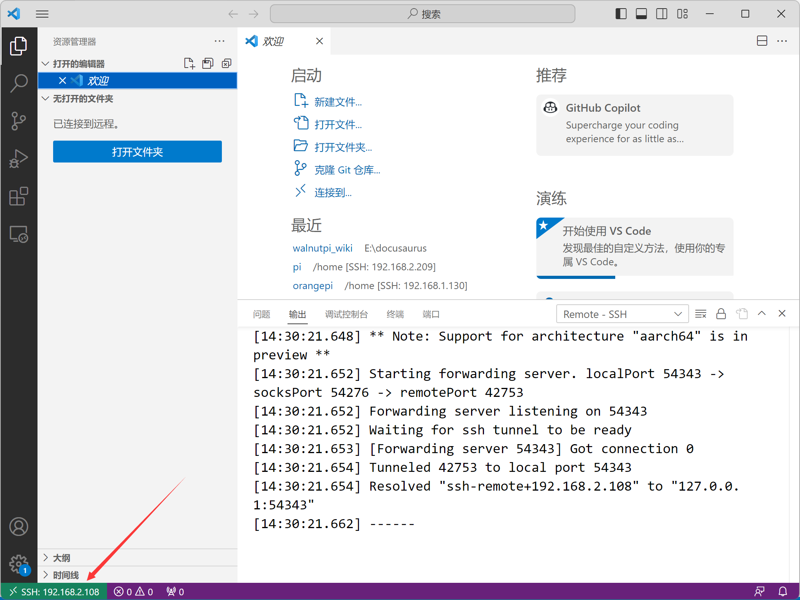

Click the file view button at position 1 in the image below, then click the open folder button at position 2. At position 3, you can enter your desired path. Here, just use the default /home/pi and click OK.

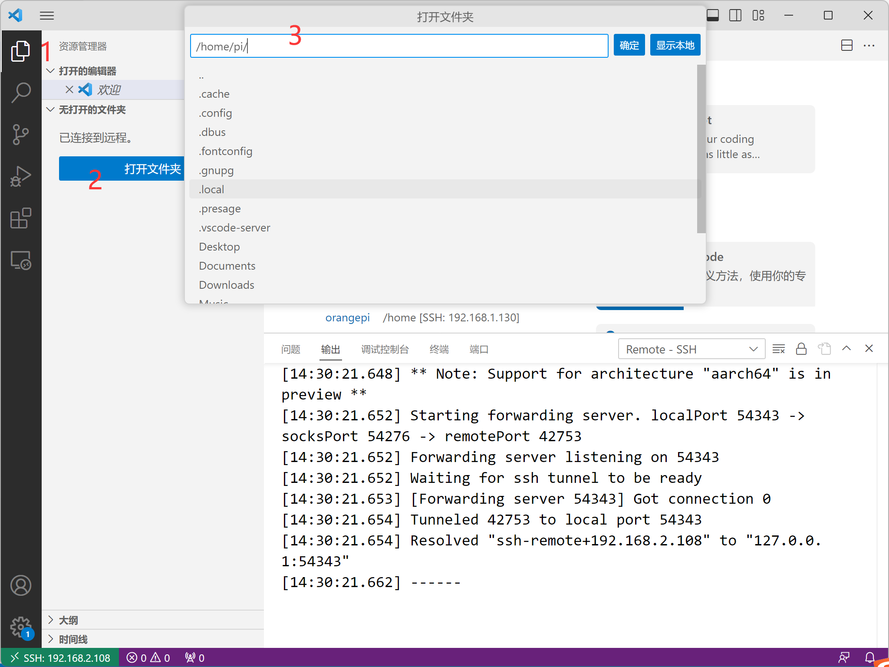

Check the trust option:


After opening, you can see the Walnut Pi directory on the left. You can download files from or upload files to the Walnut Pi development board. The right side is the document editing area.


We can create a new Walnut Pi terminal for convenient command operations:

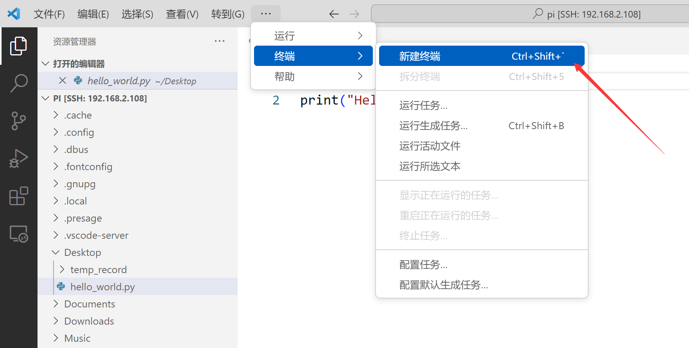

You can see a familiar terminal appearing at the bottom.


The remote terminal in VSCode works the same as the local Walnut Pi terminal. Edit your Python code and then directly use the **python xx.py** command to run the Python program.

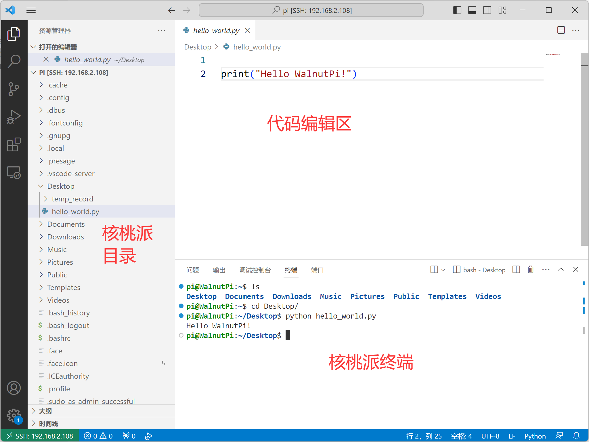

Logged-in IPs and accounts will be recorded. To log in again, simply open in the remote manager:

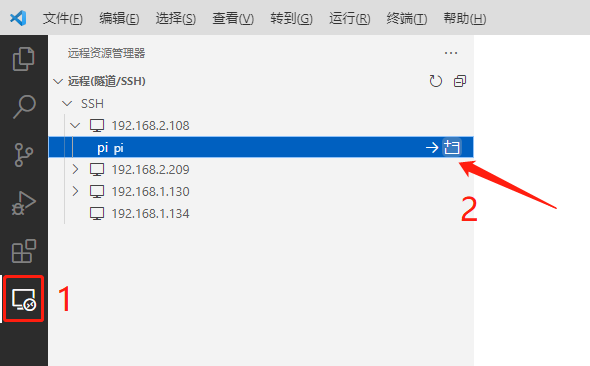

## Troubleshooting SSH Remote Connection Issues

One use case is when you have remotely connected to a Walnut Pi using Thonny or VSCode, and then the Walnut Pi has been re-imaged or its SD card has been replaced. In this case, you need to delete the computer's SSH key information to reconnect.

For Windows users, the file is located at **C:\Users\[username]\.ssh\known_hosts**

Open it, find the IP of the current Walnut Pi, and delete the IP and key information.

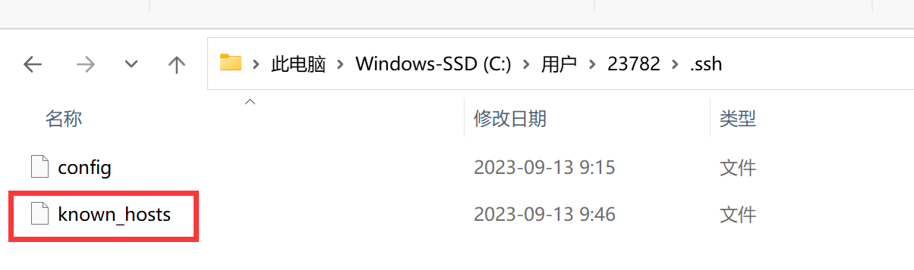


