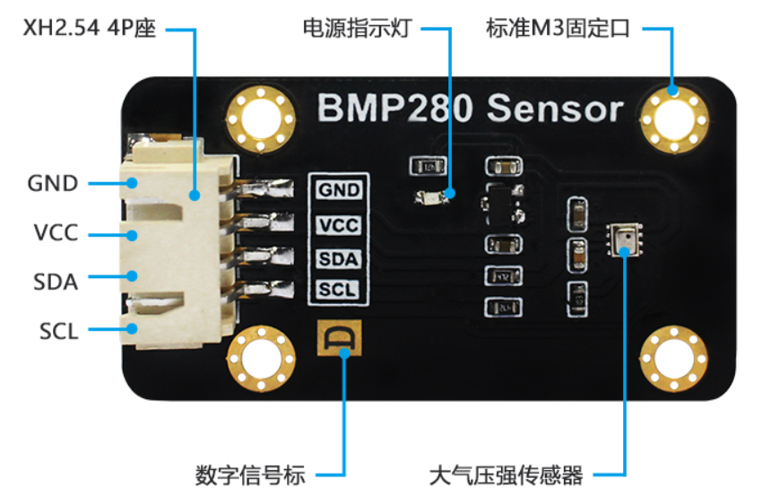
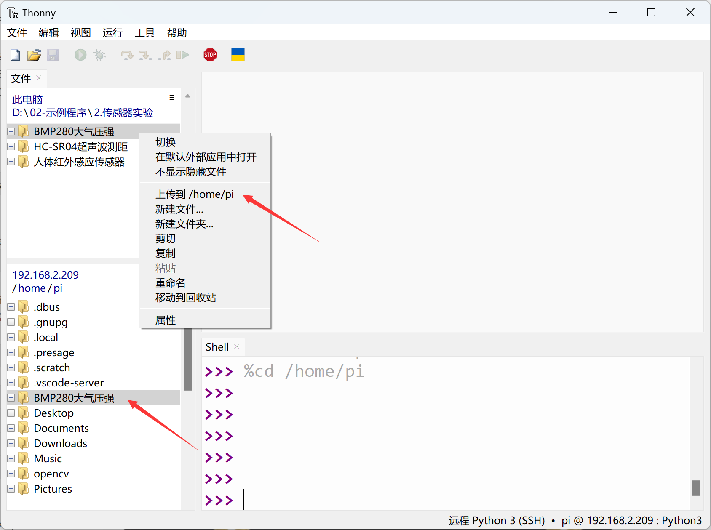
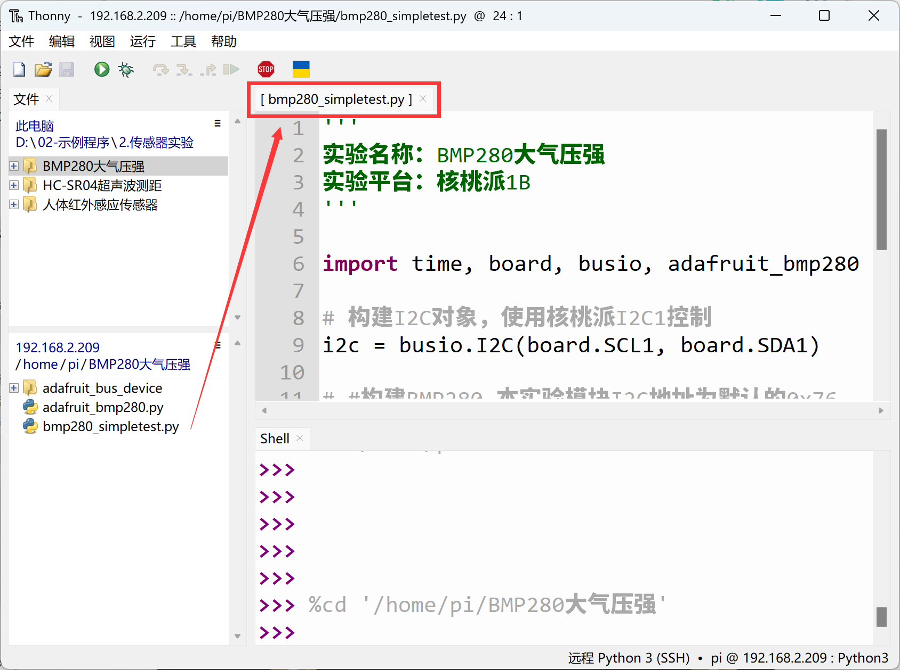

# BMP280大气压强

## 前言
本实验中大气压强传感器模块使用的是BMP280，这是一款专为移动应用而设计的高精度大气压传感器， 传感器模块采用极其紧凑的封装，其小尺寸和低功耗可以应用在手机、 GPS 模块、 手表的电池供电设备中。 BMP280 传感器除了可以测量大气压强，还可以测量温度（温度精度不高）以及通过计算公式来换算出海拔高度。

## 实验目的
通过python编程实现测量当前环境的大气压强、温度信息，将大气压强通过公式计算出当前海拔高度，打造自己的气压计！

## 实验讲解

市面上大多BMP280模块都通用，使用I2C总线通讯，下图是一款BMP280传感器模块：

 

|  模块参数 |
|  :---:  | ---  |
| 供电电压  | 3.3V |
| 工作电流  | <20mA |
| 通信方式  | I2C总线 |
| I2C地址  | 0x76（BMP280的SDO默认下拉）；<br></br> 当 BMP280 的 SDO 引脚上拉时，I2C 地址为：0x77 | 
| 引脚说明  | `VCC`: 接3.3V <br></br> `GND`: 接地 <br></br>  `SDA`: I2C数据引脚  <br></br> `SCL`: I2C时钟引脚 |

<br></br>

从上面介绍可以看到BMP280是一款通过I2C接口驱动的传感器。我们通过核桃派I2C接口编程，即可以对该模块实现数据通讯。

**海拔高度计算：**

标准大气压是指把温度为0℃、纬度45度海平面（海拔为0米）上的气压称为1个大气压，其数值为101325 帕斯卡（Pa）。

大气压和海拔高度的关系：P=P0×（1-H/44300)^5.256

因此计算高度公式为：H=44300*(1- (P/P0)^(1/5.256) )

上式中：H为海拔高度，P0=标准大气压（0℃，101325Pa）

从上面公式可以看到，高度是通过大气压强换算出来的，从物理学的角度我们可以知道，高度越高的地方，空气越稀薄，大气压强越低。通过气压的变化我们就可以计算出海拔高度；但是这存在特定条件，那就是温度为0℃的时候，而温度越高的地方，空气越稀薄，大气压强就越低。因此高度数据理论上需要做温度补偿，因此本实验的高度值换算存在一定的误差。有兴趣的小伙伴可以自行深入研究。

本例程使用核桃派的I2C1来连接BMP280传感器：
 

 


Python的强大之处是其有丰富的模块和函数库，一旦模块建立了，那么后来者使用起来就非常简单，无须再去做底层驱动的开发。从而实现面向对象的编程，而当有需要的时候又可以去改底层代码，可以说是进可攻退可守，非常灵活。在这里我们直接调用已经编写好的python驱动文件，该文件实现了对大气压、温度、高度的测量和计算。用户直接使用即可，具体如下：


## 开启I2C1

在终端输入下面指令：
```bash
sudo set-device enable i2c1
```

重启开发板：
```bash
sudo reboot
```

启动后查看开启情况：
```bash
gpio pins
```

出现下图表示开启成功：


更多GPIO配置教程请看：[GPIO设备配置](../../gpio/gpio_config.md)

## BMP280对象

在CircuitPython中可以直接使用写好的Python库来获取BMP280大气压强传感器数据。具体介绍如下：

### 构造函数
```python
bmp280 = adafruit_bmp280.Adafruit_BMP280_I2C(i2c,address=0x76)
```
构建bmp280对象。

参数说明：
- `i2c` 需要构建i2c对象，参考: [I2C对象说明](../gpio/i2c_oled#i2c对象)；这里不再重复。
- `address` 模块I2C地址。默认：0x76；

### 使用方法

```python
bmp280.sea_level_pressure = 1013.25
```
设置当地海平面标准大气压值，单位hPa

<br></br>

```python
bmp280.temperature
```
返回温度值，单位℃，数据类型为`float`

<br></br>

```python
bmp280.pressure
```
返回大气压强值，单位hPa (1hPa = 100Pa), 数据类型为`float`

<br></br>

```python
bmp280.altitude
```
返回海拔高度值，单位m, 数据类型为`float`

<br></br>

理解了BMP280传感器原理和对象使用方法后，我们可以整理出编程思路，流程图如下 ：

```mermaid
graph TD
    导入相关模块-->构建BMP280对象-->获取温度/气压/海拔高度值并打印-->获取温度/气压/海拔高度值并打印;
```

## 参考代码

```python
'''
实验名称：BMP280大气压强
实验平台：核桃派2B
'''

import time, board, busio, adafruit_bmp280

# 构建I2C对象，使用核桃派I2C1控制
i2c = busio.I2C(board.SCL1, board.SDA1)

# #构建BMP280,本实验模块I2C地址为默认的0x76.
bmp280 = adafruit_bmp280.Adafruit_BMP280_I2C(i2c,address=0x76)

# 当地海平面标准大气压
bmp280.sea_level_pressure = 1013.25

while True:
    
    print("\nTemperature: %0.1f C" % bmp280.temperature)
    print("Pressure: %0.1f hPa" % bmp280.pressure)
    print("Altitude = %0.2f meters" % bmp280.altitude)
    
    time.sleep(1)
```

## 实验结果

终端输入下面指令确认I2C1开启情况：
```bash
gpio pins
```

出现下图表示开启成功：

 

如没开启请按前面内容打开：[开启I2C1](#开启i2c1)

将BMP280传感器按下图连接到核桃派， SDA1连接到模块SDA引脚, SCL1连接到模块SCL引脚：

 

由于本例程代码依赖其它py库，所以需要将整个例程文件夹上传到核桃派：

 

发送成功后需要打开远程目录（核桃派）的py文件来运行，因为运行会导入文件夹里面的其它库文件，因此这类型代码在电脑本地运行是无效的。

 

这里使用Thonny远程核桃派运行以上Python代码，关于核桃派运行python代码方法请参考： [运行Python代码](../python_run.md)。运行成功后可以看到终端打印出温度、气压和海拔高度信息：

 
