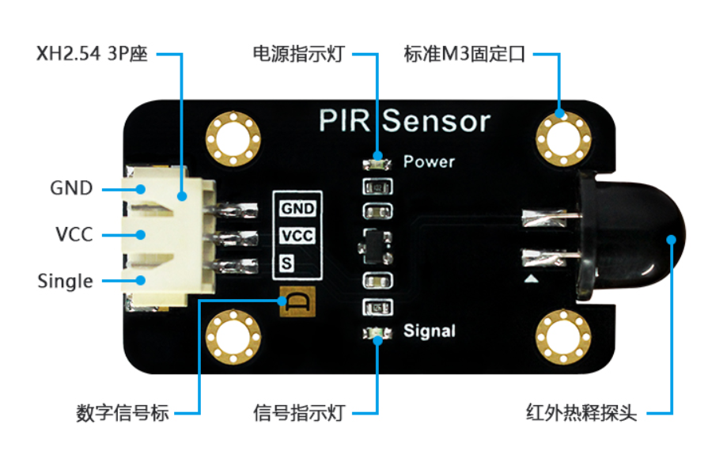
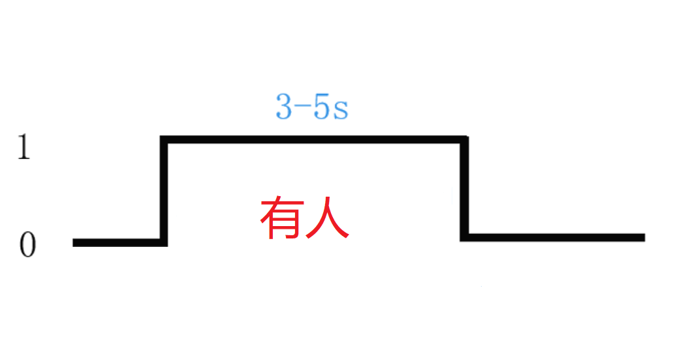
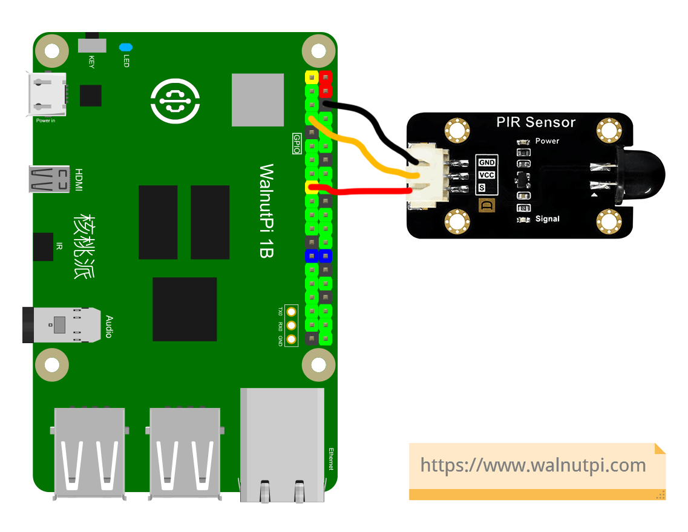
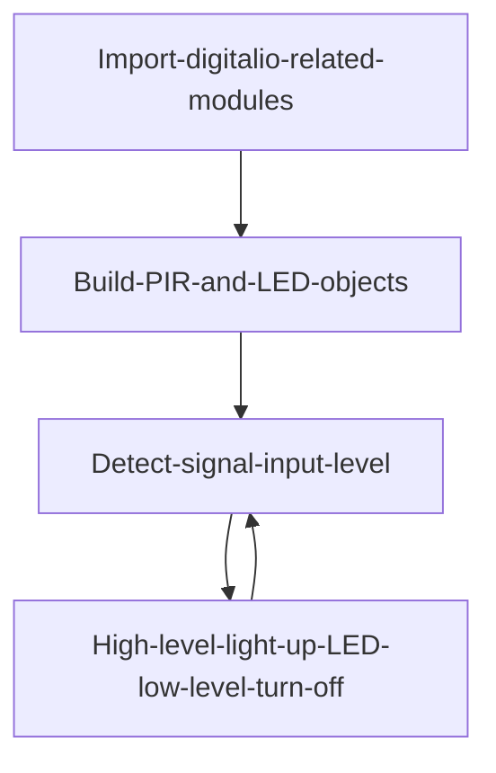
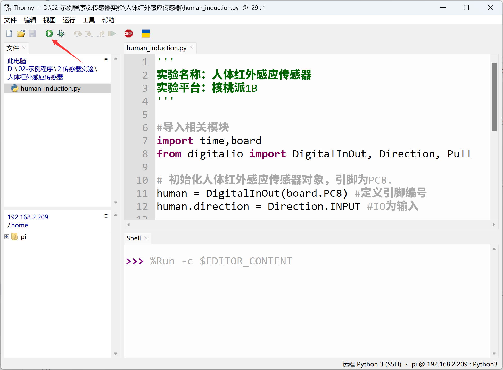
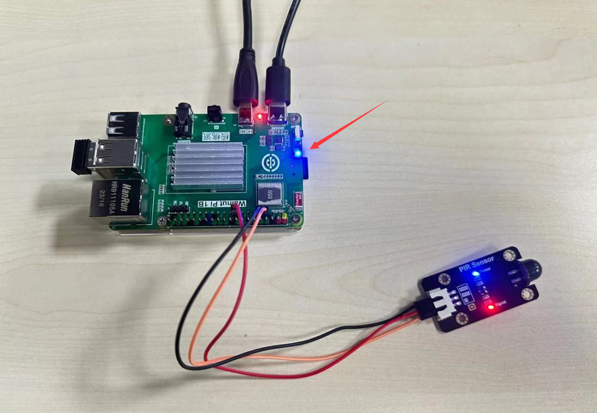
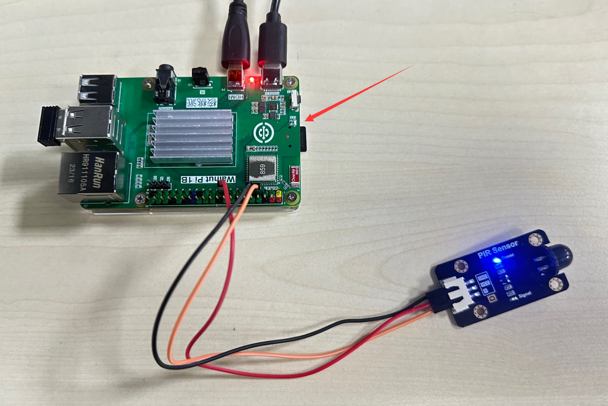

# PIR Motion Sensor

## Introduction
PIR (Passive Infrared) motion sensors are widely used in indoor security applications. Their principle involves a detection element converting detected human body infrared radiation into a weak voltage signal, which is then amplified and output. To improve detection sensitivity and increase detection range, a plastic Fresnel lens is typically placed in front of the detector. Combined with the amplifier circuit, it can amplify the signal by over 70dB, enabling detection of human movement within a range of 5~10 meters.

## Experiment Objective
Use Python programming to detect the PIR motion sensor module. When a person appears, the blue indicator LED lights up (turns off when no one is present).

## Experiment Explanation

The image below shows a commonly used PIR motion sensor module, which mainly has power pins and a signal output pin (supply voltage is generally 3.3V, subject to manufacturer specifications).



When powered on, this module outputs a high level on the signal output pin for 3-5 seconds when a person is detected.



So, this sensor operates similarly to the button in the previous GPIO chapters. Simply connect the module signal pin to the Walnut Pi, and the Walnut Pi detects the pin level changes. The connection between the Walnut Pi and the PIR sensor is as follows:



## digitalio Object

In CircuitPython, you can directly use the digitalio module to program I/O input for detecting the input level. Details are as follows:

### Constructor
```python
human=digitalio.DigitalInOut(pin)
```
Parameter description:
- `pin` Development board pin number. Example: board.PB6

### Usage
```python
human.direction = value
```
Defines pin as input/output. Value options:
- `digitalio.Direction.INPUT` : Input.
- `digitalio.Direction.OUTPUT` : Output.

<br></br>

```python
human.pull = value
```
Set pull-up/pull-down resistor. Value options:
- `digitalio.Pull.UP` : Pull-up.
- `digitalio.Pull.DOWN` : Pull-down.

<br></br>

```python
value = human.value
```
Pin input return value. Value return values:
- `True` or `1` : High level.
- `False` or `0` : Low level.

<br></br>

The code flow is as follows:



## Reference Code

```python
'''
Experiment Name: PIR Motion Sensor
Experiment Platform: Walnut Pi 2B
'''

# Import related modules
import time,board
from digitalio import DigitalInOut, Direction, Pull

# Initialize PIR motion sensor object, pin PB6.
human = DigitalInOut(board.PB6) # Define pin number
human.direction = Direction.INPUT # IO as input

# Build LED object and initialize
led = DigitalInOut(board.LED) # Define pin number
led.direction = Direction.OUTPUT  # IO as output

while True:

    if human.value == 1: # Person detected
        
        led.value = 1 # Light up LED

    else: # No person
        
        led.value = 0 # Turn off LED

    time.sleep(0.5) # Detection interval 0.5 seconds
```

## Experiment Results

Here we use Thonny to remotely run the above Python code on the Walnut Pi. For instructions on running Python code on the Walnut Pi, please refer to: [Running Python Code](../python_run.md)



When the sensor detects a person, the blue LED lights up.



When no person is detected, the blue LED turns off.


