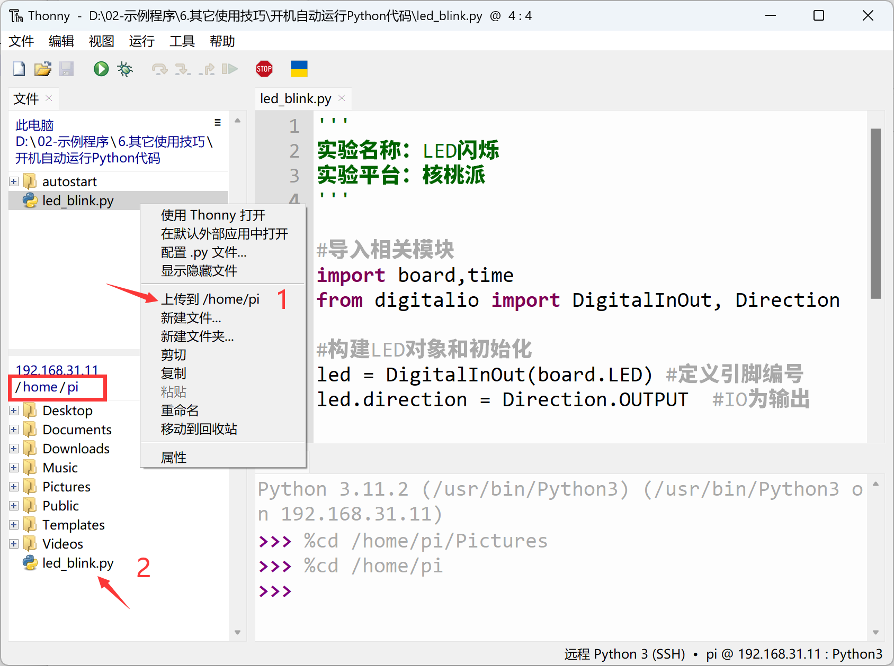
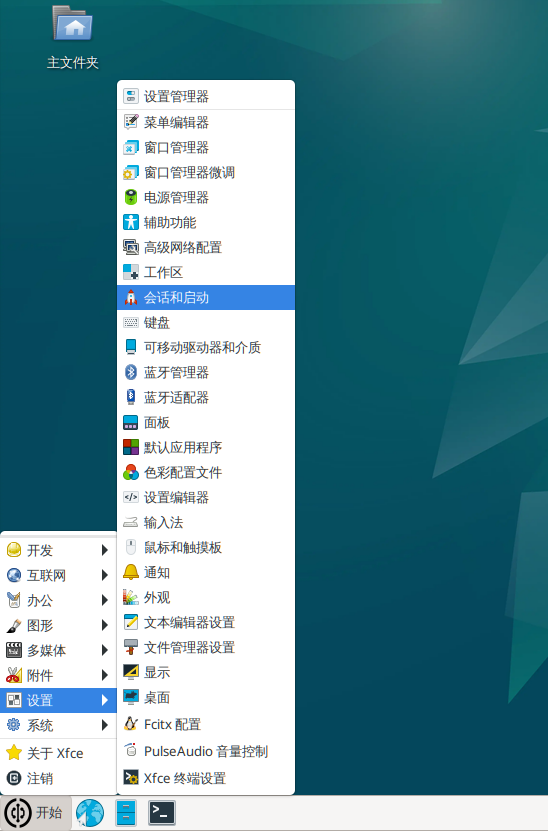
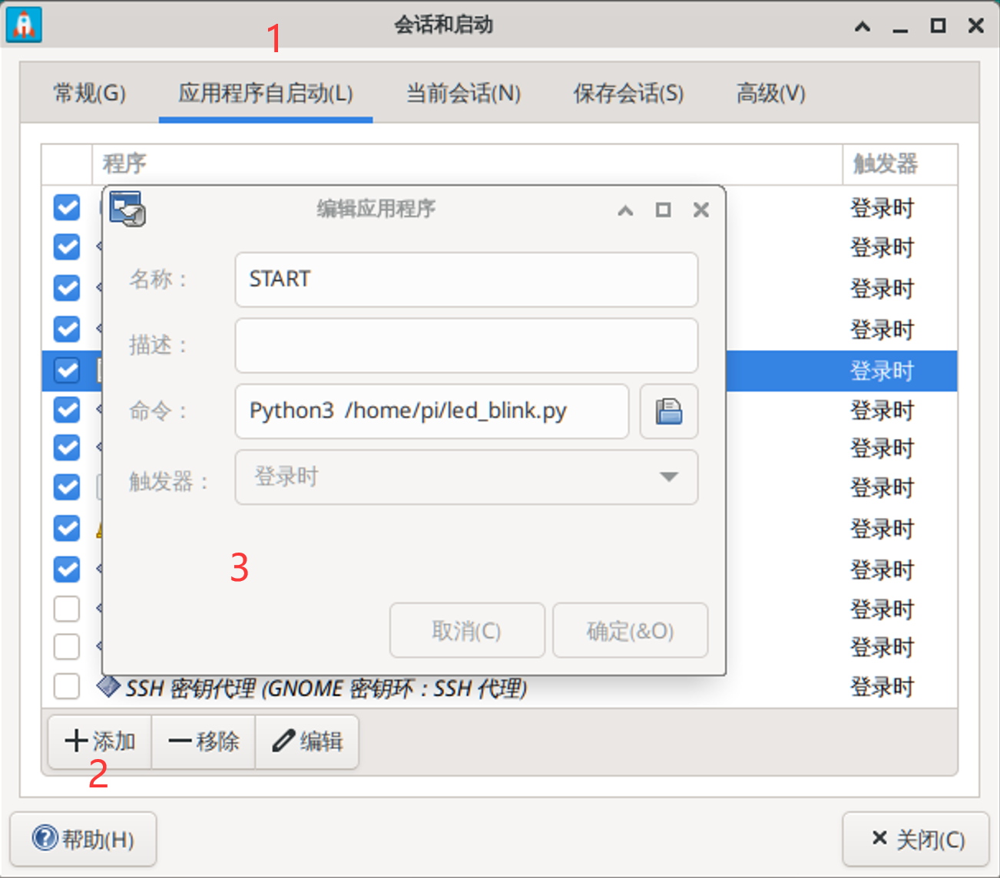
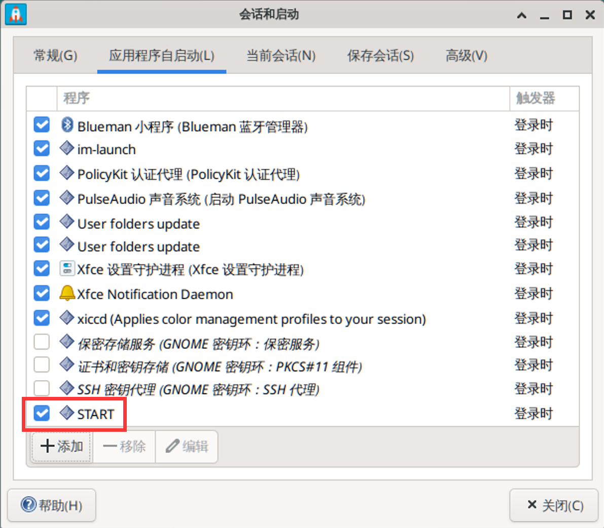
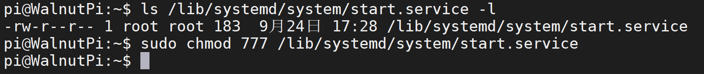
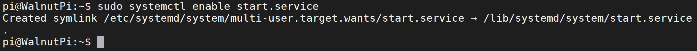

# Auto-Run Python Code at Startup

In previous chapters, we learned many Python embedded programming examples. Some of you may wonder: can we place already-written Python code on the Walnut Pi and have it execute automatically at startup? The answer is yes, and it's a very practical feature. In this section, we will explain it in detail.

## Using the Walnut Pi System Auto-Run Script Feature (Recommended)

The Walnut Pi system comes with an auto-run script feature that supports both desktop and headless (non-desktop) systems. No configuration is needed to execute specified script files at startup. For configuration instructions, please refer to: [Auto-Run Scripts at Startup](../../os_software/auto_run.md)

## Desktop System Method

First, let's write a test Python code that uses the onboard LED blinking effect as a function demonstration, along with printing "Hello WalnutPi!" as a notification message. The code is as follows (available in the Walnut Pi development board resource package -- Example Programs -- Other Tips):

```python
'''
Experiment Name: LED Blink
Experiment Platform: Walnut Pi
'''

# Import related modules
import board,time
from digitalio import DigitalInOut, Direction

# Build LED object and initialize
led = DigitalInOut(board.LED) # Define pin number
led.direction = Direction.OUTPUT  # IO as output

while True:

    led.value = 1 # Output high level, light up onboard blue LED
    
    time.sleep(0.5)
    
    led.value = 0 # Output low level, turn off onboard blue LED
    
    time.sleep(0.5)
    
    print("Hello WalnutPi!") # Output print message
```

Save the above code as **led_blink.py** and place it in the Walnut Pi /home/pi directory for testing. You can transfer it using Thonny or copy it directly to that directory using a USB drive.



Then, on the Walnut Pi desktop, click **Start Menu -- Settings -- Session and Startup**.



After launching, click **Application Autostart**, then click **+ Add** at the bottom left. In the pop-up dialog, configure the following:
- `Name`: Define the application name. We'll use START here; you can modify it as desired.
- `Description`: Description of this application; can be left blank.
- `Command`: The command. Here we use the following Python terminal command to launch the Python script. Be sure to use **Python3** with proper capitalization, because this program has been granted elevated privileges on the Walnut Pi, with administrator rights to run Python scripts, avoiding permission-related errors.
```bash
Python3 /home/pi/led_blink.py
```
- `Trigger`: Select "on login".




After confirmation, you can see the START program appear in the list.



Once created, you can find this startup file in the /home/pi/.config/autostart directory. Right-click and select Edit Launcher for more editing options.


As shown below, you can check the **Run in terminal** option, so that when the application opens, a new terminal will pop up on the desktop, making it easier to view debug information. If unchecked, it will run in the background.


After saving, you can double-click the application to test. You will see a new terminal pop up on the desktop, printing the output from **led_blink.py**.


The onboard LED blinks periodically!


Execute the reset command, and you will see the Walnut Pi development board pop up a terminal printing "Hello WalnutPi!" and the LED blinking, indicating that the Python code auto-start is working properly.
```bash
sudo reboot
```

## Headless (Non-Desktop) System Method

The previous section covered the method for the Walnut Pi desktop system. Here we'll explain the method for non-desktop versions, using the startup service method. **This method also works for systems with a desktop!**

As before, let's first write a test Python code using the onboard LED blinking effect for demonstration, along with printing "Hello WalnutPi!" as a notification message. The code is as follows (available in the Walnut Pi development board resource package -- Example Programs -- Other Tips):

```python
'''
Experiment Name: LED Blink
Experiment Platform: Walnut Pi
'''

# Import related modules
import board,time
from digitalio import DigitalInOut, Direction

# Build LED object and initialize
led = DigitalInOut(board.LED) # Define pin number
led.direction = Direction.OUTPUT  # IO as output

while True:

    led.value = 1 # Output high level, light up onboard blue LED
    
    time.sleep(0.5)
    
    led.value = 0 # Output low level, turn off onboard blue LED
    
    time.sleep(0.5)
    
    print("Hello WalnutPi!") # Output print message
```

Save the above code as **led_blink.py** and place it in the Walnut Pi /home/pi directory for testing. You can transfer it using Thonny or copy it directly to that directory using a USB drive.


Create a start.service file in the /lib/systemd/system directory. **(This file is available in the Walnut Pi development board resource package -- Example Programs -- Other Tips -- Non-Desktop System Method directory.)**

```bash
sudo nano /lib/systemd/system/start.service
```

Modify the content as follows:

```bash
[Unit]
Description=Expand partition size

[Service]
Type=oneshot
ExecStart=Python3 /home/pi/led_blink.py
RemainAfterExit=yes
StandardOutput=null

[Install]
WantedBy=multi-user.target
```


After saving, grant maximum permissions to the file:
```bash
sudo chmod 777 /lib/systemd/system/start.service
```


Enable the service:
```bash
 sudo systemctl enable start.service
```


Execute the reset command. You will see the Walnut Pi development board's LED blinking after restart, indicating that the Python code auto-start is working properly. Since this method runs in the background, the "Hello WalnutPi!" print message won't be visible!
```bash
sudo reboot
```


<br></br>

:::tip
Both methods above work by launching a Python script via commands. Users can modify the command to run specific Linux commands or software on power-up.
:::
