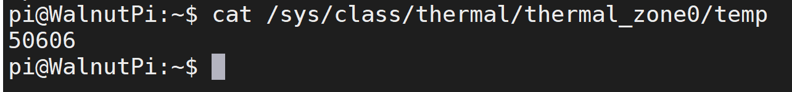
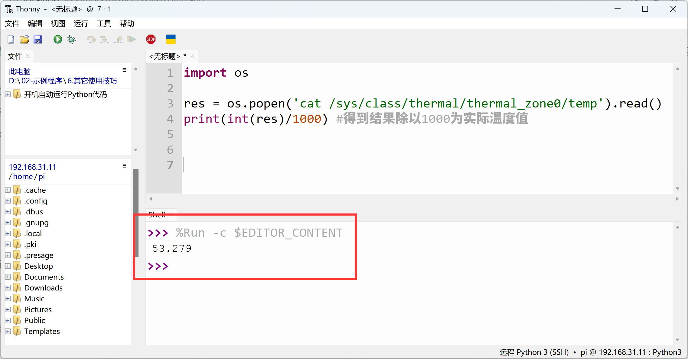
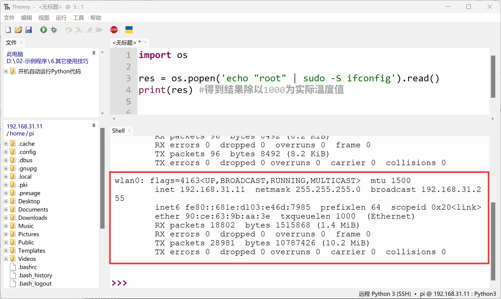

# Calling Terminal Commands from Python

In this chapter, we've learned about Python hardware control and some common programming. Additionally, we can use Python to directly call Linux commands of the Walnut Pi system. With this capability, Python programming can read system information, launch applications, and more through commands, making Python use on the Walnut Pi even more versatile.

## os.popen Object

You can call commands using the os.popen() method.

### Syntax
```python
os.popen(command[, mode[, bufsize]])
```

- `command` : Command.
- `mode` : Mode.
    -`r` : Read (default)
    -`w` : Write
- `bufsize` : Read or write buffer size. Default 0, no buffering.

## Examples

### Get CPU Temperature
In the terminal, we can obtain CPU temperature using the following command. See: [CPU Temperature Information](../../os_software/core_temp.md).
**Divide the result by 1000 for the actual temperature value.**

```bash
cat /sys/class/thermal/thermal_zone0/temp
```


In Python, this can be programmed as follows:
```python
import os

res = os.popen('cat /sys/class/thermal/thermal_zone0/temp').read()
print(int(res)/1000) # Divide result by 1000 for actual temperature value
```


### Get IP Information (With Root Privileges)

Sometimes we need root privileges to execute commands. How can this be done in Python? Let's demonstrate using the sudo ifconfig command.

In the Linux terminal, the following command can be used to run sudo without manually entering a password:

```bash
'echo "root" | sudo -S ifconfig'
```

In the command above, the **sudo -S** command receives the administrator password **root** directly from the echo input.

In Python, it can be programmed as follows:

```python
import os

res = os.popen('echo "root" | sudo -S ifconfig').read()
print(res) # Divide result by 1000 for actual temperature value
```


