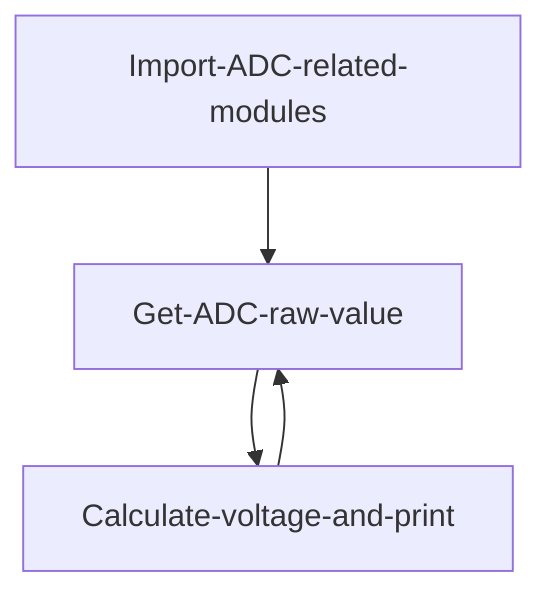
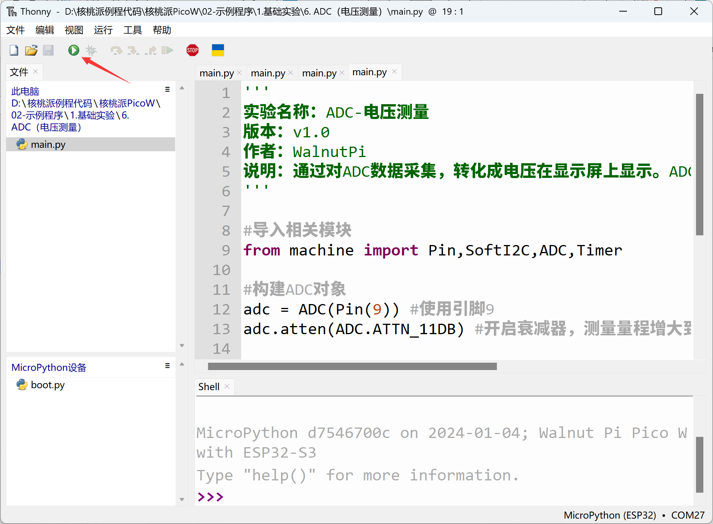
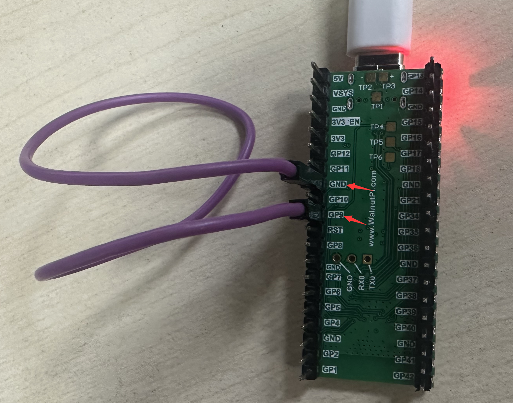
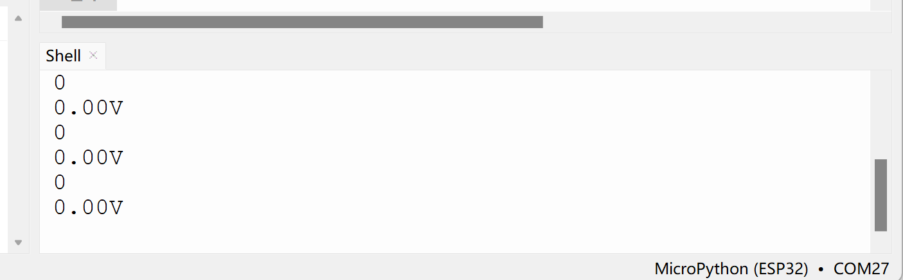
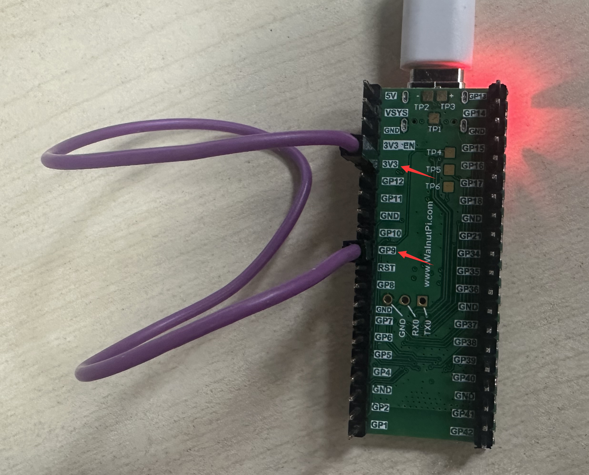
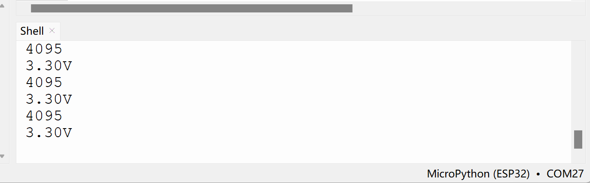

# ADC (Voltage Measurement)

## Introduction
ADC (Analog to Digital Conversion) converts analog signals into digital signals. Since MCUs can only recognize binary digital data, external analog signals are often converted through ADC into digital information that the MCU can process. A common application is converting varying voltage into digital signals to achieve voltage measurement.


## Objective
Learn ADC programming.

## Experiment Explanation

The WalnutPi PicoW has 2 ADC channels with 12-bit precision, supporting multiple channel (pin) inputs:

The ESP32-S3 ADC has a default range of 0-1V (0-4095), but the chip integrates an attenuator supporting up to 11dB attenuation. By configuring the attenuator, the range can be increased to about 3V. Let's look at the ADC module's constructor and usage methods.

## ADC Object

### Constructor
```python
adc = machine.ADC(Pin(id))
```
Build an ADC object. The ADC pin mapping is as follows:

- `Pin(id)` : Pin object supporting ADC, e.g., Pin(9), Pin(11).


### Usage
```python
adc.read()
```
Get the ADC value. Measurement precision is 12 bits, returning 0-4095 (corresponding to 0-1V).

<br></br>

```python
adc.atten(attenuation)
```
Configure the attenuator. Configuring the attenuator increases the voltage measurement range at the cost of precision.
- `attenuation` : Attenuation setting.
    - `ADC.ATTN_0DB` : 0dB attenuation, max measurement voltage 1.00V. (default configuration)
    - `ADC.ATTN_2_5DB` : 2.5dB attenuation, max input voltage approximately 1.34V;
    - `ADC.ATTN_6DB` : 6dB attenuation, max input voltage approximately 2.00V;
    - `ADC.ATTN_11DB` : 11dB attenuation, max input voltage approximately 3.3V

You read that right — just two functions are needed to get the ADC value. In this experiment we'll use 11dB attenuation to achieve a 0-3.3V range. Let's organize the programming logic. First import the relevant modules, then initialize them. In a loop, continuously read the ADC value, convert it to voltage, read every 300 milliseconds. Details are as follows:

For more usage, refer to the official documentation:<br></br>
https://docs.micropython.org/en/latest/esp32/quickref.html#adc-analog-to-digital-conversion

<br></br>

After familiarizing with the ADC usage, we'll implement periodic pin voltage measurement through code. The flow chart is as follows:




## Reference Code

```python
'''
Experiment Name: ADC - Voltage Measurement
Version: v1.0
Author: WalnutPi
Description: Collect ADC data, convert to voltage and display. ADC precision 12-bit (0~4095), measurement voltage 0-3.3V.
'''

#Import related modules
from machine import Pin,SoftI2C,ADC,Timer

#Build ADC object
adc = ADC(Pin(9)) #Use pin 9
adc.atten(ADC.ATTN_11DB) #Enable attenuator, increase measurement range to 3.3V

def ADC_Test(tim):

    #Print ADC raw value
    print(adc.read())

    #Calculate voltage, obtained data 0-4095 corresponds to 0-3.3V, ('%.2f'%) means keep 2 decimal places
    print('%.2f'%(adc.read()/4095*3.3) +'V')


#Start timer
tim = Timer(1)
tim.init(period=300, mode=Timer.PERIODIC, callback=ADC_Test) #Period 300ms
```

## Experimental Results

Run the code in Thonny IDE:



Short WalnutPi PicoW pin 9 to GND with a jumper wire, and you can see the measured voltage is 0V:





Short WalnutPi PicoW pin 9 to 3.3V with a jumper wire, and you can see the measured voltage is 3.3V:





::::danger Warning
ADC measurement input voltage must not exceed 3.3V, as it may damage the main control chip.
::::
