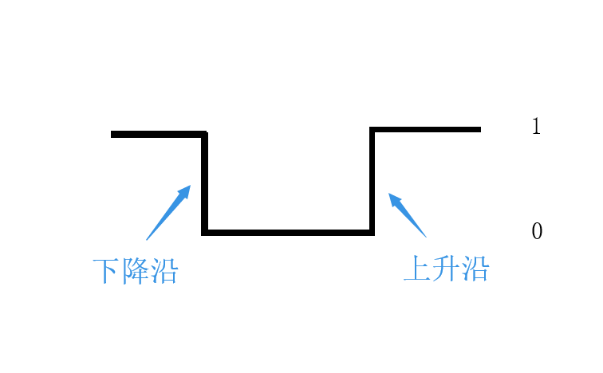
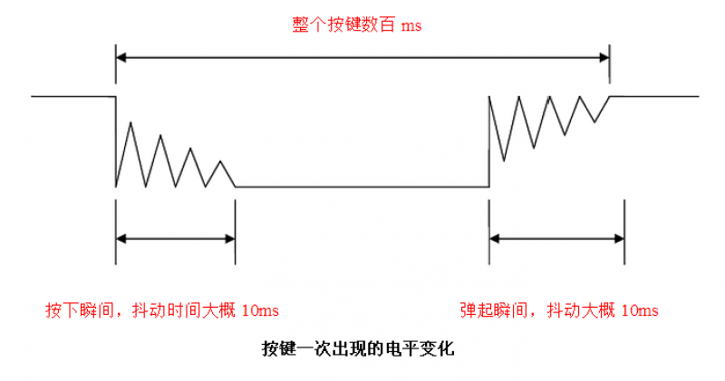
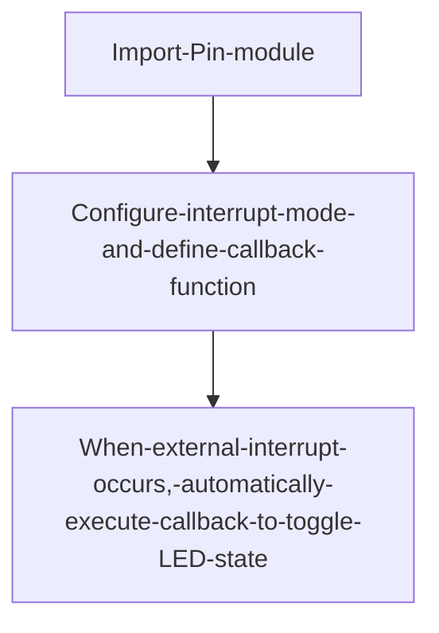
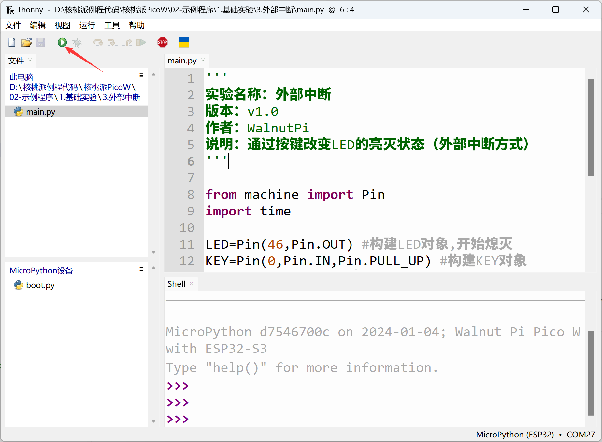
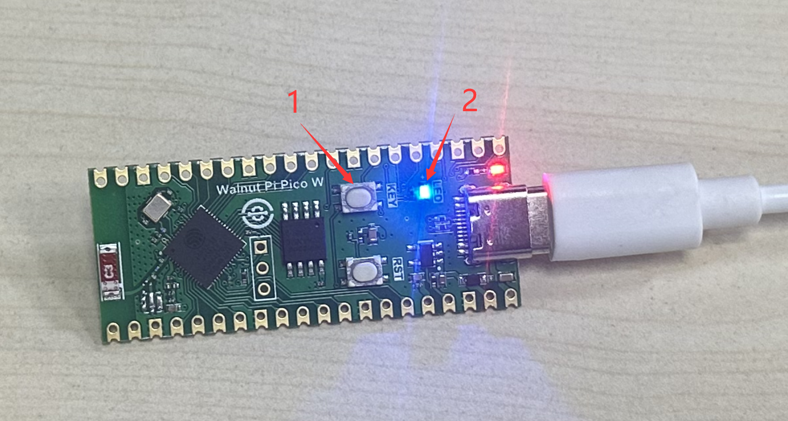

# External Interrupt

## Introduction

In the previous section on ordinary buttons (GPIO), although we could implement IO input/output functionality, the code continuously polls for IO input changes, making it inefficient — especially in certain scenarios. For example, if a button might only be pressed once a day to execute a function, we would waste significant time constantly polling for button presses.

To solve this problem, we introduce the concept of external interrupts. As the name suggests, we only execute the relevant function when the button is pressed (generating an interrupt). This greatly saves CPU resources, making interrupts widely used in real-world projects.


## Objective
Use interrupts to detect KEY button state. When the button is pressed (generating an external interrupt), toggle the LED on/off state.

## Experiment Explanation
The button's corresponding IO pin on the WalnutPi PicoW was covered in the previous section — it's pin 0.


External interrupts are also configured through the Pin submodule of the machine module. Let's first look at its constructor and usage:

## Pin Object

Pin is a pin object.

### Constructor
```python
KEY = machine.Pin(id, mode, pull)
```

Pin is located under the machine module:

- `id` : Chip pin number, e.g., 0, 2, 46.
- `mode` : Input/output mode.
    - `Pin.IN` : Input mode;
    - `Pin.OUT` : Output mode;
- `pull`: Pull-up/pull-down resistor configuration.
    - `None` : No pull-up/pull-down resistor;
    - `Pin.PULL_UP` : Pull-up resistor enabled;
    - `Pin.PULL_DOWN` : Pull-down resistor enabled.


### Usage
```python
KEY.irq(handler,trigger)
```
Configure interrupt mode:
- `handler` : Callback function executed when an interrupt occurs.
- `trigger` : Interrupt trigger mode, 4 types total.
    - `Pin.IRQ_FALLING` : Falling edge trigger;
    - `Pin.IRQ_RISING` : Rising edge trigger.
    - `Pin.IRQ_LOW_LEVEL` : Low level trigger;
    - `Pin.IRQ_HIGH_LEVEL` : High level trigger.

<br></br>

For more usage, refer to the official documentation:<br></br>
https://docs.micropython.org/en/latest/library/machine.Pin.html#machine-pin

<br></br>

Let's first understand the concepts of rising and falling edges. Since the KEY button pin is connected to GND through the button (i.e., low level "0"), when the button is pressed and then released, the pin first gets a falling edge, then a rising edge, as shown below:


Button bounce may occur when pressed, as shown below, potentially causing false detection. Therefore we need to use a delay function for debouncing:


We can choose the falling edge method to trigger the external interrupt, meaning the interrupt fires immediately when the button is pressed.

The external interrupt programming approach is similar to the GPIO button chapter. After initializing the interrupt, when the system detects an external interrupt, it executes the LED state toggle code. The flow chart is as follows:



## Reference Code

```python
'''
Experiment Name: External Interrupt
Version: v1.0
Author: WalnutPi
Description: Change LED on/off state via button (external interrupt method)
'''

from machine import Pin
import time

LED=Pin(46,Pin.OUT) #Build LED object, initially off
KEY=Pin(0,Pin.IN,Pin.PULL_UP) #Build KEY object
state=0  #LED pin state

#LED state toggle function
def fun(KEY):
    global state
    time.sleep_ms(10) #Debounce
    if KEY.value()==0: #Confirm button is pressed
        state = not state
        LED.value(state)

KEY.irq(fun,Pin.IRQ_FALLING) #Define interrupt, falling edge trigger
```

Notes on the code above:

1. `state` is a global variable, so you must add `global state` when using it inside the `fun` function, otherwise a new local variable with the same name will be created, causing conflicts.

2. When defining the callback function `fun`, you need to pass the Pin object `KEY` into it.


## Experimental Results

Run the code in Thonny IDE:



Each time the KEY button is pressed, the blue LED toggles on and off.



From the reference code, only a few lines achieved the experiment's goal, and compared to using a `while True` real-time polling function, the code efficiency is greatly enhanced. External interrupts have very broad applications — beyond ordinary button input and level detection, many input devices such as sensors also use external interrupts for real-time detection, which will be covered in later chapters.
