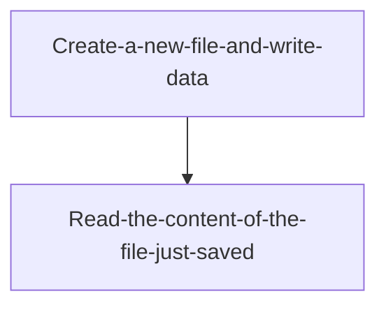
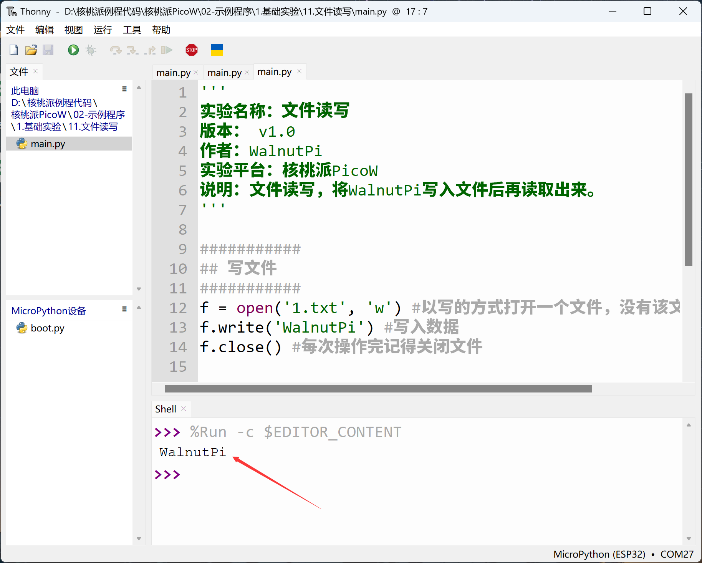
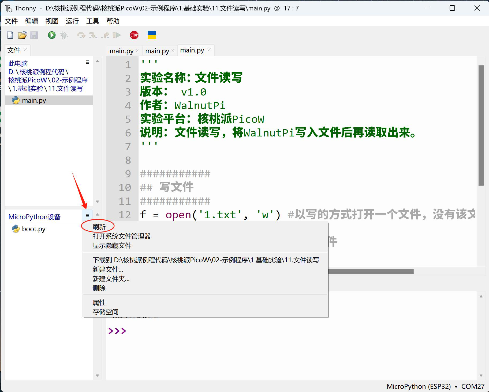

# File Read/Write

## Introduction
In embedded programming, we often need to save certain data persistently (power-off retention), typically using storage methods like EEPROM or flash. However, MicroPython has its own file system, so we can simply save data as files.

## Objective
Program file read/write operations.

## Experiment Explanation

Most file operation commands in MicroPython are compatible with CPython. Therefore we can directly use Python programming to implement file read/write.

The programming flow is as follows:



## Reference Code

```python
'''
Experiment Name: File Read/Write
Version: v1.0
Author: WalnutPi
Platform: WalnutPi PicoW
Description: File read/write — write "WalnutPi" to a file, then read it back.
'''

###########
## Write file
###########
f = open('1.txt', 'w') #Open a file in write mode; if the file doesn't exist, create it
f.write('WalnutPi') #Write data
f.close() #Remember to close the file after each operation

###########
## Read file
###########
f = open('1.txt', 'r') #Open a file in read mode
text = f.read()
print(text) #Read data and print it in the terminal
f.close() #Remember to close the file after each operation
```

## Experimental Results

Run the code and you can see the serial terminal prints the file content.



Click **Menu Bar — Refresh** on the right side of the IDE's development board file system to see the file just saved (or reset the development board and reconnect).




For more file operation usage, search online for Python or MicroPython file read/write.
