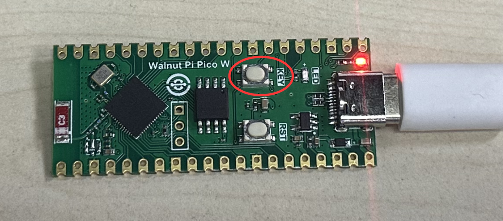
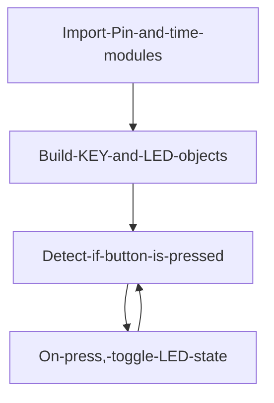
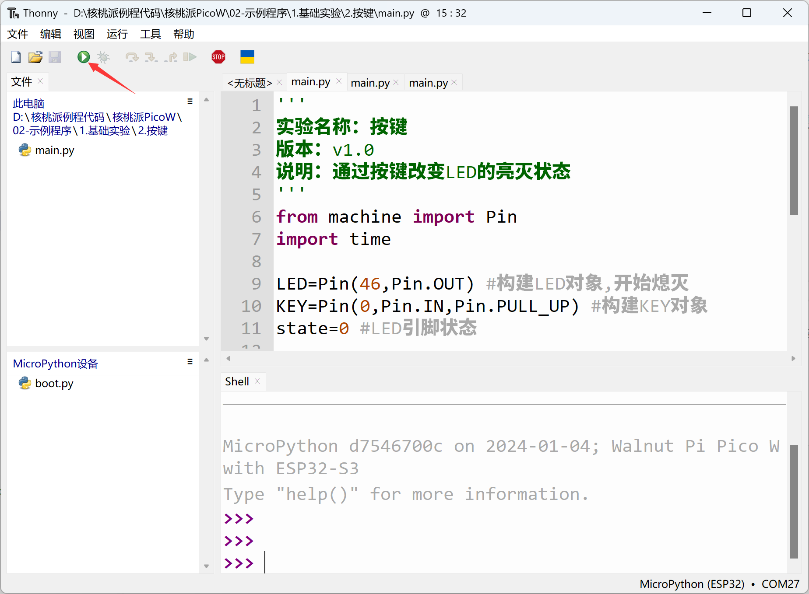

# Button

## Introduction
The button is the simplest and most common input device. Many products rely on buttons, including early iPhones. Today we'll learn how to write a button program using MicroPython. With button input functionality, we can create many interesting things.

## Objective
Use the button function to change the on/off state of the LED (blue LED) when the button is pressed.

## Experiment Explanation

The WalnutPi PicoW development board has 2 buttons: RST and KEY. RST, as the name suggests, is for reset. So the only button we can actually use is KEY.

The function button KEY is located on the development board as shown below:



Let's first look at the schematic to find the IO pin corresponding to the button.


From the schematic, one end of the KEY button is connected to ESP32-S3 pin 0, and the other end is connected to GND. So when the button is not pressed, it inputs high level (1); when pressed, it inputs low level (0).

Like the LED earlier, button input detection also uses the Pin object module. Details are as follows:

## Pin Object

Pin is a pin object.

### Constructor
```python
KEY = machine.Pin(id, mode, pull)
```

Pin is located under the machine module:

- `id` : Chip pin number, e.g., 0, 2, 46.
- `mode` : Input/output mode.
    - `Pin.IN` : Input mode;
    - `Pin.OUT` : Output mode;
- `pull`: Pull-up/pull-down resistor configuration.
    - `None` : No pull-up/pull-down resistor;
    - `Pin.PULL_UP` : Pull-up resistor enabled;
    - `Pin.PULL_DOWN` : Pull-down resistor enabled.


### Usage
```python
KEY.value([X])
```
Configure pin level:
- `Output mode` : Output level value.
    - `0` : Output low level;
    - `1` : Output high level.
- `Input mode` : No parameters needed, gets the current pin input level.

<br></br>

For more usage, refer to the official documentation:<br></br>
https://docs.micropython.org/en/latest/library/machine.Pin.html#machine-pin

<br></br>

When a button is pressed, bouncing may occur as shown below, which could cause false detection. Therefore we need to use a delay function for debouncing:


A common method is: when the button value is detected as 0, delay for about 10ms, then check again. If the button pin value is still 0, the button is confirmed as pressed. The delay uses the time module as follows:
```python
import time

time.sleep(1)           # Sleep for 1 second
time.sleep_ms(500)      # Sleep for 500 milliseconds
time.sleep_us(10)       # Sleep for 10 microseconds
start = time.ticks_ms() # Get the millisecond counter start value

delta = time.ticks_diff(time.ticks_ms(), start) # Calculate the difference from power-on to current time
```

We configure button pin 0 as input to light up the blue LED when the button is pressed and turn it off when released. The code writing flow is as follows:



## Reference Code

```python
'''
Experiment Name: Button
Version: v1.0
Description: Change LED on/off state via button
'''
from machine import Pin
import time

LED=Pin(46,Pin.OUT) #Build LED object, initially off
KEY=Pin(0,Pin.IN,Pin.PULL_UP) #Build KEY object
state=0 #LED pin state

while True:

    if KEY.value()==0:   #Button is pressed
        time.sleep_ms(10) #Debounce
        if KEY.value()==0: #Confirm button is pressed

            state=not state  #Use 'not' statement, not '~'
            LED.value(state) #Toggle LED state
            print('KEY')

            while not KEY.value(): #Check if button is released
                pass
```

From the code above, after initializing each object, it enters a loop. When KEY value is detected as 0 (button pressed), a 10ms delay is applied before checking again;

`state` is the value of the LED state, which toggles using `not` each time the button is pressed. Note that in Python, use **not** instead of **~**. `not` returns True and False, i.e., 0 and 1. Using `~` is a bitwise negation and would cause an error.


## Experimental Results

Run the code in Thonny IDE:



You can see that each time the KEY button is pressed, the blue LED toggles on and off.


GPIO is a very versatile feature. Once you master GPIO, you can use all the pins on the development board for your own purposes, offering great flexibility.
